# POC_ETH_Truffle_PetStoreVBox201805
Bitácora ampliada con notas propias sobre el desarrollo del tutorial [Ethereum Pet Shop](http://truffleframework.com/tutorials/pet-shop)

Contiene la bitácora de progreso de ejecución del tutorial, y de hecho contiene partes literales del tutorial, ampliado con notas y detalles propias y pensado para servir de posible guía para poder reproducir el tutorial cuando sea preciso pero también por si puede ser de utilidad como guía ampliada a terceros a los que pudiera ser de utilidad.

## Bitácora y notas

### Versión de linux utilizada en este ejemplo
```sh
# cat /etc/issue
Debian GNU/Linux 9 \n \l
# uname -a
Linux vbxdeb8 4.9.0-5-amd64 #1 SMP Debian 4.9.65-3+deb9u2 (2018-01-04) x86_64 GNU/Linux
```


### Instalación de NodeJS 6.0 LTS + npm
[How to Install NodeJS on Debian 9 Stretch Linux ](https://linuxconfig.org/how-to-install-nodejs-on-debian-9-stretch-linux)

```sh
root@vbxdeb8:~# mkdir Descargas
root@vbxdeb8:~# cd Descargas/

root@vbxdeb8:~/Descargas# wget --verbose https://deb.nodesource.com/setup_6.x
--2018-05-01 19:49:21--  https://deb.nodesource.com/setup_6.x
Resolviendo deb.nodesource.com (deb.nodesource.com)... 13.33.235.63, 13.33.235.17, 13.33.235.102, ...
Conectando con deb.nodesource.com (deb.nodesource.com)[13.33.235.63]:443... conectado.
Petición HTTP enviada, esperando respuesta... 200 OK
Longitud: 11040 (11K) [text/plain]
Grabando a: “setup_6.x”

setup_6.x                                   100%[==========================================================================================>]  10,78K  --.-KB/s    in 0s      

2018-05-01 19:49:22 (139 MB/s) - “setup_6.x” guardado [11040/11040]

root@vbxdeb8:~/Descargas# chmod u+x setup_6.x 

root@vbxdeb8:~/Descargas# ./setup_6.x 

root@vbxdeb8:~/Descargas# ./setup_6.x 

## Installing the NodeSource Node.js 6.x LTS Boron repo...


## Populating apt-get cache...

+ apt-get update
Obj:1 http://security.debian.org/debian-security stretch/updates InRelease
Obj:2 http://packages.microsoft.com/repos/vscode stable InRelease                                                               
Ign:3 http://ftp.de.debian.org/debian stretch InRelease                   
Obj:4 http://ftp.de.debian.org/debian stretch-updates InRelease
Obj:5 http://ftp.de.debian.org/debian stretch Release
Leyendo lista de paquetes... Hecho

## Installing packages required for setup: apt-transport-https...

+ apt-get install -y apt-transport-https > /dev/null 2>&1

## Confirming "stretch" is supported...

+ curl -sLf -o /dev/null 'https://deb.nodesource.com/node_6.x/dists/stretch/Release'

## Adding the NodeSource signing key to your keyring...

+ curl -s https://deb.nodesource.com/gpgkey/nodesource.gpg.key | apt-key add -
OK

## Creating apt sources list file for the NodeSource Node.js 6.x LTS Boron repo...

+ echo 'deb https://deb.nodesource.com/node_6.x stretch main' > /etc/apt/sources.list.d/nodesource.list
+ echo 'deb-src https://deb.nodesource.com/node_6.x stretch main' >> /etc/apt/sources.list.d/nodesource.list

## Running `apt-get update` for you...

+ apt-get update
Obj:1 http://security.debian.org/debian-security stretch/updates InRelease
Obj:2 http://packages.microsoft.com/repos/vscode stable InRelease                
Ign:3 http://ftp.de.debian.org/debian stretch InRelease                          
Obj:4 http://ftp.de.debian.org/debian stretch-updates InRelease
Obj:5 http://ftp.de.debian.org/debian stretch Release  
Des:7 https://deb.nodesource.com/node_6.x stretch InRelease [4.635 B]
Des:8 https://deb.nodesource.com/node_6.x stretch/main amd64 Packages [1.004 B]
Descargados 5.639 B en 1s (4.811 B/s)
Leyendo lista de paquetes... Hecho

## Run `sudo apt-get install -y nodejs` to install Node.js 6.x LTS Boron and npm
## You may also need development tools to build native addons:
     sudo apt-get install gcc g++ make
## To install the Yarn package manager, run:
     curl -sL https://dl.yarnpkg.com/debian/pubkey.gpg | sudo apt-key add -
     echo "deb https://dl.yarnpkg.com/debian/ stable main" | sudo tee /etc/apt/sources.list.d/yarn.list
     sudo apt-get update && sudo apt-get install yarn


root@vbxdeb8:~/Descargas# apt-get install -y nodejs
Leyendo lista de paquetes... Hecho
Creando árbol de dependencias       
Leyendo la información de estado... Hecho
El paquete indicado a continuación se instaló de forma automática y ya no es necesario.
  libuv1
Utilice «apt autoremove» para eliminarlo.
Se instalarán los siguientes paquetes NUEVOS:
  nodejs
0 actualizados, 1 nuevos se instalarán, 0 para eliminar y 200 no actualizados.
Se necesita descargar 10,1 MB de archivos.
Se utilizarán 45,6 MB de espacio de disco adicional después de esta operación.
Des:1 https://deb.nodesource.com/node_6.x stretch/main amd64 nodejs amd64 6.14.2-1nodesource1 [10,1 MB]
Descargados 10,1 MB en 1s (5.824 kB/s)
Seleccionando el paquete nodejs previamente no seleccionado.
(Leyendo la base de datos ... 263653 ficheros o directorios instalados actualmente.)
Preparando para desempaquetar .../nodejs_6.14.2-1nodesource1_amd64.deb ...
Desempaquetando nodejs (6.14.2-1nodesource1) ...
Configurando nodejs (6.14.2-1nodesource1) ...
Procesando disparadores para man-db (2.7.6.1-2) ...

root@vbxdeb8:~/Descargas# node --version
v6.14.2
root@vbxdeb8:~/Descargas# nodejs --version
v6.14.2
root@vbxdeb8:~/Descargas# npm --version
3.10.10


root@vbxdeb8:~/Descargas# curl -sL https://dl.yarnpkg.com/debian/pubkey.gpg | sudo apt-key add -
OK
root@vbxdeb8:~/Descargas# echo "deb https://dl.yarnpkg.com/debian/ stable main" | sudo tee /etc/apt/sources.list.d/yarn.list
deb https://dl.yarnpkg.com/debian/ stable main


root@vbxdeb8:~/Descargas# apt-get update && sudo apt-get install yarn
Obj:1 http://security.debian.org/debian-security stretch/updates InRelease
Obj:2 http://packages.microsoft.com/repos/vscode stable InRelease                                                  
Ign:3 http://ftp.de.debian.org/debian stretch InRelease                                                            
Obj:4 http://ftp.de.debian.org/debian stretch-updates InRelease
Obj:5 http://ftp.de.debian.org/debian stretch Release  
Obj:6 https://deb.nodesource.com/node_6.x stretch InRelease
Des:7 https://dl.yarnpkg.com/debian stable InRelease [11,5 kB]
Des:9 https://dl.yarnpkg.com/debian stable/main all Packages [7.053 B]
Des:10 https://dl.yarnpkg.com/debian stable/main amd64 Packages [7.053 B]
Descargados 25,6 kB en 1s (15,0 kB/s)
Leyendo lista de paquetes... Hecho
Leyendo lista de paquetes... Hecho
Creando árbol de dependencias       
Leyendo la información de estado... Hecho
El paquete indicado a continuación se instaló de forma automática y ya no es necesario.
  libuv1
Utilice «sudo apt autoremove» para eliminarlo.
Se instalarán los siguientes paquetes NUEVOS:
  yarn
0 actualizados, 1 nuevos se instalarán, 0 para eliminar y 200 no actualizados.
Se necesita descargar 695 kB de archivos.
Se utilizarán 4.428 kB de espacio de disco adicional después de esta operación.
Des:1 https://dl.yarnpkg.com/debian stable/main amd64 yarn all 1.6.0-1 [695 kB]
Descargados 695 kB en 0s (1.428 kB/s)
Seleccionando el paquete yarn previamente no seleccionado.
(Leyendo la base de datos ... 266657 ficheros o directorios instalados actualmente.)
Preparando para desempaquetar .../archives/yarn_1.6.0-1_all.deb ...
Desempaquetando yarn (1.6.0-1) ...
Configurando yarn (1.6.0-1) ...

root@vbxdeb8:~/Descargas# yarn --version
1.6.0
```

### Instalando Truffle (como root)
```sh
npm install -g truffle
```

```sh
root@vbxdeb8:~/Descargas# npm install -g truffle
/usr/bin/truffle -> /usr/lib/node_modules/truffle/build/cli.bundled.js
/usr/lib
└─┬ truffle@4.1.7 
  ├─┬ mocha@3.5.3 
  │ ├── browser-stdout@1.3.0 
  │ ├─┬ commander@2.9.0 
  │ │ └── graceful-readlink@1.0.1 
  │ ├─┬ debug@2.6.8 
  │ │ └── ms@2.0.0 
  │ ├── diff@3.2.0 
  │ ├── escape-string-regexp@1.0.5 
  │ ├─┬ glob@7.1.1 
  │ │ ├── fs.realpath@1.0.0 
  │ │ ├─┬ inflight@1.0.6 
  │ │ │ └── wrappy@1.0.2 
  │ │ ├── inherits@2.0.3 
  │ │ ├─┬ minimatch@3.0.4 
  │ │ │ └─┬ brace-expansion@1.1.11 
  │ │ │   ├── balanced-match@1.0.0 
  │ │ │   └── concat-map@0.0.1 
  │ │ ├── once@1.4.0 
  │ │ └── path-is-absolute@1.0.1 
  │ ├── growl@1.9.2 
  │ ├── he@1.1.1 
  │ ├── json3@3.3.2 
  │ ├─┬ lodash.create@3.1.1 
  │ │ ├─┬ lodash._baseassign@3.2.0 
  │ │ │ ├── lodash._basecopy@3.0.1 
  │ │ │ └─┬ lodash.keys@3.1.2 
  │ │ │   ├── lodash._getnative@3.9.1 
  │ │ │   ├── lodash.isarguments@3.1.0 
  │ │ │   └── lodash.isarray@3.0.4 
  │ │ ├── lodash._basecreate@3.0.3 
  │ │ └── lodash._isiterateecall@3.0.9 
  │ ├─┬ mkdirp@0.5.1 
  │ │ └── minimist@0.0.8 
  │ └─┬ supports-color@3.1.2 
  │   └── has-flag@1.0.0 
  ├── original-require@1.0.1 
  └─┬ solc@0.4.23 
    ├─┬ fs-extra@0.30.0 
    │ ├── graceful-fs@4.1.11 
    │ ├── jsonfile@2.4.0 
    │ ├── klaw@1.3.1 
    │ └── rimraf@2.6.2 
    ├── memorystream@0.3.1 
    ├── require-from-string@1.2.1 
    ├── semver@5.5.0 
    └─┬ yargs@4.8.1 
      ├─┬ cliui@3.2.0 
      │ ├─┬ strip-ansi@3.0.1 
      │ │ └── ansi-regex@2.1.1 
      │ └── wrap-ansi@2.1.0 
      ├── decamelize@1.2.0 
      ├── get-caller-file@1.0.2 
      ├── lodash.assign@4.2.0 
      ├─┬ os-locale@1.4.0 
      │ └─┬ lcid@1.0.0 
      │   └── invert-kv@1.0.0 
      ├─┬ read-pkg-up@1.0.1 
      │ ├─┬ find-up@1.1.2 
      │ │ ├── path-exists@2.1.0 
      │ │ └─┬ pinkie-promise@2.0.1 
      │ │   └── pinkie@2.0.4 
      │ └─┬ read-pkg@1.1.0 
      │   ├─┬ load-json-file@1.1.0 
      │   │ ├─┬ parse-json@2.2.0 
      │   │ │ └─┬ error-ex@1.3.1 
      │   │ │   └── is-arrayish@0.2.1 
      │   │ ├── pify@2.3.0 
      │   │ └─┬ strip-bom@2.0.0 
      │   │   └── is-utf8@0.2.1 
      │   ├─┬ normalize-package-data@2.4.0 
      │   │ ├── hosted-git-info@2.6.0 
      │   │ ├─┬ is-builtin-module@1.0.0 
      │   │ │ └── builtin-modules@1.1.1 
      │   │ └─┬ validate-npm-package-license@3.0.3 
      │   │   ├─┬ spdx-correct@3.0.0 
      │   │   │ └── spdx-license-ids@3.0.0 
      │   │   └─┬ spdx-expression-parse@3.0.0 
      │   │     └── spdx-exceptions@2.1.0 
      │   └── path-type@1.1.0 
      ├── require-directory@2.1.1 
      ├── require-main-filename@1.0.1 
      ├── set-blocking@2.0.0 
      ├─┬ string-width@1.0.2 
      │ ├── code-point-at@1.1.0 
      │ └─┬ is-fullwidth-code-point@1.0.0 
      │   └── number-is-nan@1.0.1 
      ├── which-module@1.0.0 
      ├── window-size@0.2.0 
      ├── y18n@3.2.1 
      └─┬ yargs-parser@2.4.1 
        └── camelcase@3.0.0 

root@vbxdeb8:~/Descargas# truffle version
Truffle v4.1.7 (core: 4.1.7)
Solidity v0.4.23 (solc-js)

```

### We also will be using `Ganache`, a personal blockchain for Ethereum development you can use to deploy contracts, develop applications, and run tests. You can download Ganache by navigating to [http://truffleframework.com/ganache](http://truffleframework.com/ganache) and clicking the "Download" button.

```sh
devel@vbxdeb8:~$ cd Descargas/
devel@vbxdeb8:~/Descargas$ ls
code_1.22.2-1523551015_amd64.deb  ganache-1.1.0-x86_64.AppImage
devel@vbxdeb8:~/Descargas$ ls -l
total 143860
-rw-r--r-- 1 devel devel  45479630 may  1 19:29 code_1.22.2-1523551015_amd64.deb
-rwxr-xr-x 1 devel devel 101827892 may  1 20:41 ganache-1.1.0-x86_64.AppImage
devel@vbxdeb8:~/Descargas$ ./ganache-1.1.0-x86_64.AppImage 
Checking for update
Generated new staging user ID: 42886281-9c65-50d2-9aac-286e700ce997
Update for version 1.1.0 is not available (latest version: 1.1.0, downgrade is disallowed.
```

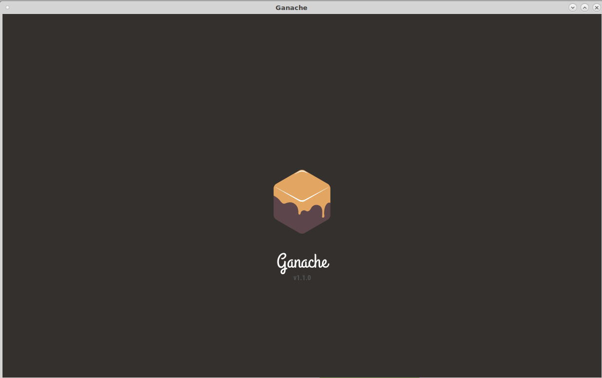


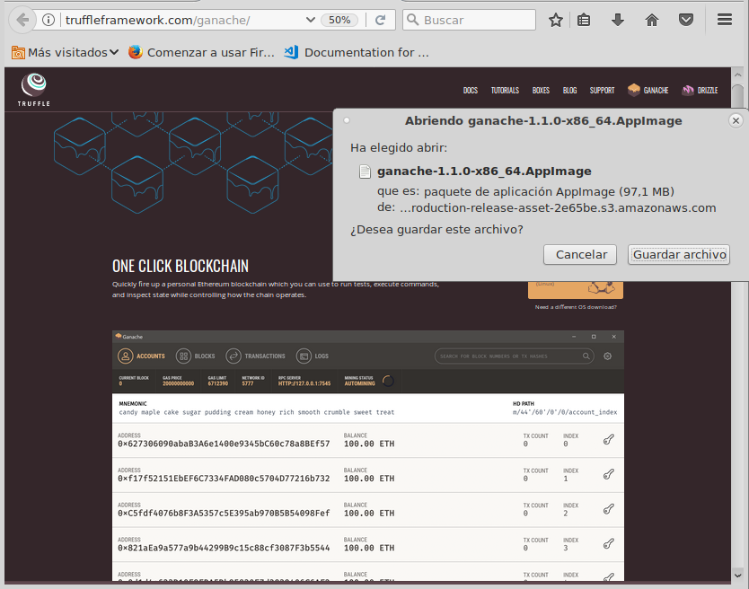

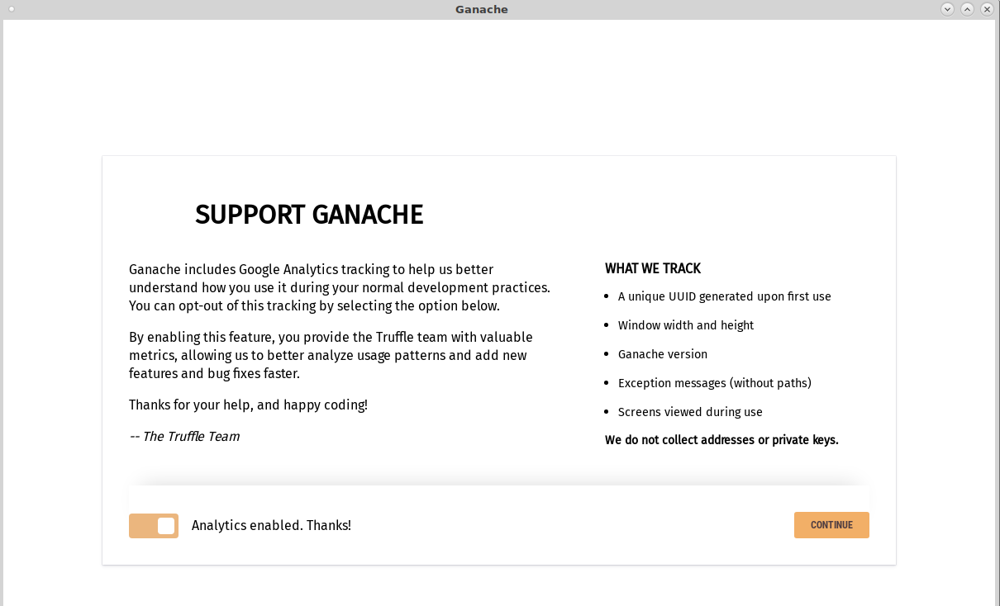

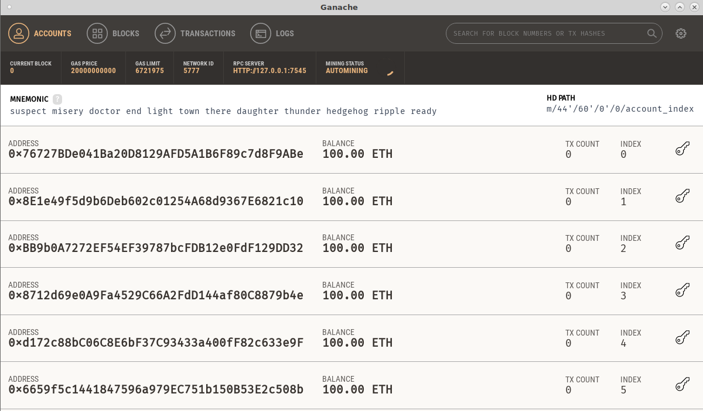

### Metamask


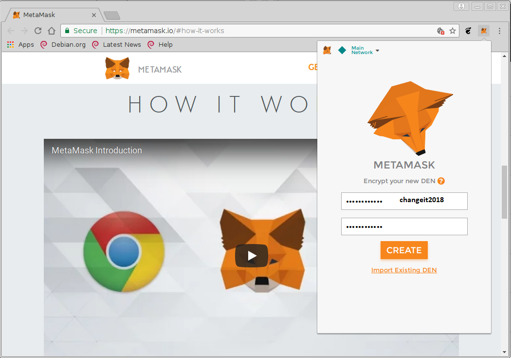

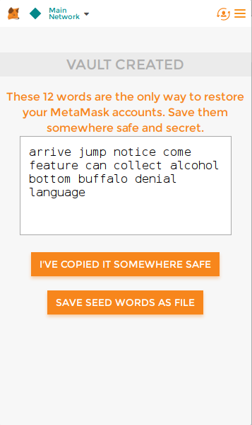

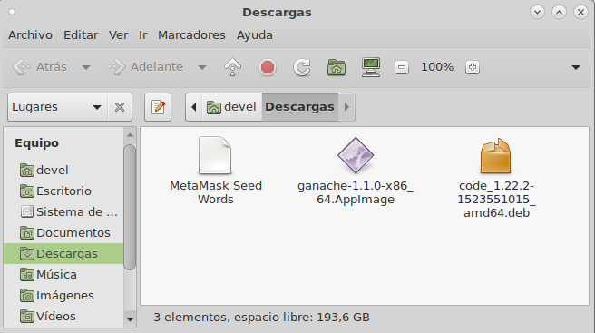

### Semillas para regenerar Ganache inicializado con las mismas cuentas

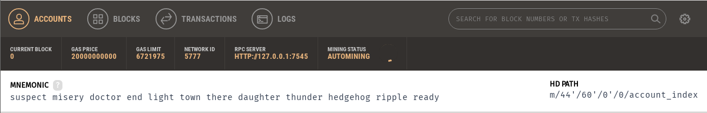

>suspect misery doctor end light town there daughter thunder hedgehog ripple ready

### Importando cuentas de Ganache en Metamask

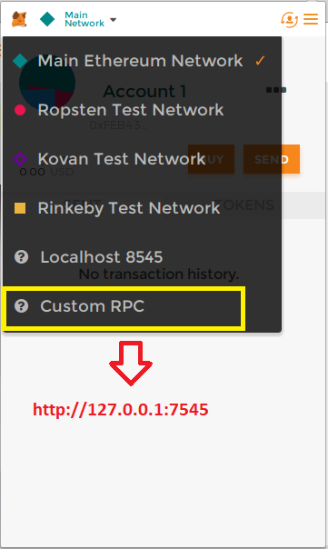

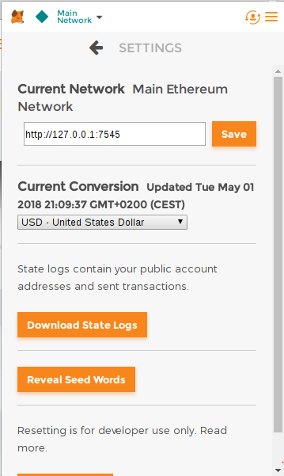

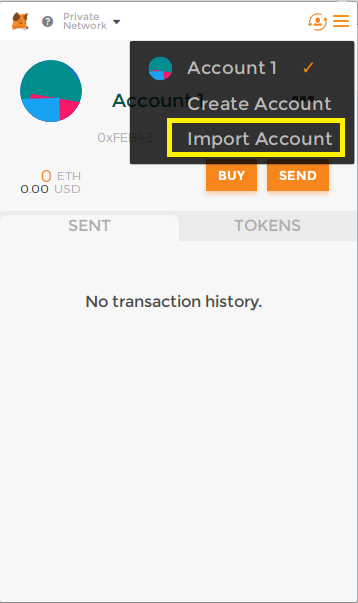

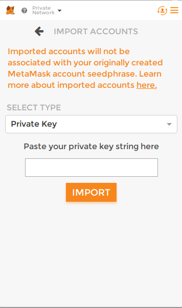

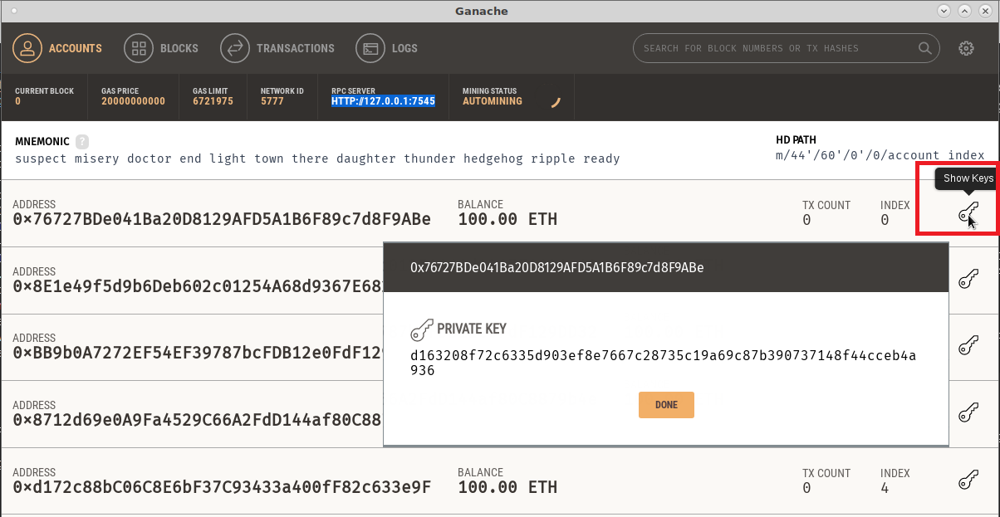

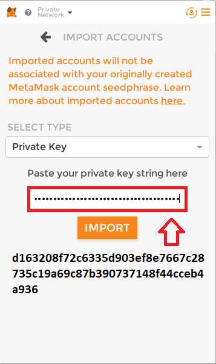

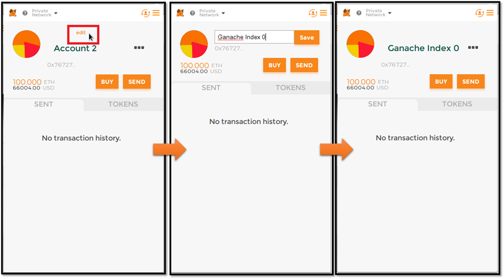

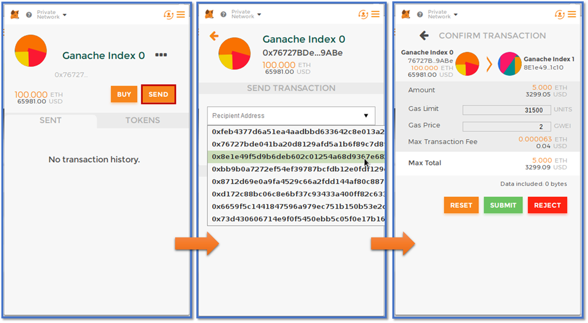

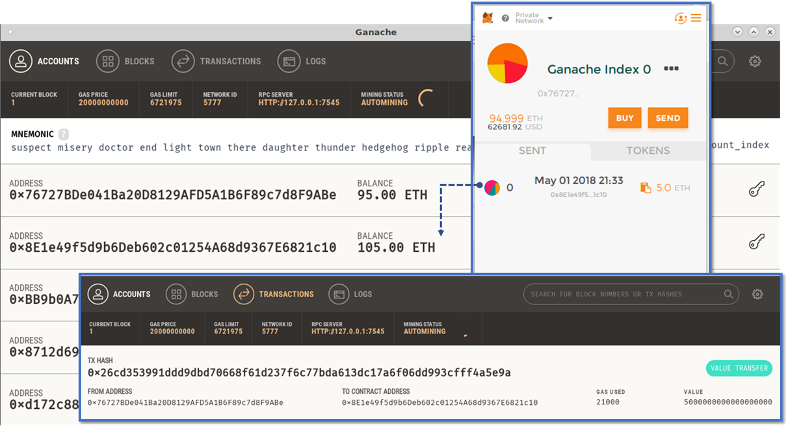

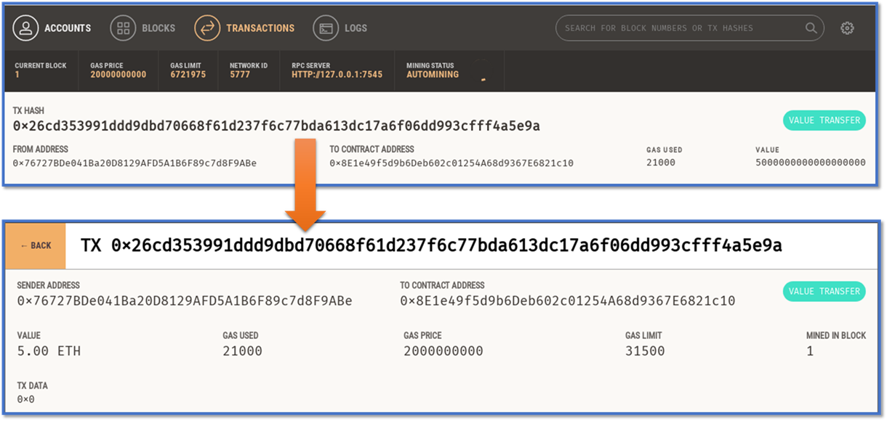

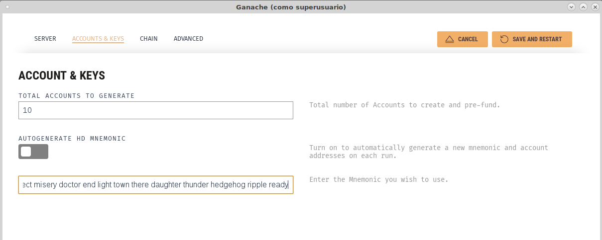

### Metamask `Private Network (Custom RPC)`
    * url RPC: http://127.0.0.1:7545


## Truffle

### Inicializar proyecto

Truffle initializes in the current directory, so first create a directory in your development folder of choice and then moving inside it.

```sh
devel@vbxdeb8:~/Escritorio/POC/TRUFFLE_PETSTORE$ mkdir pet-shop-tutorial --verbose
mkdir: se ha creado el directorio 'pet-shop-tutorial'

devel@vbxdeb8:~/Escritorio/POC/TRUFFLE_PETSTORE$ cd pet-shop-tutorial/


```

We've created a special `Truffle Box` just for this tutorial called `pet-shop`, which includes the basic project structure as well as code for the user interface. Use the `truffle unbox` command to unpack this Truffle Box.

[Truffle Boxes](http://truffleframework.com/boxes/) are helpful boilerplates that allow you to focus on what makes your dapp unique. In addition to Truffle, Truffle Boxes can contain other helpful modules, Solidity contracts & libraries, front-end views and more; all the way up to complete example dapps.

```sh
devel@vbxdeb8:~/Escritorio/POC/TRUFFLE_PETSTORE/pet-shop-tutorial$ truffle unbox pet-shop
Downloading...
Unpacking...
Setting up...
Unbox successful. Sweet!

Commands:

  Compile:        truffle compile
  Migrate:        truffle migrate
  Test contracts: truffle test
  Run dev server: npm run dev
```

> Note: Truffle can be initialized a few different ways. Another useful initialization command is `truffle init`, which `creates an empty Truffle project with no example contracts included`. For more information, please see the documentation on [Creating a project](http://truffleframework.com/docs/getting_started/project). 

### Project Directory structure

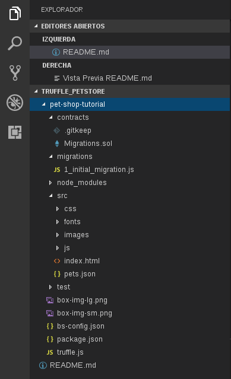


* The default Truffle directory structure contains the following:

    * `contracts/`: Contains the [Solidity](https://solidity.readthedocs.io/) source files for our smart contracts. There is an important contract in here called `Migrations.sol`, which we'll talk about later.
    * `migrations/`: Truffle uses a `migration system` to handle smart contract deployments. A migration is an additional special smart contract that keeps track of changes.
    * `test/`: Contains both JavaScript and Solidity tests for our smart contracts
    * `truffle.js`: Truffle configuration file

>The `pet-shop Truffle Box` has extra files and folders in it, but we won't worry about those just yet.

#### Migrations.sol
```solidity
pragma solidity ^0.4.17;

contract Migrations {
  address public owner;
  uint public last_completed_migration;

  modifier restricted() {
    if (msg.sender == owner) _;
  }

  function Migrations() public {
    owner = msg.sender;
  }

  function setCompleted(uint completed) public restricted {
    last_completed_migration = completed;
  }

  function upgrade(address new_address) public restricted {
    Migrations upgraded = Migrations(new_address);
    upgraded.setCompleted(last_completed_migration);
  }
}
```

#### truffle.js (ORIGINAL)
```js
module.exports = {
  // See <http://truffleframework.com/docs/advanced/configuration>
  // for more about customizing your Truffle configuration!
  networks: {
    development: {
      host: "127.0.0.1",
      port: 7545,
      network_id: "*" // Match any network id
    }
  }
};
```

### Writing the smart contract

We'll start our dapp by writing the smart contract that acts as the back-end logic and storage.

1.  Create a new file named `Adoption.sol` in the `contracts/` directory.

2.  Add the following content to the file:

```
pragma solidity ^0.4.17;

contract Adoption {

}
```

>Things to notice:
>
>The minimum version of Solidity required is noted at the top of the contract: `pragma solidity ^0.4.17;`. The pragma command means "additional information that only the compiler cares about", while the caret symbol (^) means "the version indicated or higher".
>
>Like JavaScript or PHP, statements are terminated with `semicolons`.

### Variable setup

Solidity is a `statically-typed language`, meaning data types like strings, integers, and arrays must be defined. Solidity has a unique type called an `address`. Addresses are `Ethereum addresses`, stored as `20 byte` values. Every account and smart contract on the Ethereum blockchain has an address and can send and receive Ether to and from this address.

1. Add the following variable on the next line after contract Adoption {.

```
    address[16] public adopters;
```

>Things to notice:
>
>We've defined a single variable: `adopters`. This is an `array` of Ethereum addresses. Arrays contain one type and can have a `fixed or variable length`. In this case the type is address and the length is 16.
>
>You'll also notice `adopters` is `public`. Public variables have automatic getter methods, but in the case of arrays a key is required and will only return a single value. Later, we'll write a function to return the whole array for use in our UI.

```
pragma solidity ^0.4.17;

contract Adoption {

    address[16] public adopters;
    
}
```

### Your first function: Adopting a pet

Let's allow users to make adoption requests.

1. Add the following function to the smart contract after the variable declaration we set up above.

```
function adopt(uint petId) public returns (uint) {
  require(petId >= 0 && petId <= 15);

  adopters[petId] = msg.sender;

  return petId;
}
```

>Things to notice:
>
>In Solidity the types of both the function parameters and output must be specified. In this case we'll be taking in a `petId (integer)` and returning an `integer`.
>
>We are checking to make sure `petId` is `in range` of our `adopters` array. Arrays in Solidity are indexed from 0, so the ID value will need to be between 0 and 15. We use the `require()` statement to ensure the ID is within range.
>
>If the ID is in range, we then add the address that made the call to our adopters array. **The address of the person or smart contract who called this function is denoted by `msg.sender`**.
>
>Finally, we return the `petId` provided as a confirmation.

```
pragma solidity ^0.4.17;

contract Adoption {

    address[16] public adopters;
    
    // Adopting a pet
    function adopt(uint petId) public returns (uint) {
        require(petId >= 0 && petId <= 15);

        adopters[petId] = msg.sender;

        return petId;
    }
}
```

### Your second function: Retrieving the adopters

As mentioned above, array getters return only a single value from a given key. Our UI needs to update all pet adoption statuses, but making 16 API calls is not ideal. So our next step is to write a function to return the entire array.

1. Add the following getAdopters() function to the smart contract, after the adopt() function we added above:

```
// Retrieving the adopters
function getAdopters() public view returns (address[16]) {
  return adopters;
}
```

>Since `adopters` is already declared, we can simply return it. Be sure to specify the `return type` (in this case, the type for adopters) as `address[16]`.

```
pragma solidity ^0.4.17;

contract Adoption {

    address[16] public adopters;
    
    // Adopting a pet
    function adopt(uint petId) public returns (uint) {
        require(petId >= 0 && petId <= 15);

        adopters[petId] = msg.sender;

        return petId;
    }

    // Retrieving the adopters
    function getAdopters() public view returns (address[16]) {
        return adopters;    
    }
}
```

### Compiling and migrating the smart contract

Now that we have written our smart contract, the next steps are to compile and migrate it.

Truffle has a `built-in developer console`, which we call `Truffle Develop`, which generates a `development blockchain` that we can use to `test deploy contracts`. It also `has the ability to run Truffle commands directly` from the console. We will use Truffle Develop to perform most of the actions on our contract in this tutorial.

### Compilation

Solidity is a compiled language, meaning we need to compile our Solidity to `bytecode` for the `Ethereum Virtual Machine (EVM)` to execute. Think of it as translating our human-readable Solidity into something the EVM understands.

1. In a terminal, make sure you are in the root of the directory that contains the dapp and type:

```
truffle compile
```

```
devel@vbxdeb8:~/Escritorio/POC/TRUFFLE_PETSTORE/pet-shop-tutorial$ truffle compile --verbose
Compiling ./contracts/Adoption.sol...
Compiling ./contracts/Migrations.sol...

Compilation warnings encountered:

/home/devel/POC/TRUFFLE_PETSTORE/pet-shop-tutorial/contracts/Migrations.sol:11:3: Warning: Defining constructors as functions with the same name as the contract is deprecated. Use "constructor(...) { ... }" instead.
  function Migrations() public {
  ^ (Relevant source part starts here and spans across multiple lines).

Writing artifacts to ./build/contracts

devel@vbxdeb8:~/Escritorio/POC/TRUFFLE_PETSTORE/pet-shop-tutorial$ tree ./build/contracts
./build/contracts
├── Adoption.json
└── Migrations.json

0 directories, 2 files

```
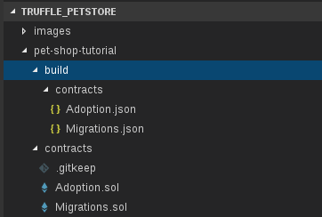

#### ./build/contracts/Adoption.json
```json
{
  "contractName": "Adoption",
  "abi": [
    {
      "constant": true,
      "inputs": [
        {
          "name": "",
          "type": "uint256"
        }
      ],
      "name": "adopters",
      "outputs": [
        {
          "name": "",
          "type": "address"
        }
      ],
      "payable": false,
      "stateMutability": "view",
      "type": "function"
    },
    {
      "constant": false,
      "inputs": [
        {
          "name": "petId",
          "type": "uint256"
        }
      ],
      "name": "adopt",
      "outputs": [
        {
          "name": "",
          "type": "uint256"
        }
      ],
      "payable": false,
      "stateMutability": "nonpayable",
      "type": "function"
    },
    {
      "constant": true,
      "inputs": [],
      "name": "getAdopters",
      "outputs": [
        {
          "name": "",
          "type": "address[16]"
        }
      ],
      "payable": false,
      "stateMutability": "view",
      "type": "function"
    }
  ],
  "bytecode": "0x608060405234801561001057600080fd5b506102d8806100206000396000f300608060405260043610610057576000357c0100000000000000000000000000000000000000000000000000000000900463ffffffff1680633de4eb171461005c57806343ae80d3146100af5780638588b2c51461011c575b600080fd5b34801561006857600080fd5b5061007161015d565b6040518082601060200280838360005b8381101561009c578082015181840152602081019050610081565b5050505090500191505060405180910390f35b3480156100bb57600080fd5b506100da600480360381019080803590602001909291905050506101de565b604051808273ffffffffffffffffffffffffffffffffffffffff1673ffffffffffffffffffffffffffffffffffffffff16815260200191505060405180910390f35b34801561012857600080fd5b5061014760048036038101908080359060200190929190505050610213565b6040518082815260200191505060405180910390f35b610165610288565b60006010806020026040519081016040528092919082601080156101d4576020028201915b8160009054906101000a900473ffffffffffffffffffffffffffffffffffffffff1673ffffffffffffffffffffffffffffffffffffffff168152602001906001019080831161018a575b5050505050905090565b6000816010811015156101ed57fe5b016000915054906101000a900473ffffffffffffffffffffffffffffffffffffffff1681565b60008082101580156102265750600f8211155b151561023157600080fd5b3360008360108110151561024157fe5b0160006101000a81548173ffffffffffffffffffffffffffffffffffffffff021916908373ffffffffffffffffffffffffffffffffffffffff160217905550819050919050565b610200604051908101604052806010906020820280388339808201915050905050905600a165627a7a723058208fc77019a0167c33adfbc42d02a69530898127a82e2d18a465dca64755918f790029",
  "deployedBytecode": "0x608060405260043610610057576000357c0100000000000000000000000000000000000000000000000000000000900463ffffffff1680633de4eb171461005c57806343ae80d3146100af5780638588b2c51461011c575b600080fd5b34801561006857600080fd5b5061007161015d565b6040518082601060200280838360005b8381101561009c578082015181840152602081019050610081565b5050505090500191505060405180910390f35b3480156100bb57600080fd5b506100da600480360381019080803590602001909291905050506101de565b604051808273ffffffffffffffffffffffffffffffffffffffff1673ffffffffffffffffffffffffffffffffffffffff16815260200191505060405180910390f35b34801561012857600080fd5b5061014760048036038101908080359060200190929190505050610213565b6040518082815260200191505060405180910390f35b610165610288565b60006010806020026040519081016040528092919082601080156101d4576020028201915b8160009054906101000a900473ffffffffffffffffffffffffffffffffffffffff1673ffffffffffffffffffffffffffffffffffffffff168152602001906001019080831161018a575b5050505050905090565b6000816010811015156101ed57fe5b016000915054906101000a900473ffffffffffffffffffffffffffffffffffffffff1681565b60008082101580156102265750600f8211155b151561023157600080fd5b3360008360108110151561024157fe5b0160006101000a81548173ffffffffffffffffffffffffffffffffffffffff021916908373ffffffffffffffffffffffffffffffffffffffff160217905550819050919050565b610200604051908101604052806010906020820280388339808201915050905050905600a165627a7a723058208fc77019a0167c33adfbc42d02a69530898127a82e2d18a465dca64755918f790029",
  "sourceMap": "26:379:0:-;;;;8:9:-1;5:2;;;30:1;27;20:12;5:2;26:379:0;;;;;;;",
  "deployedSourceMap": "26:379:0:-;;;;;;;;;;;;;;;;;;;;;;;;;;;;;;;;;;310:93;;8:9:-1;5:2;;;30:1;27;20:12;5:2;310:93:0;;;;;;;;;;;;;;;23:1:-1;8:100;33:3;30:1;27:10;8:100;;;99:1;94:3;90:11;84:18;80:1;75:3;71:11;64:39;52:2;49:1;45:10;40:15;;8:100;;;12:14;310:93:0;;;;;;;;;;;;;;;;51:27;;8:9:-1;5:2;;;30:1;27;20:12;5:2;51:27:0;;;;;;;;;;;;;;;;;;;;;;;;;;;;;;;;;;;;;;;;;;;;;;;111:162;;8:9:-1;5:2;;;30:1;27;20:12;5:2;111:162:0;;;;;;;;;;;;;;;;;;;;;;;;;;;;;;;;;;;;;;;;;;;310:93;354:11;;:::i;:::-;384:8;377:15;;;;;;;;;;;;;;;;;;;;;;;;;;;;;;;;;;;;;;;;;;;;;;;;;;;;;;;;;;;;;310:93;:::o;51:27::-;;;;;;;;;;;;;;;;;;;;;;;;;:::o;111:162::-;154:4;187:1;178:5;:10;;:25;;;;;201:2;192:5;:11;;178:25;170:34;;;;;;;;233:10;215:8;224:5;215:15;;;;;;;;;;;:28;;;;;;;;;;;;;;;;;;261:5;254:12;;111:162;;;:::o;26:379::-;;;;;;;;;;;;29:2:-1;21:6;17:15;117:4;105:10;97:6;88:34;148:4;140:6;136:17;126:27;;0:157;26:379:0;;;;:::o",
  "source": "pragma solidity ^0.4.17;\n\ncontract Adoption {\n\n    address[16] public adopters;\n    \n    // Adopting a pet\n    function adopt(uint petId) public returns (uint) {\n        require(petId >= 0 && petId <= 15);\n\n        adopters[petId] = msg.sender;\n\n        return petId;\n    }\n\n    // Retrieving the adopters\n    function getAdopters() public view returns (address[16]) {\n        return adopters;    \n    }\n}\n",
  "sourcePath": "/home/devel/POC/TRUFFLE_PETSTORE/pet-shop-tutorial/contracts/Adoption.sol",
  "ast": {
    "absolutePath": "/home/devel/POC/TRUFFLE_PETSTORE/pet-shop-tutorial/contracts/Adoption.sol",
    "exportedSymbols": {
      "Adoption": [
        43
      ]
    },
    "id": 44,
    "nodeType": "SourceUnit",
    "nodes": [
      {
        "id": 1,
        "literals": [
          "solidity",
          "^",
          "0.4",
          ".17"
        ],
        "nodeType": "PragmaDirective",
        "src": "0:24:0"
      },
      {
        "baseContracts": [],
        "contractDependencies": [],
        "contractKind": "contract",
        "documentation": null,
        "fullyImplemented": true,
        "id": 43,
        "linearizedBaseContracts": [
          43
        ],
        "name": "Adoption",
        "nodeType": "ContractDefinition",
        "nodes": [
          {
            "constant": false,
            "id": 5,
            "name": "adopters",
            "nodeType": "VariableDeclaration",
            "scope": 43,
            "src": "51:27:0",
            "stateVariable": true,
            "storageLocation": "default",
            "typeDescriptions": {
              "typeIdentifier": "t_array$_t_address_$16_storage",
              "typeString": "address[16]"
            },
            "typeName": {
              "baseType": {
                "id": 2,
                "name": "address",
                "nodeType": "ElementaryTypeName",
                "src": "51:7:0",
                "typeDescriptions": {
                  "typeIdentifier": "t_address",
                  "typeString": "address"
                }
              },
              "id": 4,
              "length": {
                "argumentTypes": null,
                "hexValue": "3136",
                "id": 3,
                "isConstant": false,
                "isLValue": false,
                "isPure": false,
                "kind": "number",
                "lValueRequested": false,
                "nodeType": "Literal",
                "src": "59:2:0",
                "subdenomination": null,
                "typeDescriptions": {
                  "typeIdentifier": null,
                  "typeString": null
                },
                "value": "16"
              },
              "nodeType": "ArrayTypeName",
              "src": "51:11:0",
              "typeDescriptions": {
                "typeIdentifier": "t_array$_t_address_$16_storage_ptr",
                "typeString": "address[16]"
              }
            },
            "value": null,
            "visibility": "public"
          },
          {
            "body": {
              "id": 31,
              "nodeType": "Block",
              "src": "160:113:0",
              "statements": [
                {
                  "expression": {
                    "argumentTypes": null,
                    "arguments": [
                      {
                        "argumentTypes": null,
                        "commonType": {
                          "typeIdentifier": "t_bool",
                          "typeString": "bool"
                        },
                        "id": 19,
                        "isConstant": false,
                        "isLValue": false,
                        "isPure": false,
                        "lValueRequested": false,
                        "leftExpression": {
                          "argumentTypes": null,
                          "commonType": {
                            "typeIdentifier": "t_uint256",
                            "typeString": "uint256"
                          },
                          "id": 15,
                          "isConstant": false,
                          "isLValue": false,
                          "isPure": false,
                          "lValueRequested": false,
                          "leftExpression": {
                            "argumentTypes": null,
                            "id": 13,
                            "name": "petId",
                            "nodeType": "Identifier",
                            "overloadedDeclarations": [],
                            "referencedDeclaration": 7,
                            "src": "178:5:0",
                            "typeDescriptions": {
                              "typeIdentifier": "t_uint256",
                              "typeString": "uint256"
                            }
                          },
                          "nodeType": "BinaryOperation",
                          "operator": ">=",
                          "rightExpression": {
                            "argumentTypes": null,
                            "hexValue": "30",
                            "id": 14,
                            "isConstant": false,
                            "isLValue": false,
                            "isPure": true,
                            "kind": "number",
                            "lValueRequested": false,
                            "nodeType": "Literal",
                            "src": "187:1:0",
                            "subdenomination": null,
                            "typeDescriptions": {
                              "typeIdentifier": "t_rational_0_by_1",
                              "typeString": "int_const 0"
                            },
                            "value": "0"
                          },
                          "src": "178:10:0",
                          "typeDescriptions": {
                            "typeIdentifier": "t_bool",
                            "typeString": "bool"
                          }
                        },
                        "nodeType": "BinaryOperation",
                        "operator": "&&",
                        "rightExpression": {
                          "argumentTypes": null,
                          "commonType": {
                            "typeIdentifier": "t_uint256",
                            "typeString": "uint256"
                          },
                          "id": 18,
                          "isConstant": false,
                          "isLValue": false,
                          "isPure": false,
                          "lValueRequested": false,
                          "leftExpression": {
                            "argumentTypes": null,
                            "id": 16,
                            "name": "petId",
                            "nodeType": "Identifier",
                            "overloadedDeclarations": [],
                            "referencedDeclaration": 7,
                            "src": "192:5:0",
                            "typeDescriptions": {
                              "typeIdentifier": "t_uint256",
                              "typeString": "uint256"
                            }
                          },
                          "nodeType": "BinaryOperation",
                          "operator": "<=",
                          "rightExpression": {
                            "argumentTypes": null,
                            "hexValue": "3135",
                            "id": 17,
                            "isConstant": false,
                            "isLValue": false,
                            "isPure": true,
                            "kind": "number",
                            "lValueRequested": false,
                            "nodeType": "Literal",
                            "src": "201:2:0",
                            "subdenomination": null,
                            "typeDescriptions": {
                              "typeIdentifier": "t_rational_15_by_1",
                              "typeString": "int_const 15"
                            },
                            "value": "15"
                          },
                          "src": "192:11:0",
                          "typeDescriptions": {
                            "typeIdentifier": "t_bool",
                            "typeString": "bool"
                          }
                        },
                        "src": "178:25:0",
                        "typeDescriptions": {
                          "typeIdentifier": "t_bool",
                          "typeString": "bool"
                        }
                      }
                    ],
                    "expression": {
                      "argumentTypes": [
                        {
                          "typeIdentifier": "t_bool",
                          "typeString": "bool"
                        }
                      ],
                      "id": 12,
                      "name": "require",
                      "nodeType": "Identifier",
                      "overloadedDeclarations": [
                        118,
                        119
                      ],
                      "referencedDeclaration": 118,
                      "src": "170:7:0",
                      "typeDescriptions": {
                        "typeIdentifier": "t_function_require_pure$_t_bool_$returns$__$",
                        "typeString": "function (bool) pure"
                      }
                    },
                    "id": 20,
                    "isConstant": false,
                    "isLValue": false,
                    "isPure": false,
                    "kind": "functionCall",
                    "lValueRequested": false,
                    "names": [],
                    "nodeType": "FunctionCall",
                    "src": "170:34:0",
                    "typeDescriptions": {
                      "typeIdentifier": "t_tuple$__$",
                      "typeString": "tuple()"
                    }
                  },
                  "id": 21,
                  "nodeType": "ExpressionStatement",
                  "src": "170:34:0"
                },
                {
                  "expression": {
                    "argumentTypes": null,
                    "id": 27,
                    "isConstant": false,
                    "isLValue": false,
                    "isPure": false,
                    "lValueRequested": false,
                    "leftHandSide": {
                      "argumentTypes": null,
                      "baseExpression": {
                        "argumentTypes": null,
                        "id": 22,
                        "name": "adopters",
                        "nodeType": "Identifier",
                        "overloadedDeclarations": [],
                        "referencedDeclaration": 5,
                        "src": "215:8:0",
                        "typeDescriptions": {
                          "typeIdentifier": "t_array$_t_address_$16_storage",
                          "typeString": "address[16] storage ref"
                        }
                      },
                      "id": 24,
                      "indexExpression": {
                        "argumentTypes": null,
                        "id": 23,
                        "name": "petId",
                        "nodeType": "Identifier",
                        "overloadedDeclarations": [],
                        "referencedDeclaration": 7,
                        "src": "224:5:0",
                        "typeDescriptions": {
                          "typeIdentifier": "t_uint256",
                          "typeString": "uint256"
                        }
                      },
                      "isConstant": false,
                      "isLValue": true,
                      "isPure": false,
                      "lValueRequested": true,
                      "nodeType": "IndexAccess",
                      "src": "215:15:0",
                      "typeDescriptions": {
                        "typeIdentifier": "t_address",
                        "typeString": "address"
                      }
                    },
                    "nodeType": "Assignment",
                    "operator": "=",
                    "rightHandSide": {
                      "argumentTypes": null,
                      "expression": {
                        "argumentTypes": null,
                        "id": 25,
                        "name": "msg",
                        "nodeType": "Identifier",
                        "overloadedDeclarations": [],
                        "referencedDeclaration": 115,
                        "src": "233:3:0",
                        "typeDescriptions": {
                          "typeIdentifier": "t_magic_message",
                          "typeString": "msg"
                        }
                      },
                      "id": 26,
                      "isConstant": false,
                      "isLValue": false,
                      "isPure": false,
                      "lValueRequested": false,
                      "memberName": "sender",
                      "nodeType": "MemberAccess",
                      "referencedDeclaration": null,
                      "src": "233:10:0",
                      "typeDescriptions": {
                        "typeIdentifier": "t_address",
                        "typeString": "address"
                      }
                    },
                    "src": "215:28:0",
                    "typeDescriptions": {
                      "typeIdentifier": "t_address",
                      "typeString": "address"
                    }
                  },
                  "id": 28,
                  "nodeType": "ExpressionStatement",
                  "src": "215:28:0"
                },
                {
                  "expression": {
                    "argumentTypes": null,
                    "id": 29,
                    "name": "petId",
                    "nodeType": "Identifier",
                    "overloadedDeclarations": [],
                    "referencedDeclaration": 7,
                    "src": "261:5:0",
                    "typeDescriptions": {
                      "typeIdentifier": "t_uint256",
                      "typeString": "uint256"
                    }
                  },
                  "functionReturnParameters": 11,
                  "id": 30,
                  "nodeType": "Return",
                  "src": "254:12:0"
                }
              ]
            },
            "documentation": null,
            "id": 32,
            "implemented": true,
            "isConstructor": false,
            "isDeclaredConst": false,
            "modifiers": [],
            "name": "adopt",
            "nodeType": "FunctionDefinition",
            "parameters": {
              "id": 8,
              "nodeType": "ParameterList",
              "parameters": [
                {
                  "constant": false,
                  "id": 7,
                  "name": "petId",
                  "nodeType": "VariableDeclaration",
                  "scope": 32,
                  "src": "126:10:0",
                  "stateVariable": false,
                  "storageLocation": "default",
                  "typeDescriptions": {
                    "typeIdentifier": "t_uint256",
                    "typeString": "uint256"
                  },
                  "typeName": {
                    "id": 6,
                    "name": "uint",
                    "nodeType": "ElementaryTypeName",
                    "src": "126:4:0",
                    "typeDescriptions": {
                      "typeIdentifier": "t_uint256",
                      "typeString": "uint256"
                    }
                  },
                  "value": null,
                  "visibility": "internal"
                }
              ],
              "src": "125:12:0"
            },
            "payable": false,
            "returnParameters": {
              "id": 11,
              "nodeType": "ParameterList",
              "parameters": [
                {
                  "constant": false,
                  "id": 10,
                  "name": "",
                  "nodeType": "VariableDeclaration",
                  "scope": 32,
                  "src": "154:4:0",
                  "stateVariable": false,
                  "storageLocation": "default",
                  "typeDescriptions": {
                    "typeIdentifier": "t_uint256",
                    "typeString": "uint256"
                  },
                  "typeName": {
                    "id": 9,
                    "name": "uint",
                    "nodeType": "ElementaryTypeName",
                    "src": "154:4:0",
                    "typeDescriptions": {
                      "typeIdentifier": "t_uint256",
                      "typeString": "uint256"
                    }
                  },
                  "value": null,
                  "visibility": "internal"
                }
              ],
              "src": "153:6:0"
            },
            "scope": 43,
            "src": "111:162:0",
            "stateMutability": "nonpayable",
            "superFunction": null,
            "visibility": "public"
          },
          {
            "body": {
              "id": 41,
              "nodeType": "Block",
              "src": "367:36:0",
              "statements": [
                {
                  "expression": {
                    "argumentTypes": null,
                    "id": 39,
                    "name": "adopters",
                    "nodeType": "Identifier",
                    "overloadedDeclarations": [],
                    "referencedDeclaration": 5,
                    "src": "384:8:0",
                    "typeDescriptions": {
                      "typeIdentifier": "t_array$_t_address_$16_storage",
                      "typeString": "address[16] storage ref"
                    }
                  },
                  "functionReturnParameters": 38,
                  "id": 40,
                  "nodeType": "Return",
                  "src": "377:15:0"
                }
              ]
            },
            "documentation": null,
            "id": 42,
            "implemented": true,
            "isConstructor": false,
            "isDeclaredConst": true,
            "modifiers": [],
            "name": "getAdopters",
            "nodeType": "FunctionDefinition",
            "parameters": {
              "id": 33,
              "nodeType": "ParameterList",
              "parameters": [],
              "src": "330:2:0"
            },
            "payable": false,
            "returnParameters": {
              "id": 38,
              "nodeType": "ParameterList",
              "parameters": [
                {
                  "constant": false,
                  "id": 37,
                  "name": "",
                  "nodeType": "VariableDeclaration",
                  "scope": 42,
                  "src": "354:11:0",
                  "stateVariable": false,
                  "storageLocation": "default",
                  "typeDescriptions": {
                    "typeIdentifier": "t_array$_t_address_$16_memory_ptr",
                    "typeString": "address[16]"
                  },
                  "typeName": {
                    "baseType": {
                      "id": 34,
                      "name": "address",
                      "nodeType": "ElementaryTypeName",
                      "src": "354:7:0",
                      "typeDescriptions": {
                        "typeIdentifier": "t_address",
                        "typeString": "address"
                      }
                    },
                    "id": 36,
                    "length": {
                      "argumentTypes": null,
                      "hexValue": "3136",
                      "id": 35,
                      "isConstant": false,
                      "isLValue": false,
                      "isPure": false,
                      "kind": "number",
                      "lValueRequested": false,
                      "nodeType": "Literal",
                      "src": "362:2:0",
                      "subdenomination": null,
                      "typeDescriptions": {
                        "typeIdentifier": null,
                        "typeString": null
                      },
                      "value": "16"
                    },
                    "nodeType": "ArrayTypeName",
                    "src": "354:11:0",
                    "typeDescriptions": {
                      "typeIdentifier": "t_array$_t_address_$16_storage_ptr",
                      "typeString": "address[16]"
                    }
                  },
                  "value": null,
                  "visibility": "internal"
                }
              ],
              "src": "353:13:0"
            },
            "scope": 43,
            "src": "310:93:0",
            "stateMutability": "view",
            "superFunction": null,
            "visibility": "public"
          }
        ],
        "scope": 44,
        "src": "26:379:0"
      }
    ],
    "src": "0:406:0"
  },
  "legacyAST": {
    "absolutePath": "/home/devel/POC/TRUFFLE_PETSTORE/pet-shop-tutorial/contracts/Adoption.sol",
    "exportedSymbols": {
      "Adoption": [
        43
      ]
    },
    "id": 44,
    "nodeType": "SourceUnit",
    "nodes": [
      {
        "id": 1,
        "literals": [
          "solidity",
          "^",
          "0.4",
          ".17"
        ],
        "nodeType": "PragmaDirective",
        "src": "0:24:0"
      },
      {
        "baseContracts": [],
        "contractDependencies": [],
        "contractKind": "contract",
        "documentation": null,
        "fullyImplemented": true,
        "id": 43,
        "linearizedBaseContracts": [
          43
        ],
        "name": "Adoption",
        "nodeType": "ContractDefinition",
        "nodes": [
          {
            "constant": false,
            "id": 5,
            "name": "adopters",
            "nodeType": "VariableDeclaration",
            "scope": 43,
            "src": "51:27:0",
            "stateVariable": true,
            "storageLocation": "default",
            "typeDescriptions": {
              "typeIdentifier": "t_array$_t_address_$16_storage",
              "typeString": "address[16]"
            },
            "typeName": {
              "baseType": {
                "id": 2,
                "name": "address",
                "nodeType": "ElementaryTypeName",
                "src": "51:7:0",
                "typeDescriptions": {
                  "typeIdentifier": "t_address",
                  "typeString": "address"
                }
              },
              "id": 4,
              "length": {
                "argumentTypes": null,
                "hexValue": "3136",
                "id": 3,
                "isConstant": false,
                "isLValue": false,
                "isPure": false,
                "kind": "number",
                "lValueRequested": false,
                "nodeType": "Literal",
                "src": "59:2:0",
                "subdenomination": null,
                "typeDescriptions": {
                  "typeIdentifier": null,
                  "typeString": null
                },
                "value": "16"
              },
              "nodeType": "ArrayTypeName",
              "src": "51:11:0",
              "typeDescriptions": {
                "typeIdentifier": "t_array$_t_address_$16_storage_ptr",
                "typeString": "address[16]"
              }
            },
            "value": null,
            "visibility": "public"
          },
          {
            "body": {
              "id": 31,
              "nodeType": "Block",
              "src": "160:113:0",
              "statements": [
                {
                  "expression": {
                    "argumentTypes": null,
                    "arguments": [
                      {
                        "argumentTypes": null,
                        "commonType": {
                          "typeIdentifier": "t_bool",
                          "typeString": "bool"
                        },
                        "id": 19,
                        "isConstant": false,
                        "isLValue": false,
                        "isPure": false,
                        "lValueRequested": false,
                        "leftExpression": {
                          "argumentTypes": null,
                          "commonType": {
                            "typeIdentifier": "t_uint256",
                            "typeString": "uint256"
                          },
                          "id": 15,
                          "isConstant": false,
                          "isLValue": false,
                          "isPure": false,
                          "lValueRequested": false,
                          "leftExpression": {
                            "argumentTypes": null,
                            "id": 13,
                            "name": "petId",
                            "nodeType": "Identifier",
                            "overloadedDeclarations": [],
                            "referencedDeclaration": 7,
                            "src": "178:5:0",
                            "typeDescriptions": {
                              "typeIdentifier": "t_uint256",
                              "typeString": "uint256"
                            }
                          },
                          "nodeType": "BinaryOperation",
                          "operator": ">=",
                          "rightExpression": {
                            "argumentTypes": null,
                            "hexValue": "30",
                            "id": 14,
                            "isConstant": false,
                            "isLValue": false,
                            "isPure": true,
                            "kind": "number",
                            "lValueRequested": false,
                            "nodeType": "Literal",
                            "src": "187:1:0",
                            "subdenomination": null,
                            "typeDescriptions": {
                              "typeIdentifier": "t_rational_0_by_1",
                              "typeString": "int_const 0"
                            },
                            "value": "0"
                          },
                          "src": "178:10:0",
                          "typeDescriptions": {
                            "typeIdentifier": "t_bool",
                            "typeString": "bool"
                          }
                        },
                        "nodeType": "BinaryOperation",
                        "operator": "&&",
                        "rightExpression": {
                          "argumentTypes": null,
                          "commonType": {
                            "typeIdentifier": "t_uint256",
                            "typeString": "uint256"
                          },
                          "id": 18,
                          "isConstant": false,
                          "isLValue": false,
                          "isPure": false,
                          "lValueRequested": false,
                          "leftExpression": {
                            "argumentTypes": null,
                            "id": 16,
                            "name": "petId",
                            "nodeType": "Identifier",
                            "overloadedDeclarations": [],
                            "referencedDeclaration": 7,
                            "src": "192:5:0",
                            "typeDescriptions": {
                              "typeIdentifier": "t_uint256",
                              "typeString": "uint256"
                            }
                          },
                          "nodeType": "BinaryOperation",
                          "operator": "<=",
                          "rightExpression": {
                            "argumentTypes": null,
                            "hexValue": "3135",
                            "id": 17,
                            "isConstant": false,
                            "isLValue": false,
                            "isPure": true,
                            "kind": "number",
                            "lValueRequested": false,
                            "nodeType": "Literal",
                            "src": "201:2:0",
                            "subdenomination": null,
                            "typeDescriptions": {
                              "typeIdentifier": "t_rational_15_by_1",
                              "typeString": "int_const 15"
                            },
                            "value": "15"
                          },
                          "src": "192:11:0",
                          "typeDescriptions": {
                            "typeIdentifier": "t_bool",
                            "typeString": "bool"
                          }
                        },
                        "src": "178:25:0",
                        "typeDescriptions": {
                          "typeIdentifier": "t_bool",
                          "typeString": "bool"
                        }
                      }
                    ],
                    "expression": {
                      "argumentTypes": [
                        {
                          "typeIdentifier": "t_bool",
                          "typeString": "bool"
                        }
                      ],
                      "id": 12,
                      "name": "require",
                      "nodeType": "Identifier",
                      "overloadedDeclarations": [
                        118,
                        119
                      ],
                      "referencedDeclaration": 118,
                      "src": "170:7:0",
                      "typeDescriptions": {
                        "typeIdentifier": "t_function_require_pure$_t_bool_$returns$__$",
                        "typeString": "function (bool) pure"
                      }
                    },
                    "id": 20,
                    "isConstant": false,
                    "isLValue": false,
                    "isPure": false,
                    "kind": "functionCall",
                    "lValueRequested": false,
                    "names": [],
                    "nodeType": "FunctionCall",
                    "src": "170:34:0",
                    "typeDescriptions": {
                      "typeIdentifier": "t_tuple$__$",
                      "typeString": "tuple()"
                    }
                  },
                  "id": 21,
                  "nodeType": "ExpressionStatement",
                  "src": "170:34:0"
                },
                {
                  "expression": {
                    "argumentTypes": null,
                    "id": 27,
                    "isConstant": false,
                    "isLValue": false,
                    "isPure": false,
                    "lValueRequested": false,
                    "leftHandSide": {
                      "argumentTypes": null,
                      "baseExpression": {
                        "argumentTypes": null,
                        "id": 22,
                        "name": "adopters",
                        "nodeType": "Identifier",
                        "overloadedDeclarations": [],
                        "referencedDeclaration": 5,
                        "src": "215:8:0",
                        "typeDescriptions": {
                          "typeIdentifier": "t_array$_t_address_$16_storage",
                          "typeString": "address[16] storage ref"
                        }
                      },
                      "id": 24,
                      "indexExpression": {
                        "argumentTypes": null,
                        "id": 23,
                        "name": "petId",
                        "nodeType": "Identifier",
                        "overloadedDeclarations": [],
                        "referencedDeclaration": 7,
                        "src": "224:5:0",
                        "typeDescriptions": {
                          "typeIdentifier": "t_uint256",
                          "typeString": "uint256"
                        }
                      },
                      "isConstant": false,
                      "isLValue": true,
                      "isPure": false,
                      "lValueRequested": true,
                      "nodeType": "IndexAccess",
                      "src": "215:15:0",
                      "typeDescriptions": {
                        "typeIdentifier": "t_address",
                        "typeString": "address"
                      }
                    },
                    "nodeType": "Assignment",
                    "operator": "=",
                    "rightHandSide": {
                      "argumentTypes": null,
                      "expression": {
                        "argumentTypes": null,
                        "id": 25,
                        "name": "msg",
                        "nodeType": "Identifier",
                        "overloadedDeclarations": [],
                        "referencedDeclaration": 115,
                        "src": "233:3:0",
                        "typeDescriptions": {
                          "typeIdentifier": "t_magic_message",
                          "typeString": "msg"
                        }
                      },
                      "id": 26,
                      "isConstant": false,
                      "isLValue": false,
                      "isPure": false,
                      "lValueRequested": false,
                      "memberName": "sender",
                      "nodeType": "MemberAccess",
                      "referencedDeclaration": null,
                      "src": "233:10:0",
                      "typeDescriptions": {
                        "typeIdentifier": "t_address",
                        "typeString": "address"
                      }
                    },
                    "src": "215:28:0",
                    "typeDescriptions": {
                      "typeIdentifier": "t_address",
                      "typeString": "address"
                    }
                  },
                  "id": 28,
                  "nodeType": "ExpressionStatement",
                  "src": "215:28:0"
                },
                {
                  "expression": {
                    "argumentTypes": null,
                    "id": 29,
                    "name": "petId",
                    "nodeType": "Identifier",
                    "overloadedDeclarations": [],
                    "referencedDeclaration": 7,
                    "src": "261:5:0",
                    "typeDescriptions": {
                      "typeIdentifier": "t_uint256",
                      "typeString": "uint256"
                    }
                  },
                  "functionReturnParameters": 11,
                  "id": 30,
                  "nodeType": "Return",
                  "src": "254:12:0"
                }
              ]
            },
            "documentation": null,
            "id": 32,
            "implemented": true,
            "isConstructor": false,
            "isDeclaredConst": false,
            "modifiers": [],
            "name": "adopt",
            "nodeType": "FunctionDefinition",
            "parameters": {
              "id": 8,
              "nodeType": "ParameterList",
              "parameters": [
                {
                  "constant": false,
                  "id": 7,
                  "name": "petId",
                  "nodeType": "VariableDeclaration",
                  "scope": 32,
                  "src": "126:10:0",
                  "stateVariable": false,
                  "storageLocation": "default",
                  "typeDescriptions": {
                    "typeIdentifier": "t_uint256",
                    "typeString": "uint256"
                  },
                  "typeName": {
                    "id": 6,
                    "name": "uint",
                    "nodeType": "ElementaryTypeName",
                    "src": "126:4:0",
                    "typeDescriptions": {
                      "typeIdentifier": "t_uint256",
                      "typeString": "uint256"
                    }
                  },
                  "value": null,
                  "visibility": "internal"
                }
              ],
              "src": "125:12:0"
            },
            "payable": false,
            "returnParameters": {
              "id": 11,
              "nodeType": "ParameterList",
              "parameters": [
                {
                  "constant": false,
                  "id": 10,
                  "name": "",
                  "nodeType": "VariableDeclaration",
                  "scope": 32,
                  "src": "154:4:0",
                  "stateVariable": false,
                  "storageLocation": "default",
                  "typeDescriptions": {
                    "typeIdentifier": "t_uint256",
                    "typeString": "uint256"
                  },
                  "typeName": {
                    "id": 9,
                    "name": "uint",
                    "nodeType": "ElementaryTypeName",
                    "src": "154:4:0",
                    "typeDescriptions": {
                      "typeIdentifier": "t_uint256",
                      "typeString": "uint256"
                    }
                  },
                  "value": null,
                  "visibility": "internal"
                }
              ],
              "src": "153:6:0"
            },
            "scope": 43,
            "src": "111:162:0",
            "stateMutability": "nonpayable",
            "superFunction": null,
            "visibility": "public"
          },
          {
            "body": {
              "id": 41,
              "nodeType": "Block",
              "src": "367:36:0",
              "statements": [
                {
                  "expression": {
                    "argumentTypes": null,
                    "id": 39,
                    "name": "adopters",
                    "nodeType": "Identifier",
                    "overloadedDeclarations": [],
                    "referencedDeclaration": 5,
                    "src": "384:8:0",
                    "typeDescriptions": {
                      "typeIdentifier": "t_array$_t_address_$16_storage",
                      "typeString": "address[16] storage ref"
                    }
                  },
                  "functionReturnParameters": 38,
                  "id": 40,
                  "nodeType": "Return",
                  "src": "377:15:0"
                }
              ]
            },
            "documentation": null,
            "id": 42,
            "implemented": true,
            "isConstructor": false,
            "isDeclaredConst": true,
            "modifiers": [],
            "name": "getAdopters",
            "nodeType": "FunctionDefinition",
            "parameters": {
              "id": 33,
              "nodeType": "ParameterList",
              "parameters": [],
              "src": "330:2:0"
            },
            "payable": false,
            "returnParameters": {
              "id": 38,
              "nodeType": "ParameterList",
              "parameters": [
                {
                  "constant": false,
                  "id": 37,
                  "name": "",
                  "nodeType": "VariableDeclaration",
                  "scope": 42,
                  "src": "354:11:0",
                  "stateVariable": false,
                  "storageLocation": "default",
                  "typeDescriptions": {
                    "typeIdentifier": "t_array$_t_address_$16_memory_ptr",
                    "typeString": "address[16]"
                  },
                  "typeName": {
                    "baseType": {
                      "id": 34,
                      "name": "address",
                      "nodeType": "ElementaryTypeName",
                      "src": "354:7:0",
                      "typeDescriptions": {
                        "typeIdentifier": "t_address",
                        "typeString": "address"
                      }
                    },
                    "id": 36,
                    "length": {
                      "argumentTypes": null,
                      "hexValue": "3136",
                      "id": 35,
                      "isConstant": false,
                      "isLValue": false,
                      "isPure": false,
                      "kind": "number",
                      "lValueRequested": false,
                      "nodeType": "Literal",
                      "src": "362:2:0",
                      "subdenomination": null,
                      "typeDescriptions": {
                        "typeIdentifier": null,
                        "typeString": null
                      },
                      "value": "16"
                    },
                    "nodeType": "ArrayTypeName",
                    "src": "354:11:0",
                    "typeDescriptions": {
                      "typeIdentifier": "t_array$_t_address_$16_storage_ptr",
                      "typeString": "address[16]"
                    }
                  },
                  "value": null,
                  "visibility": "internal"
                }
              ],
              "src": "353:13:0"
            },
            "scope": 43,
            "src": "310:93:0",
            "stateMutability": "view",
            "superFunction": null,
            "visibility": "public"
          }
        ],
        "scope": 44,
        "src": "26:379:0"
      }
    ],
    "src": "0:406:0"
  },
  "compiler": {
    "name": "solc",
    "version": "0.4.23+commit.124ca40d.Emscripten.clang"
  },
  "networks": {},
  "schemaVersion": "2.0.0",
  "updatedAt": "2018-05-03T08:45:45.043Z"
}
```
#### ./build/contracts/Migrations.json
```json
{
  "contractName": "Migrations",
  "abi": [
    {
      "constant": true,
      "inputs": [],
      "name": "last_completed_migration",
      "outputs": [
        {
          "name": "",
          "type": "uint256"
        }
      ],
      "payable": false,
      "stateMutability": "view",
      "type": "function"
    },
    {
      "constant": true,
      "inputs": [],
      "name": "owner",
      "outputs": [
        {
          "name": "",
          "type": "address"
        }
      ],
      "payable": false,
      "stateMutability": "view",
      "type": "function"
    },
    {
      "inputs": [],
      "payable": false,
      "stateMutability": "nonpayable",
      "type": "constructor"
    },
    {
      "constant": false,
      "inputs": [
        {
          "name": "completed",
          "type": "uint256"
        }
      ],
      "name": "setCompleted",
      "outputs": [],
      "payable": false,
      "stateMutability": "nonpayable",
      "type": "function"
    },
    {
      "constant": false,
      "inputs": [
        {
          "name": "new_address",
          "type": "address"
        }
      ],
      "name": "upgrade",
      "outputs": [],
      "payable": false,
      "stateMutability": "nonpayable",
      "type": "function"
    }
  ],
  "bytecode": "0x608060405234801561001057600080fd5b50336000806101000a81548173ffffffffffffffffffffffffffffffffffffffff021916908373ffffffffffffffffffffffffffffffffffffffff1602179055506102f8806100606000396000f300608060405260043610610062576000357c0100000000000000000000000000000000000000000000000000000000900463ffffffff1680630900f01014610067578063445df0ac146100aa5780638da5cb5b146100d5578063fdacd5761461012c575b600080fd5b34801561007357600080fd5b506100a8600480360381019080803573ffffffffffffffffffffffffffffffffffffffff169060200190929190505050610159565b005b3480156100b657600080fd5b506100bf610241565b6040518082815260200191505060405180910390f35b3480156100e157600080fd5b506100ea610247565b604051808273ffffffffffffffffffffffffffffffffffffffff1673ffffffffffffffffffffffffffffffffffffffff16815260200191505060405180910390f35b34801561013857600080fd5b506101576004803603810190808035906020019092919050505061026c565b005b60008060009054906101000a900473ffffffffffffffffffffffffffffffffffffffff1673ffffffffffffffffffffffffffffffffffffffff163373ffffffffffffffffffffffffffffffffffffffff16141561023d578190508073ffffffffffffffffffffffffffffffffffffffff1663fdacd5766001546040518263ffffffff167c010000000000000000000000000000000000000000000000000000000002815260040180828152602001915050600060405180830381600087803b15801561022457600080fd5b505af1158015610238573d6000803e3d6000fd5b505050505b5050565b60015481565b6000809054906101000a900473ffffffffffffffffffffffffffffffffffffffff1681565b6000809054906101000a900473ffffffffffffffffffffffffffffffffffffffff1673ffffffffffffffffffffffffffffffffffffffff163373ffffffffffffffffffffffffffffffffffffffff1614156102c957806001819055505b505600a165627a7a72305820d3e6e4a77a7d382cb8403c5992c64d18424bb037483f736422e00e3ba1ed03990029",
  "deployedBytecode": "0x608060405260043610610062576000357c0100000000000000000000000000000000000000000000000000000000900463ffffffff1680630900f01014610067578063445df0ac146100aa5780638da5cb5b146100d5578063fdacd5761461012c575b600080fd5b34801561007357600080fd5b506100a8600480360381019080803573ffffffffffffffffffffffffffffffffffffffff169060200190929190505050610159565b005b3480156100b657600080fd5b506100bf610241565b6040518082815260200191505060405180910390f35b3480156100e157600080fd5b506100ea610247565b604051808273ffffffffffffffffffffffffffffffffffffffff1673ffffffffffffffffffffffffffffffffffffffff16815260200191505060405180910390f35b34801561013857600080fd5b506101576004803603810190808035906020019092919050505061026c565b005b60008060009054906101000a900473ffffffffffffffffffffffffffffffffffffffff1673ffffffffffffffffffffffffffffffffffffffff163373ffffffffffffffffffffffffffffffffffffffff16141561023d578190508073ffffffffffffffffffffffffffffffffffffffff1663fdacd5766001546040518263ffffffff167c010000000000000000000000000000000000000000000000000000000002815260040180828152602001915050600060405180830381600087803b15801561022457600080fd5b505af1158015610238573d6000803e3d6000fd5b505050505b5050565b60015481565b6000809054906101000a900473ffffffffffffffffffffffffffffffffffffffff1681565b6000809054906101000a900473ffffffffffffffffffffffffffffffffffffffff1673ffffffffffffffffffffffffffffffffffffffff163373ffffffffffffffffffffffffffffffffffffffff1614156102c957806001819055505b505600a165627a7a72305820d3e6e4a77a7d382cb8403c5992c64d18424bb037483f736422e00e3ba1ed03990029",
  "sourceMap": "26:488:1:-;;;178:58;8:9:-1;5:2;;;30:1;27;20:12;5:2;178:58:1;221:10;213:5;;:18;;;;;;;;;;;;;;;;;;26:488;;;;;;",
  "deployedSourceMap": "26:488:1:-;;;;;;;;;;;;;;;;;;;;;;;;;;;;;;;;;;;;;;;347:165;;8:9:-1;5:2;;;30:1;27;20:12;5:2;347:165:1;;;;;;;;;;;;;;;;;;;;;;;;;;;;74:36;;8:9:-1;5:2;;;30:1;27;20:12;5:2;74:36:1;;;;;;;;;;;;;;;;;;;;;;;50:20;;8:9:-1;5:2;;;30:1;27;20:12;5:2;50:20:1;;;;;;;;;;;;;;;;;;;;;;;;;;;240:103;;8:9:-1;5:2;;;30:1;27;20:12;5:2;240:103:1;;;;;;;;;;;;;;;;;;;;;;;;;;347:165;409:19;161:5;;;;;;;;;;;147:19;;:10;:19;;;143:26;;;442:11;409:45;;460:8;:21;;;482:24;;460:47;;;;;;;;;;;;;;;;;;;;;;;;;;;;;;;;8:9:-1;5:2;;;30:1;27;20:12;5:2;460:47:1;;;;8:9:-1;5:2;;;45:16;42:1;39;24:38;77:16;74:1;67:27;5:2;460:47:1;;;;143:26;347:165;;:::o;74:36::-;;;;:::o;50:20::-;;;;;;;;;;;;;:::o;240:103::-;161:5;;;;;;;;;;;147:19;;:10;:19;;;143:26;;;329:9;302:24;:36;;;;143:26;240:103;:::o",
  "source": "pragma solidity ^0.4.17;\n\ncontract Migrations {\n  address public owner;\n  uint public last_completed_migration;\n\n  modifier restricted() {\n    if (msg.sender == owner) _;\n  }\n\n  function Migrations() public {\n    owner = msg.sender;\n  }\n\n  function setCompleted(uint completed) public restricted {\n    last_completed_migration = completed;\n  }\n\n  function upgrade(address new_address) public restricted {\n    Migrations upgraded = Migrations(new_address);\n    upgraded.setCompleted(last_completed_migration);\n  }\n}\n",
  "sourcePath": "/home/devel/POC/TRUFFLE_PETSTORE/pet-shop-tutorial/contracts/Migrations.sol",
  "ast": {
    "absolutePath": "/home/devel/POC/TRUFFLE_PETSTORE/pet-shop-tutorial/contracts/Migrations.sol",
    "exportedSymbols": {
      "Migrations": [
        100
      ]
    },
    "id": 101,
    "nodeType": "SourceUnit",
    "nodes": [
      {
        "id": 45,
        "literals": [
          "solidity",
          "^",
          "0.4",
          ".17"
        ],
        "nodeType": "PragmaDirective",
        "src": "0:24:1"
      },
      {
        "baseContracts": [],
        "contractDependencies": [],
        "contractKind": "contract",
        "documentation": null,
        "fullyImplemented": true,
        "id": 100,
        "linearizedBaseContracts": [
          100
        ],
        "name": "Migrations",
        "nodeType": "ContractDefinition",
        "nodes": [
          {
            "constant": false,
            "id": 47,
            "name": "owner",
            "nodeType": "VariableDeclaration",
            "scope": 100,
            "src": "50:20:1",
            "stateVariable": true,
            "storageLocation": "default",
            "typeDescriptions": {
              "typeIdentifier": "t_address",
              "typeString": "address"
            },
            "typeName": {
              "id": 46,
              "name": "address",
              "nodeType": "ElementaryTypeName",
              "src": "50:7:1",
              "typeDescriptions": {
                "typeIdentifier": "t_address",
                "typeString": "address"
              }
            },
            "value": null,
            "visibility": "public"
          },
          {
            "constant": false,
            "id": 49,
            "name": "last_completed_migration",
            "nodeType": "VariableDeclaration",
            "scope": 100,
            "src": "74:36:1",
            "stateVariable": true,
            "storageLocation": "default",
            "typeDescriptions": {
              "typeIdentifier": "t_uint256",
              "typeString": "uint256"
            },
            "typeName": {
              "id": 48,
              "name": "uint",
              "nodeType": "ElementaryTypeName",
              "src": "74:4:1",
              "typeDescriptions": {
                "typeIdentifier": "t_uint256",
                "typeString": "uint256"
              }
            },
            "value": null,
            "visibility": "public"
          },
          {
            "body": {
              "id": 57,
              "nodeType": "Block",
              "src": "137:37:1",
              "statements": [
                {
                  "condition": {
                    "argumentTypes": null,
                    "commonType": {
                      "typeIdentifier": "t_address",
                      "typeString": "address"
                    },
                    "id": 54,
                    "isConstant": false,
                    "isLValue": false,
                    "isPure": false,
                    "lValueRequested": false,
                    "leftExpression": {
                      "argumentTypes": null,
                      "expression": {
                        "argumentTypes": null,
                        "id": 51,
                        "name": "msg",
                        "nodeType": "Identifier",
                        "overloadedDeclarations": [],
                        "referencedDeclaration": 115,
                        "src": "147:3:1",
                        "typeDescriptions": {
                          "typeIdentifier": "t_magic_message",
                          "typeString": "msg"
                        }
                      },
                      "id": 52,
                      "isConstant": false,
                      "isLValue": false,
                      "isPure": false,
                      "lValueRequested": false,
                      "memberName": "sender",
                      "nodeType": "MemberAccess",
                      "referencedDeclaration": null,
                      "src": "147:10:1",
                      "typeDescriptions": {
                        "typeIdentifier": "t_address",
                        "typeString": "address"
                      }
                    },
                    "nodeType": "BinaryOperation",
                    "operator": "==",
                    "rightExpression": {
                      "argumentTypes": null,
                      "id": 53,
                      "name": "owner",
                      "nodeType": "Identifier",
                      "overloadedDeclarations": [],
                      "referencedDeclaration": 47,
                      "src": "161:5:1",
                      "typeDescriptions": {
                        "typeIdentifier": "t_address",
                        "typeString": "address"
                      }
                    },
                    "src": "147:19:1",
                    "typeDescriptions": {
                      "typeIdentifier": "t_bool",
                      "typeString": "bool"
                    }
                  },
                  "falseBody": null,
                  "id": 56,
                  "nodeType": "IfStatement",
                  "src": "143:26:1",
                  "trueBody": {
                    "id": 55,
                    "nodeType": "PlaceholderStatement",
                    "src": "168:1:1"
                  }
                }
              ]
            },
            "documentation": null,
            "id": 58,
            "name": "restricted",
            "nodeType": "ModifierDefinition",
            "parameters": {
              "id": 50,
              "nodeType": "ParameterList",
              "parameters": [],
              "src": "134:2:1"
            },
            "src": "115:59:1",
            "visibility": "internal"
          },
          {
            "body": {
              "id": 66,
              "nodeType": "Block",
              "src": "207:29:1",
              "statements": [
                {
                  "expression": {
                    "argumentTypes": null,
                    "id": 64,
                    "isConstant": false,
                    "isLValue": false,
                    "isPure": false,
                    "lValueRequested": false,
                    "leftHandSide": {
                      "argumentTypes": null,
                      "id": 61,
                      "name": "owner",
                      "nodeType": "Identifier",
                      "overloadedDeclarations": [],
                      "referencedDeclaration": 47,
                      "src": "213:5:1",
                      "typeDescriptions": {
                        "typeIdentifier": "t_address",
                        "typeString": "address"
                      }
                    },
                    "nodeType": "Assignment",
                    "operator": "=",
                    "rightHandSide": {
                      "argumentTypes": null,
                      "expression": {
                        "argumentTypes": null,
                        "id": 62,
                        "name": "msg",
                        "nodeType": "Identifier",
                        "overloadedDeclarations": [],
                        "referencedDeclaration": 115,
                        "src": "221:3:1",
                        "typeDescriptions": {
                          "typeIdentifier": "t_magic_message",
                          "typeString": "msg"
                        }
                      },
                      "id": 63,
                      "isConstant": false,
                      "isLValue": false,
                      "isPure": false,
                      "lValueRequested": false,
                      "memberName": "sender",
                      "nodeType": "MemberAccess",
                      "referencedDeclaration": null,
                      "src": "221:10:1",
                      "typeDescriptions": {
                        "typeIdentifier": "t_address",
                        "typeString": "address"
                      }
                    },
                    "src": "213:18:1",
                    "typeDescriptions": {
                      "typeIdentifier": "t_address",
                      "typeString": "address"
                    }
                  },
                  "id": 65,
                  "nodeType": "ExpressionStatement",
                  "src": "213:18:1"
                }
              ]
            },
            "documentation": null,
            "id": 67,
            "implemented": true,
            "isConstructor": true,
            "isDeclaredConst": false,
            "modifiers": [],
            "name": "Migrations",
            "nodeType": "FunctionDefinition",
            "parameters": {
              "id": 59,
              "nodeType": "ParameterList",
              "parameters": [],
              "src": "197:2:1"
            },
            "payable": false,
            "returnParameters": {
              "id": 60,
              "nodeType": "ParameterList",
              "parameters": [],
              "src": "207:0:1"
            },
            "scope": 100,
            "src": "178:58:1",
            "stateMutability": "nonpayable",
            "superFunction": null,
            "visibility": "public"
          },
          {
            "body": {
              "id": 78,
              "nodeType": "Block",
              "src": "296:47:1",
              "statements": [
                {
                  "expression": {
                    "argumentTypes": null,
                    "id": 76,
                    "isConstant": false,
                    "isLValue": false,
                    "isPure": false,
                    "lValueRequested": false,
                    "leftHandSide": {
                      "argumentTypes": null,
                      "id": 74,
                      "name": "last_completed_migration",
                      "nodeType": "Identifier",
                      "overloadedDeclarations": [],
                      "referencedDeclaration": 49,
                      "src": "302:24:1",
                      "typeDescriptions": {
                        "typeIdentifier": "t_uint256",
                        "typeString": "uint256"
                      }
                    },
                    "nodeType": "Assignment",
                    "operator": "=",
                    "rightHandSide": {
                      "argumentTypes": null,
                      "id": 75,
                      "name": "completed",
                      "nodeType": "Identifier",
                      "overloadedDeclarations": [],
                      "referencedDeclaration": 69,
                      "src": "329:9:1",
                      "typeDescriptions": {
                        "typeIdentifier": "t_uint256",
                        "typeString": "uint256"
                      }
                    },
                    "src": "302:36:1",
                    "typeDescriptions": {
                      "typeIdentifier": "t_uint256",
                      "typeString": "uint256"
                    }
                  },
                  "id": 77,
                  "nodeType": "ExpressionStatement",
                  "src": "302:36:1"
                }
              ]
            },
            "documentation": null,
            "id": 79,
            "implemented": true,
            "isConstructor": false,
            "isDeclaredConst": false,
            "modifiers": [
              {
                "arguments": null,
                "id": 72,
                "modifierName": {
                  "argumentTypes": null,
                  "id": 71,
                  "name": "restricted",
                  "nodeType": "Identifier",
                  "overloadedDeclarations": [],
                  "referencedDeclaration": 58,
                  "src": "285:10:1",
                  "typeDescriptions": {
                    "typeIdentifier": "t_modifier$__$",
                    "typeString": "modifier ()"
                  }
                },
                "nodeType": "ModifierInvocation",
                "src": "285:10:1"
              }
            ],
            "name": "setCompleted",
            "nodeType": "FunctionDefinition",
            "parameters": {
              "id": 70,
              "nodeType": "ParameterList",
              "parameters": [
                {
                  "constant": false,
                  "id": 69,
                  "name": "completed",
                  "nodeType": "VariableDeclaration",
                  "scope": 79,
                  "src": "262:14:1",
                  "stateVariable": false,
                  "storageLocation": "default",
                  "typeDescriptions": {
                    "typeIdentifier": "t_uint256",
                    "typeString": "uint256"
                  },
                  "typeName": {
                    "id": 68,
                    "name": "uint",
                    "nodeType": "ElementaryTypeName",
                    "src": "262:4:1",
                    "typeDescriptions": {
                      "typeIdentifier": "t_uint256",
                      "typeString": "uint256"
                    }
                  },
                  "value": null,
                  "visibility": "internal"
                }
              ],
              "src": "261:16:1"
            },
            "payable": false,
            "returnParameters": {
              "id": 73,
              "nodeType": "ParameterList",
              "parameters": [],
              "src": "296:0:1"
            },
            "scope": 100,
            "src": "240:103:1",
            "stateMutability": "nonpayable",
            "superFunction": null,
            "visibility": "public"
          },
          {
            "body": {
              "id": 98,
              "nodeType": "Block",
              "src": "403:109:1",
              "statements": [
                {
                  "assignments": [
                    87
                  ],
                  "declarations": [
                    {
                      "constant": false,
                      "id": 87,
                      "name": "upgraded",
                      "nodeType": "VariableDeclaration",
                      "scope": 99,
                      "src": "409:19:1",
                      "stateVariable": false,
                      "storageLocation": "default",
                      "typeDescriptions": {
                        "typeIdentifier": "t_contract$_Migrations_$100",
                        "typeString": "contract Migrations"
                      },
                      "typeName": {
                        "contractScope": null,
                        "id": 86,
                        "name": "Migrations",
                        "nodeType": "UserDefinedTypeName",
                        "referencedDeclaration": 100,
                        "src": "409:10:1",
                        "typeDescriptions": {
                          "typeIdentifier": "t_contract$_Migrations_$100",
                          "typeString": "contract Migrations"
                        }
                      },
                      "value": null,
                      "visibility": "internal"
                    }
                  ],
                  "id": 91,
                  "initialValue": {
                    "argumentTypes": null,
                    "arguments": [
                      {
                        "argumentTypes": null,
                        "id": 89,
                        "name": "new_address",
                        "nodeType": "Identifier",
                        "overloadedDeclarations": [],
                        "referencedDeclaration": 81,
                        "src": "442:11:1",
                        "typeDescriptions": {
                          "typeIdentifier": "t_address",
                          "typeString": "address"
                        }
                      }
                    ],
                    "expression": {
                      "argumentTypes": [
                        {
                          "typeIdentifier": "t_address",
                          "typeString": "address"
                        }
                      ],
                      "id": 88,
                      "name": "Migrations",
                      "nodeType": "Identifier",
                      "overloadedDeclarations": [],
                      "referencedDeclaration": 100,
                      "src": "431:10:1",
                      "typeDescriptions": {
                        "typeIdentifier": "t_type$_t_contract$_Migrations_$100_$",
                        "typeString": "type(contract Migrations)"
                      }
                    },
                    "id": 90,
                    "isConstant": false,
                    "isLValue": false,
                    "isPure": false,
                    "kind": "typeConversion",
                    "lValueRequested": false,
                    "names": [],
                    "nodeType": "FunctionCall",
                    "src": "431:23:1",
                    "typeDescriptions": {
                      "typeIdentifier": "t_contract$_Migrations_$100",
                      "typeString": "contract Migrations"
                    }
                  },
                  "nodeType": "VariableDeclarationStatement",
                  "src": "409:45:1"
                },
                {
                  "expression": {
                    "argumentTypes": null,
                    "arguments": [
                      {
                        "argumentTypes": null,
                        "id": 95,
                        "name": "last_completed_migration",
                        "nodeType": "Identifier",
                        "overloadedDeclarations": [],
                        "referencedDeclaration": 49,
                        "src": "482:24:1",
                        "typeDescriptions": {
                          "typeIdentifier": "t_uint256",
                          "typeString": "uint256"
                        }
                      }
                    ],
                    "expression": {
                      "argumentTypes": [
                        {
                          "typeIdentifier": "t_uint256",
                          "typeString": "uint256"
                        }
                      ],
                      "expression": {
                        "argumentTypes": null,
                        "id": 92,
                        "name": "upgraded",
                        "nodeType": "Identifier",
                        "overloadedDeclarations": [],
                        "referencedDeclaration": 87,
                        "src": "460:8:1",
                        "typeDescriptions": {
                          "typeIdentifier": "t_contract$_Migrations_$100",
                          "typeString": "contract Migrations"
                        }
                      },
                      "id": 94,
                      "isConstant": false,
                      "isLValue": false,
                      "isPure": false,
                      "lValueRequested": false,
                      "memberName": "setCompleted",
                      "nodeType": "MemberAccess",
                      "referencedDeclaration": 79,
                      "src": "460:21:1",
                      "typeDescriptions": {
                        "typeIdentifier": "t_function_external_nonpayable$_t_uint256_$returns$__$",
                        "typeString": "function (uint256) external"
                      }
                    },
                    "id": 96,
                    "isConstant": false,
                    "isLValue": false,
                    "isPure": false,
                    "kind": "functionCall",
                    "lValueRequested": false,
                    "names": [],
                    "nodeType": "FunctionCall",
                    "src": "460:47:1",
                    "typeDescriptions": {
                      "typeIdentifier": "t_tuple$__$",
                      "typeString": "tuple()"
                    }
                  },
                  "id": 97,
                  "nodeType": "ExpressionStatement",
                  "src": "460:47:1"
                }
              ]
            },
            "documentation": null,
            "id": 99,
            "implemented": true,
            "isConstructor": false,
            "isDeclaredConst": false,
            "modifiers": [
              {
                "arguments": null,
                "id": 84,
                "modifierName": {
                  "argumentTypes": null,
                  "id": 83,
                  "name": "restricted",
                  "nodeType": "Identifier",
                  "overloadedDeclarations": [],
                  "referencedDeclaration": 58,
                  "src": "392:10:1",
                  "typeDescriptions": {
                    "typeIdentifier": "t_modifier$__$",
                    "typeString": "modifier ()"
                  }
                },
                "nodeType": "ModifierInvocation",
                "src": "392:10:1"
              }
            ],
            "name": "upgrade",
            "nodeType": "FunctionDefinition",
            "parameters": {
              "id": 82,
              "nodeType": "ParameterList",
              "parameters": [
                {
                  "constant": false,
                  "id": 81,
                  "name": "new_address",
                  "nodeType": "VariableDeclaration",
                  "scope": 99,
                  "src": "364:19:1",
                  "stateVariable": false,
                  "storageLocation": "default",
                  "typeDescriptions": {
                    "typeIdentifier": "t_address",
                    "typeString": "address"
                  },
                  "typeName": {
                    "id": 80,
                    "name": "address",
                    "nodeType": "ElementaryTypeName",
                    "src": "364:7:1",
                    "typeDescriptions": {
                      "typeIdentifier": "t_address",
                      "typeString": "address"
                    }
                  },
                  "value": null,
                  "visibility": "internal"
                }
              ],
              "src": "363:21:1"
            },
            "payable": false,
            "returnParameters": {
              "id": 85,
              "nodeType": "ParameterList",
              "parameters": [],
              "src": "403:0:1"
            },
            "scope": 100,
            "src": "347:165:1",
            "stateMutability": "nonpayable",
            "superFunction": null,
            "visibility": "public"
          }
        ],
        "scope": 101,
        "src": "26:488:1"
      }
    ],
    "src": "0:515:1"
  },
  "legacyAST": {
    "absolutePath": "/home/devel/POC/TRUFFLE_PETSTORE/pet-shop-tutorial/contracts/Migrations.sol",
    "exportedSymbols": {
      "Migrations": [
        100
      ]
    },
    "id": 101,
    "nodeType": "SourceUnit",
    "nodes": [
      {
        "id": 45,
        "literals": [
          "solidity",
          "^",
          "0.4",
          ".17"
        ],
        "nodeType": "PragmaDirective",
        "src": "0:24:1"
      },
      {
        "baseContracts": [],
        "contractDependencies": [],
        "contractKind": "contract",
        "documentation": null,
        "fullyImplemented": true,
        "id": 100,
        "linearizedBaseContracts": [
          100
        ],
        "name": "Migrations",
        "nodeType": "ContractDefinition",
        "nodes": [
          {
            "constant": false,
            "id": 47,
            "name": "owner",
            "nodeType": "VariableDeclaration",
            "scope": 100,
            "src": "50:20:1",
            "stateVariable": true,
            "storageLocation": "default",
            "typeDescriptions": {
              "typeIdentifier": "t_address",
              "typeString": "address"
            },
            "typeName": {
              "id": 46,
              "name": "address",
              "nodeType": "ElementaryTypeName",
              "src": "50:7:1",
              "typeDescriptions": {
                "typeIdentifier": "t_address",
                "typeString": "address"
              }
            },
            "value": null,
            "visibility": "public"
          },
          {
            "constant": false,
            "id": 49,
            "name": "last_completed_migration",
            "nodeType": "VariableDeclaration",
            "scope": 100,
            "src": "74:36:1",
            "stateVariable": true,
            "storageLocation": "default",
            "typeDescriptions": {
              "typeIdentifier": "t_uint256",
              "typeString": "uint256"
            },
            "typeName": {
              "id": 48,
              "name": "uint",
              "nodeType": "ElementaryTypeName",
              "src": "74:4:1",
              "typeDescriptions": {
                "typeIdentifier": "t_uint256",
                "typeString": "uint256"
              }
            },
            "value": null,
            "visibility": "public"
          },
          {
            "body": {
              "id": 57,
              "nodeType": "Block",
              "src": "137:37:1",
              "statements": [
                {
                  "condition": {
                    "argumentTypes": null,
                    "commonType": {
                      "typeIdentifier": "t_address",
                      "typeString": "address"
                    },
                    "id": 54,
                    "isConstant": false,
                    "isLValue": false,
                    "isPure": false,
                    "lValueRequested": false,
                    "leftExpression": {
                      "argumentTypes": null,
                      "expression": {
                        "argumentTypes": null,
                        "id": 51,
                        "name": "msg",
                        "nodeType": "Identifier",
                        "overloadedDeclarations": [],
                        "referencedDeclaration": 115,
                        "src": "147:3:1",
                        "typeDescriptions": {
                          "typeIdentifier": "t_magic_message",
                          "typeString": "msg"
                        }
                      },
                      "id": 52,
                      "isConstant": false,
                      "isLValue": false,
                      "isPure": false,
                      "lValueRequested": false,
                      "memberName": "sender",
                      "nodeType": "MemberAccess",
                      "referencedDeclaration": null,
                      "src": "147:10:1",
                      "typeDescriptions": {
                        "typeIdentifier": "t_address",
                        "typeString": "address"
                      }
                    },
                    "nodeType": "BinaryOperation",
                    "operator": "==",
                    "rightExpression": {
                      "argumentTypes": null,
                      "id": 53,
                      "name": "owner",
                      "nodeType": "Identifier",
                      "overloadedDeclarations": [],
                      "referencedDeclaration": 47,
                      "src": "161:5:1",
                      "typeDescriptions": {
                        "typeIdentifier": "t_address",
                        "typeString": "address"
                      }
                    },
                    "src": "147:19:1",
                    "typeDescriptions": {
                      "typeIdentifier": "t_bool",
                      "typeString": "bool"
                    }
                  },
                  "falseBody": null,
                  "id": 56,
                  "nodeType": "IfStatement",
                  "src": "143:26:1",
                  "trueBody": {
                    "id": 55,
                    "nodeType": "PlaceholderStatement",
                    "src": "168:1:1"
                  }
                }
              ]
            },
            "documentation": null,
            "id": 58,
            "name": "restricted",
            "nodeType": "ModifierDefinition",
            "parameters": {
              "id": 50,
              "nodeType": "ParameterList",
              "parameters": [],
              "src": "134:2:1"
            },
            "src": "115:59:1",
            "visibility": "internal"
          },
          {
            "body": {
              "id": 66,
              "nodeType": "Block",
              "src": "207:29:1",
              "statements": [
                {
                  "expression": {
                    "argumentTypes": null,
                    "id": 64,
                    "isConstant": false,
                    "isLValue": false,
                    "isPure": false,
                    "lValueRequested": false,
                    "leftHandSide": {
                      "argumentTypes": null,
                      "id": 61,
                      "name": "owner",
                      "nodeType": "Identifier",
                      "overloadedDeclarations": [],
                      "referencedDeclaration": 47,
                      "src": "213:5:1",
                      "typeDescriptions": {
                        "typeIdentifier": "t_address",
                        "typeString": "address"
                      }
                    },
                    "nodeType": "Assignment",
                    "operator": "=",
                    "rightHandSide": {
                      "argumentTypes": null,
                      "expression": {
                        "argumentTypes": null,
                        "id": 62,
                        "name": "msg",
                        "nodeType": "Identifier",
                        "overloadedDeclarations": [],
                        "referencedDeclaration": 115,
                        "src": "221:3:1",
                        "typeDescriptions": {
                          "typeIdentifier": "t_magic_message",
                          "typeString": "msg"
                        }
                      },
                      "id": 63,
                      "isConstant": false,
                      "isLValue": false,
                      "isPure": false,
                      "lValueRequested": false,
                      "memberName": "sender",
                      "nodeType": "MemberAccess",
                      "referencedDeclaration": null,
                      "src": "221:10:1",
                      "typeDescriptions": {
                        "typeIdentifier": "t_address",
                        "typeString": "address"
                      }
                    },
                    "src": "213:18:1",
                    "typeDescriptions": {
                      "typeIdentifier": "t_address",
                      "typeString": "address"
                    }
                  },
                  "id": 65,
                  "nodeType": "ExpressionStatement",
                  "src": "213:18:1"
                }
              ]
            },
            "documentation": null,
            "id": 67,
            "implemented": true,
            "isConstructor": true,
            "isDeclaredConst": false,
            "modifiers": [],
            "name": "Migrations",
            "nodeType": "FunctionDefinition",
            "parameters": {
              "id": 59,
              "nodeType": "ParameterList",
              "parameters": [],
              "src": "197:2:1"
            },
            "payable": false,
            "returnParameters": {
              "id": 60,
              "nodeType": "ParameterList",
              "parameters": [],
              "src": "207:0:1"
            },
            "scope": 100,
            "src": "178:58:1",
            "stateMutability": "nonpayable",
            "superFunction": null,
            "visibility": "public"
          },
          {
            "body": {
              "id": 78,
              "nodeType": "Block",
              "src": "296:47:1",
              "statements": [
                {
                  "expression": {
                    "argumentTypes": null,
                    "id": 76,
                    "isConstant": false,
                    "isLValue": false,
                    "isPure": false,
                    "lValueRequested": false,
                    "leftHandSide": {
                      "argumentTypes": null,
                      "id": 74,
                      "name": "last_completed_migration",
                      "nodeType": "Identifier",
                      "overloadedDeclarations": [],
                      "referencedDeclaration": 49,
                      "src": "302:24:1",
                      "typeDescriptions": {
                        "typeIdentifier": "t_uint256",
                        "typeString": "uint256"
                      }
                    },
                    "nodeType": "Assignment",
                    "operator": "=",
                    "rightHandSide": {
                      "argumentTypes": null,
                      "id": 75,
                      "name": "completed",
                      "nodeType": "Identifier",
                      "overloadedDeclarations": [],
                      "referencedDeclaration": 69,
                      "src": "329:9:1",
                      "typeDescriptions": {
                        "typeIdentifier": "t_uint256",
                        "typeString": "uint256"
                      }
                    },
                    "src": "302:36:1",
                    "typeDescriptions": {
                      "typeIdentifier": "t_uint256",
                      "typeString": "uint256"
                    }
                  },
                  "id": 77,
                  "nodeType": "ExpressionStatement",
                  "src": "302:36:1"
                }
              ]
            },
            "documentation": null,
            "id": 79,
            "implemented": true,
            "isConstructor": false,
            "isDeclaredConst": false,
            "modifiers": [
              {
                "arguments": null,
                "id": 72,
                "modifierName": {
                  "argumentTypes": null,
                  "id": 71,
                  "name": "restricted",
                  "nodeType": "Identifier",
                  "overloadedDeclarations": [],
                  "referencedDeclaration": 58,
                  "src": "285:10:1",
                  "typeDescriptions": {
                    "typeIdentifier": "t_modifier$__$",
                    "typeString": "modifier ()"
                  }
                },
                "nodeType": "ModifierInvocation",
                "src": "285:10:1"
              }
            ],
            "name": "setCompleted",
            "nodeType": "FunctionDefinition",
            "parameters": {
              "id": 70,
              "nodeType": "ParameterList",
              "parameters": [
                {
                  "constant": false,
                  "id": 69,
                  "name": "completed",
                  "nodeType": "VariableDeclaration",
                  "scope": 79,
                  "src": "262:14:1",
                  "stateVariable": false,
                  "storageLocation": "default",
                  "typeDescriptions": {
                    "typeIdentifier": "t_uint256",
                    "typeString": "uint256"
                  },
                  "typeName": {
                    "id": 68,
                    "name": "uint",
                    "nodeType": "ElementaryTypeName",
                    "src": "262:4:1",
                    "typeDescriptions": {
                      "typeIdentifier": "t_uint256",
                      "typeString": "uint256"
                    }
                  },
                  "value": null,
                  "visibility": "internal"
                }
              ],
              "src": "261:16:1"
            },
            "payable": false,
            "returnParameters": {
              "id": 73,
              "nodeType": "ParameterList",
              "parameters": [],
              "src": "296:0:1"
            },
            "scope": 100,
            "src": "240:103:1",
            "stateMutability": "nonpayable",
            "superFunction": null,
            "visibility": "public"
          },
          {
            "body": {
              "id": 98,
              "nodeType": "Block",
              "src": "403:109:1",
              "statements": [
                {
                  "assignments": [
                    87
                  ],
                  "declarations": [
                    {
                      "constant": false,
                      "id": 87,
                      "name": "upgraded",
                      "nodeType": "VariableDeclaration",
                      "scope": 99,
                      "src": "409:19:1",
                      "stateVariable": false,
                      "storageLocation": "default",
                      "typeDescriptions": {
                        "typeIdentifier": "t_contract$_Migrations_$100",
                        "typeString": "contract Migrations"
                      },
                      "typeName": {
                        "contractScope": null,
                        "id": 86,
                        "name": "Migrations",
                        "nodeType": "UserDefinedTypeName",
                        "referencedDeclaration": 100,
                        "src": "409:10:1",
                        "typeDescriptions": {
                          "typeIdentifier": "t_contract$_Migrations_$100",
                          "typeString": "contract Migrations"
                        }
                      },
                      "value": null,
                      "visibility": "internal"
                    }
                  ],
                  "id": 91,
                  "initialValue": {
                    "argumentTypes": null,
                    "arguments": [
                      {
                        "argumentTypes": null,
                        "id": 89,
                        "name": "new_address",
                        "nodeType": "Identifier",
                        "overloadedDeclarations": [],
                        "referencedDeclaration": 81,
                        "src": "442:11:1",
                        "typeDescriptions": {
                          "typeIdentifier": "t_address",
                          "typeString": "address"
                        }
                      }
                    ],
                    "expression": {
                      "argumentTypes": [
                        {
                          "typeIdentifier": "t_address",
                          "typeString": "address"
                        }
                      ],
                      "id": 88,
                      "name": "Migrations",
                      "nodeType": "Identifier",
                      "overloadedDeclarations": [],
                      "referencedDeclaration": 100,
                      "src": "431:10:1",
                      "typeDescriptions": {
                        "typeIdentifier": "t_type$_t_contract$_Migrations_$100_$",
                        "typeString": "type(contract Migrations)"
                      }
                    },
                    "id": 90,
                    "isConstant": false,
                    "isLValue": false,
                    "isPure": false,
                    "kind": "typeConversion",
                    "lValueRequested": false,
                    "names": [],
                    "nodeType": "FunctionCall",
                    "src": "431:23:1",
                    "typeDescriptions": {
                      "typeIdentifier": "t_contract$_Migrations_$100",
                      "typeString": "contract Migrations"
                    }
                  },
                  "nodeType": "VariableDeclarationStatement",
                  "src": "409:45:1"
                },
                {
                  "expression": {
                    "argumentTypes": null,
                    "arguments": [
                      {
                        "argumentTypes": null,
                        "id": 95,
                        "name": "last_completed_migration",
                        "nodeType": "Identifier",
                        "overloadedDeclarations": [],
                        "referencedDeclaration": 49,
                        "src": "482:24:1",
                        "typeDescriptions": {
                          "typeIdentifier": "t_uint256",
                          "typeString": "uint256"
                        }
                      }
                    ],
                    "expression": {
                      "argumentTypes": [
                        {
                          "typeIdentifier": "t_uint256",
                          "typeString": "uint256"
                        }
                      ],
                      "expression": {
                        "argumentTypes": null,
                        "id": 92,
                        "name": "upgraded",
                        "nodeType": "Identifier",
                        "overloadedDeclarations": [],
                        "referencedDeclaration": 87,
                        "src": "460:8:1",
                        "typeDescriptions": {
                          "typeIdentifier": "t_contract$_Migrations_$100",
                          "typeString": "contract Migrations"
                        }
                      },
                      "id": 94,
                      "isConstant": false,
                      "isLValue": false,
                      "isPure": false,
                      "lValueRequested": false,
                      "memberName": "setCompleted",
                      "nodeType": "MemberAccess",
                      "referencedDeclaration": 79,
                      "src": "460:21:1",
                      "typeDescriptions": {
                        "typeIdentifier": "t_function_external_nonpayable$_t_uint256_$returns$__$",
                        "typeString": "function (uint256) external"
                      }
                    },
                    "id": 96,
                    "isConstant": false,
                    "isLValue": false,
                    "isPure": false,
                    "kind": "functionCall",
                    "lValueRequested": false,
                    "names": [],
                    "nodeType": "FunctionCall",
                    "src": "460:47:1",
                    "typeDescriptions": {
                      "typeIdentifier": "t_tuple$__$",
                      "typeString": "tuple()"
                    }
                  },
                  "id": 97,
                  "nodeType": "ExpressionStatement",
                  "src": "460:47:1"
                }
              ]
            },
            "documentation": null,
            "id": 99,
            "implemented": true,
            "isConstructor": false,
            "isDeclaredConst": false,
            "modifiers": [
              {
                "arguments": null,
                "id": 84,
                "modifierName": {
                  "argumentTypes": null,
                  "id": 83,
                  "name": "restricted",
                  "nodeType": "Identifier",
                  "overloadedDeclarations": [],
                  "referencedDeclaration": 58,
                  "src": "392:10:1",
                  "typeDescriptions": {
                    "typeIdentifier": "t_modifier$__$",
                    "typeString": "modifier ()"
                  }
                },
                "nodeType": "ModifierInvocation",
                "src": "392:10:1"
              }
            ],
            "name": "upgrade",
            "nodeType": "FunctionDefinition",
            "parameters": {
              "id": 82,
              "nodeType": "ParameterList",
              "parameters": [
                {
                  "constant": false,
                  "id": 81,
                  "name": "new_address",
                  "nodeType": "VariableDeclaration",
                  "scope": 99,
                  "src": "364:19:1",
                  "stateVariable": false,
                  "storageLocation": "default",
                  "typeDescriptions": {
                    "typeIdentifier": "t_address",
                    "typeString": "address"
                  },
                  "typeName": {
                    "id": 80,
                    "name": "address",
                    "nodeType": "ElementaryTypeName",
                    "src": "364:7:1",
                    "typeDescriptions": {
                      "typeIdentifier": "t_address",
                      "typeString": "address"
                    }
                  },
                  "value": null,
                  "visibility": "internal"
                }
              ],
              "src": "363:21:1"
            },
            "payable": false,
            "returnParameters": {
              "id": 85,
              "nodeType": "ParameterList",
              "parameters": [],
              "src": "403:0:1"
            },
            "scope": 100,
            "src": "347:165:1",
            "stateMutability": "nonpayable",
            "superFunction": null,
            "visibility": "public"
          }
        ],
        "scope": 101,
        "src": "26:488:1"
      }
    ],
    "src": "0:515:1"
  },
  "compiler": {
    "name": "solc",
    "version": "0.4.23+commit.124ca40d.Emscripten.clang"
  },
  "networks": {},
  "schemaVersion": "2.0.0",
  "updatedAt": "2018-05-03T08:45:45.047Z"
}
```


### Migration

Now that we've successfully compiled our contracts, it's time to migrate them to the blockchain!

A `migration` is a deployment script meant to alter the state of your application's contracts, moving it from one state to the next. For the first migration, you might just be deploying new code, but over time, other migrations might move data around or replace a contract with a new one.

>Note: Migrations are JavaScript files that help you deploy contracts to the Ethereum network. These files are responsible for staging your deployment tasks, and they're written under the assumption that your deployment needs will change over time. As your project evolves, you'll create new migration scripts to further this evolution on the blockchain. A history of previously run migrations is recorded on-chain through a special Migrations contract, detailed below. Read more about migrations in the [Truffle documentation](http://truffleframework.com/docs/getting_started/migrations). 

You'll see one JavaScript file already in the `migrations/` directory: `1_initial_migration.js`. This handles deploying the `Migrations.sol` contract to observe subsequent smart contract migrations, and ensures we don't double-migrate unchanged contracts in the future.

```js
var Migrations = artifacts.require("./Migrations.sol");

module.exports = function(deployer) {
  deployer.deploy(Migrations);
};
```

Now we are ready to create our own `migration script`.

1. Create a new file named `2_deploy_contracts.js` in the `migrations/` directory.

2. Add the following content to the `2_deploy_contracts.js` file:

```js
var Adoption = artifacts.require("Adoption");

module.exports = function(deployer) {
  deployer.deploy(Adoption);
};
```

>Note that the filename is `prefixed` with a `number` and is `suffixed` by a description.  
>The `numbered prefix` is `required` in order to record whether the migration ran successfully.  
>The `suffix` is `purely for human readability` and comprehension.
>See [Running migrations](http://truffleframework.com/docs/getting_started/migrations)

>Nota: La `blockchain de destino` así cómo la `dirección de la cuenta` (`owner`) que se usará en el despliegue se gobierna en el archivo de configuración `truffle.js` [ver Configuration  Location](http://truffleframework.com/docs/advanced/configuration) 

#### Se vá a utilizar Ganache como `blockchain` de destino:

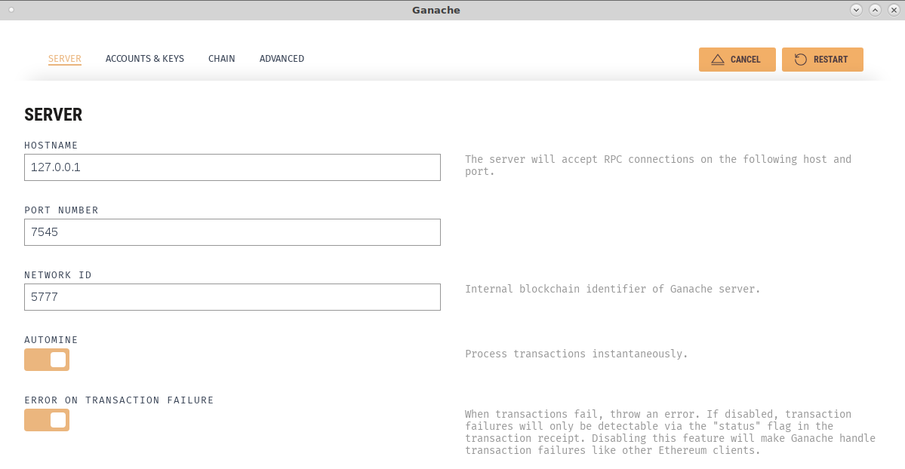


#### truffle.js (ORIGINAL)
```js
module.exports = {
  // See <http://truffleframework.com/docs/advanced/configuration>
  // for more about customizing your Truffle configuration!
  networks: {
    development: {
      host: "127.0.0.1",
      port: 7545,
      network_id: "*" // Match any network id
    }
  }
};
```

#### truffle.js (AMPLIADO) para forzar usar `Ganache` como `blockchain de despliegue` y la `primera cuenta (index 1)` como `owner` 


```js
module.exports = {
  // See <http://truffleframework.com/docs/advanced/configuration>
  // for more about customizing your Truffle configuration!
  networks: {
    development: {
      host: "127.0.0.1",
      port: 7545,
      network_id: "*", // Match any network id
  // optional config values:
   // gas (Gas limit used for deploys. Default is 4712388)
   // gasPrice (Gas price used for deploys. Default is 100000000000 (100 Shannon).)
   // from (From address used during migrations. Defaults to the first available account provided by your Ethereum client.) 
      from: "0x76727BDe041Ba20D8129AFD5A1B6F89c7d8F9ABe" // PRIMERA CUENTA DE GANACHE SI NO SE INDICA ES LA DE POR DEFECTO
   // from: "0x8E1e49f5d9b6Deb602c01254A68d9367E6821c10" // SEGUNDA CUENTA DE GANACHE
   // provider - web3 provider instance Truffle should use to talk to the Ethereum network.
   //          - function that returns a web3 provider instance (see below.)
   //          - if specified, host and port are ignored.
    }
  }
};
```

>NOTA: Se muestra aquí como ejemplo de configuración afinada. Se pensó en un principio utilizar la cuenta segunda para verificar cómo utilizar parámetros de configuración diferentes de los de por defecto pero el ejemplo de front-end usa explicitamente la `Account[0]`. Hasta no conocer a fondo los detalles de  ejemplo se prefiere seguir el guión del tutorial.  

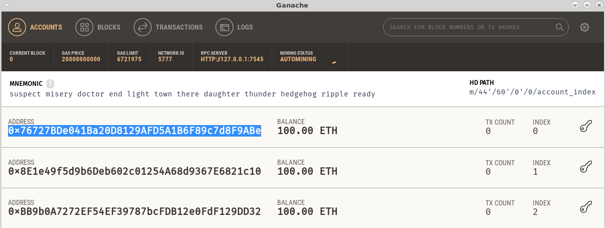

3. Back in our terminal, migrate the contract to the blockchain.

```sh
truffle migrate
```

```sh
devel@vbxdeb8:~/Escritorio/POC/TRUFFLE_PETSTORE/pet-shop-tutorial$ truffle migrate --network development
Using network 'development'.

Running migration: 1_initial_migration.js
  Deploying Migrations...
  ... 0x4292cc0871a8536146cb7d762f8403877d1097197a3aa70b8a518946a3948f76
  Migrations: 0xfc33d1226a339218f67ea795fbfc2045cd2743af
Saving successful migration to network...
  ... 0x5bfc262a133354df7f4bd0499395cd63472297a6d5be9537c1ef3d09b3f96f71
Saving artifacts...
Running migration: 2_deploy_contracts.js
  Deploying Adoption...
  ... 0x927b544eacc28fe203adf74b6223fd8ecf95f87b96fafbf6458a4af5df553ae3
  Adoption: 0xd48ecaf4c8704ae42ea151478b5feab49465dfcd
Saving successful migration to network...
  ... 0xbaf987b538035d9b3565f2b32a401da2c5114eaba0c2739183bb8937e5f1ae4e
Saving artifacts...


```

#### Ganache Logs
```
[10:38:49] Starting server with initial configuration: {"hostname":"127.0.0.1","port":7545,"network_id":5777,"total_accounts":10,"unlocked_accounts":[],"vmErrorsOnRPCResponse":true}
[10:38:49] Ganache started successfully!
[10:38:49] Waiting for requests...
[11:16:15] net_version
[11:16:15] eth_accounts
[11:16:15] net_version
[11:16:15] net_version
[11:16:15] eth_sendTransaction
[11:16:15]   Transaction: 0x4292cc0871a8536146cb7d762f8403877d1097197a3aa70b8a518946a3948f76
[11:16:15]   Contract created: 0xfc33d1226a339218f67ea795fbfc2045cd2743af
[11:16:15]   Gas usage: 277462
[11:16:15]   Block Number: 1
[11:16:15]   Block Time: Thu May 03 2018 11:16:15 GMT+0200 (CEST)
[11:16:15] eth_newBlockFilter
[11:16:15] eth_getFilterChanges
[11:16:15] eth_getTransactionReceipt
[11:16:15] eth_getCode
[11:16:15] eth_uninstallFilter
[11:16:15] eth_sendTransaction
[11:16:16]   Transaction: 0x5bfc262a133354df7f4bd0499395cd63472297a6d5be9537c1ef3d09b3f96f71
[11:16:16]   Gas usage: 42008
[11:16:16]   Block Number: 2
[11:16:16]   Block Time: Thu May 03 2018 11:16:15 GMT+0200 (CEST)
[11:16:16] eth_getTransactionReceipt
[11:16:16] eth_accounts
[11:16:16] net_version
[11:16:16] net_version
[11:16:16] eth_sendTransaction
[11:16:16]   Transaction: 0x927b544eacc28fe203adf74b6223fd8ecf95f87b96fafbf6458a4af5df553ae3
[11:16:16]   Contract created: 0xd48ecaf4c8704ae42ea151478b5feab49465dfcd
[11:16:16]   Gas usage: 246438
[11:16:16]   Block Number: 3
[11:16:16]   Block Time: Thu May 03 2018 11:16:16 GMT+0200 (CEST)
[11:16:16] eth_newBlockFilter
[11:16:16] eth_getFilterChanges
[11:16:16] eth_getTransactionReceipt
[11:16:16] eth_getCode
[11:16:16] eth_uninstallFilter
[11:16:16] eth_sendTransaction
[11:16:16]   Transaction: 0xbaf987b538035d9b3565f2b32a401da2c5114eaba0c2739183bb8937e5f1ae4e
[11:16:16]   Gas usage: 27008
[11:16:16]   Block Number: 4
[11:16:16]   Block Time: Thu May 03 2018 11:16:16 GMT+0200 (CEST)
[11:16:16] eth_getTransactionReceipt
... ... ... ... ...
```
In Ganache, note that the state of the blockchain has changed. The blockchain now shows that the current block, previously 0, is now 4. In addition, while the first account originally had 100 ether, it is now lower, due to the transaction costs of migration. We'll talk more about transaction costs later.

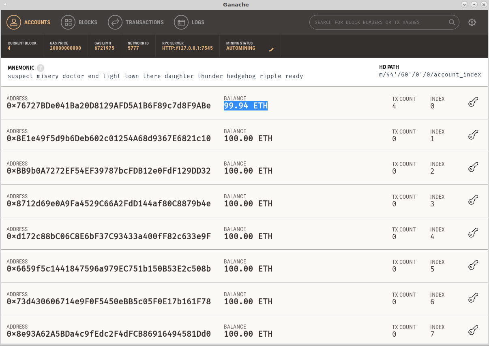

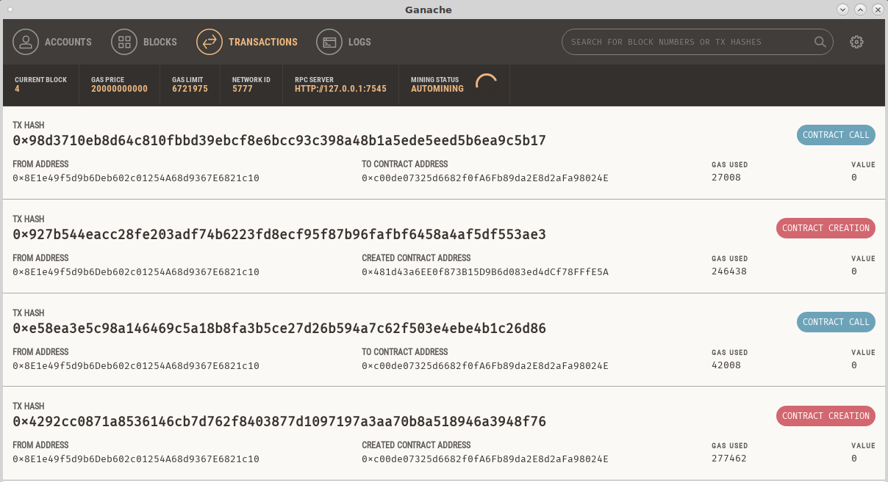

```
Running migration: 1_initial_migration.js
  Deploying Migrations...
  ... 0x4292cc0871a8536146cb7d762f8403877d1097197a3aa70b8a518946a3948f76
  Migrations: 0xfc33d1226a339218f67ea795fbfc2045cd2743af

[11:16:15] eth_sendTransaction
[11:16:15]   Transaction: 0x4292cc0871a8536146cb7d762f8403877d1097197a3aa70b8a518946a3948f76
[11:16:15]   Contract created: 0xfc33d1226a339218f67ea795fbfc2045cd2743af
[11:16:15]   Gas usage: 277462
[11:16:15]   Block Number: 1
[11:16:15]   Block Time: Thu May 03 2018 11:16:15 GMT+0200 (CEST)
```

* Direcciones
  * Contract Address: **0xfc33d1226a339218f67ea795fbfc2045cd2743af** (`Migrations.sol`)
  * Sender Address: **0x76727BDe041Ba20D8129AFD5A1B6F89c7d8F9ABe** (`Account[0]`)(`Owner`)(ver `truffle.js`)

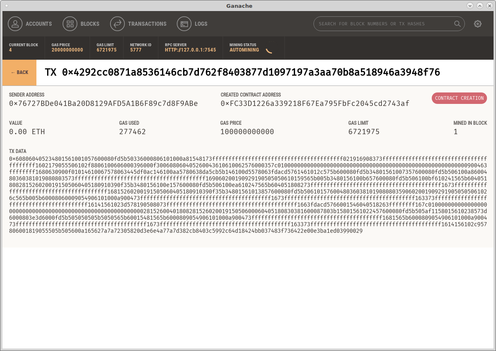

```
Saving successful migration to network...
  ... 0x5bfc262a133354df7f4bd0499395cd63472297a6d5be9537c1ef3d09b3f96f71
Saving artifacts...

[11:16:15] eth_sendTransaction
[11:16:16]   Transaction: 0x5bfc262a133354df7f4bd0499395cd63472297a6d5be9537c1ef3d09b3f96f71
[11:16:16]   Gas usage: 42008
[11:16:16]   Block Number: 2
[11:16:16]   Block Time: Thu May 03 2018 11:16:15 GMT+0200 (CEST)
```
* Direcciones y Datos
  * Contract Address: **0xfc33d1226a339218f67ea795fbfc2045cd2743af** (`Migrations`)
  * Sender Address: **0x76727BDe041Ba20D8129AFD5A1B6F89c7d8F9ABe** (`Account[0]`)(`Owner`)(ver `truffle.js`)
  * Tx Data: **0xfdacd5760000000000000000000000000000000000000000000000000000000000000001**
    * Function Address: **0xfdacd57** (`function setCompleted(uint completed)`)
    * Param value: **0000000000000000000000000000000000000000000000000000000000000001** `uint 256` con valor `1`


#### Migrations.sol
```
pragma solidity ^0.4.17;

contract Migrations {
  address public owner;
  uint public last_completed_migration;

  modifier restricted() {
    if (msg.sender == owner) _;
  }

  function Migrations() public {
    owner = msg.sender;
  }

  function setCompleted(uint completed) public restricted {
    last_completed_migration = completed;
  }

  function upgrade(address new_address) public restricted {
    Migrations upgraded = Migrations(new_address);
    upgraded.setCompleted(last_completed_migration);
  }
}
```

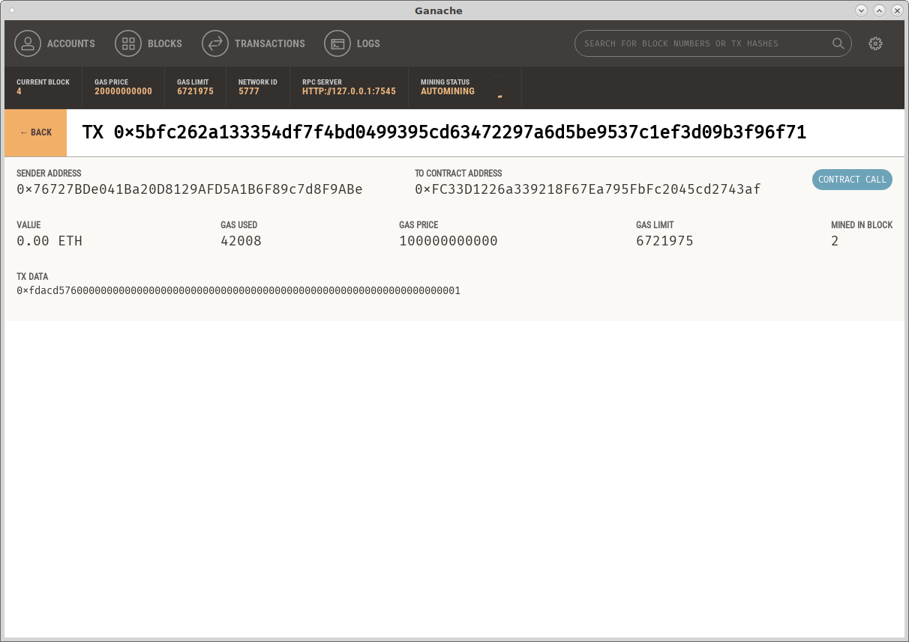

```
Running migration: 2_deploy_contracts.js
  Deploying Adoption...
  ... 0x927b544eacc28fe203adf74b6223fd8ecf95f87b96fafbf6458a4af5df553ae3
  Adoption: 0xd48ecaf4c8704ae42ea151478b5feab49465dfcd

[11:16:16] eth_sendTransaction
[11:16:16]   Transaction: 0x927b544eacc28fe203adf74b6223fd8ecf95f87b96fafbf6458a4af5df553ae3
[11:16:16]   Contract created: 0xd48ecaf4c8704ae42ea151478b5feab49465dfcd
[11:16:16]   Gas usage: 246438
[11:16:16]   Block Number: 3
[11:16:16]   Block Time: Thu May 03 2018 11:16:16 GMT+0200 (CEST)  
```

* Direcciones
  * Contract Address: **0xd48ECAf4c8704aE42eA151478B5FEab49465dfCd** (`Adoptions.sol`)
  * Sender Address: **0x76727BDe041Ba20D8129AFD5A1B6F89c7d8F9ABe** (`Account[0]`)(`Owner`)(ver `truffle.js`)

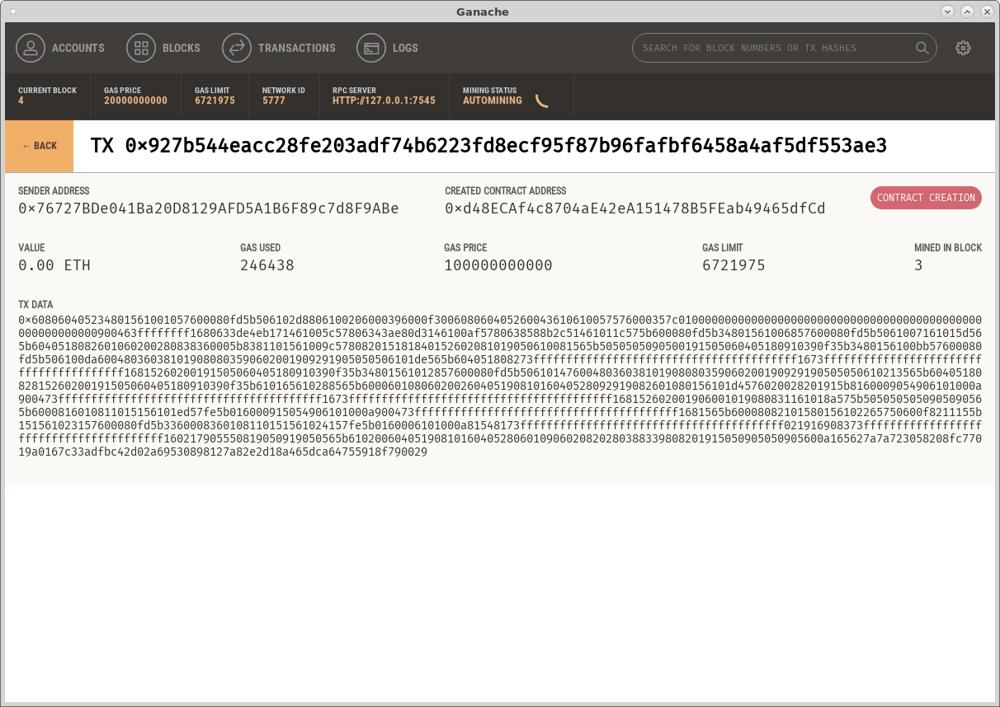

```
Saving successful migration to network...
  ... 0xbaf987b538035d9b3565f2b32a401da2c5114eaba0c2739183bb8937e5f1ae4e
Saving artifacts...

[11:16:16] eth_sendTransaction
[11:16:16]   Transaction: 0xbaf987b538035d9b3565f2b32a401da2c5114eaba0c2739183bb8937e5f1ae4e
[11:16:16]   Gas usage: 27008
[11:16:16]   Block Number: 4
[11:16:16]   Block Time: Thu May 03 2018 11:16:16 GMT+0200 (CEST)
```

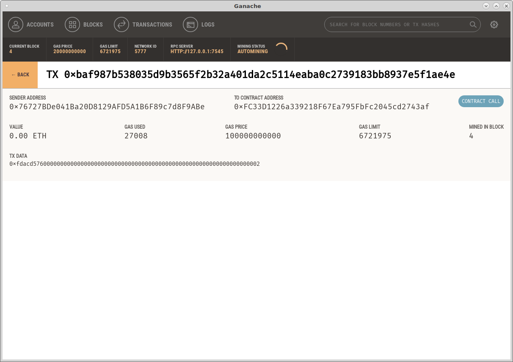

* Direcciones y Datos
  * Contract Address: **0xfc33d1226a339218f67ea795fbfc2045cd2743af** (`Migrations`)
  * Sender Address: **0x76727BDe041Ba20D8129AFD5A1B6F89c7d8F9ABe** (`Account[0]`)(`Owner`)(ver `truffle.js`)
  * Tx Data: **0xfdacd5760000000000000000000000000000000000000000000000000000000000000002**
    * Function Address: **0xfdacd57** (`function setCompleted(uint completed)`)
    * Param value: **0000000000000000000000000000000000000000000000000000000000000002** `uint 256` con valor `2`

#### Migrations.sol
```
pragma solidity ^0.4.17;

contract Migrations {
  address public owner;
  uint public last_completed_migration;

  modifier restricted() {
    if (msg.sender == owner) _;
  }

  function Migrations() public {
    owner = msg.sender;
  }

  function setCompleted(uint completed) public restricted {
    last_completed_migration = completed;
  }

  function upgrade(address new_address) public restricted {
    Migrations upgraded = Migrations(new_address);
    upgraded.setCompleted(last_completed_migration);
  }
}
```


### Traza HTTP realizada durante el proceso de `migration`

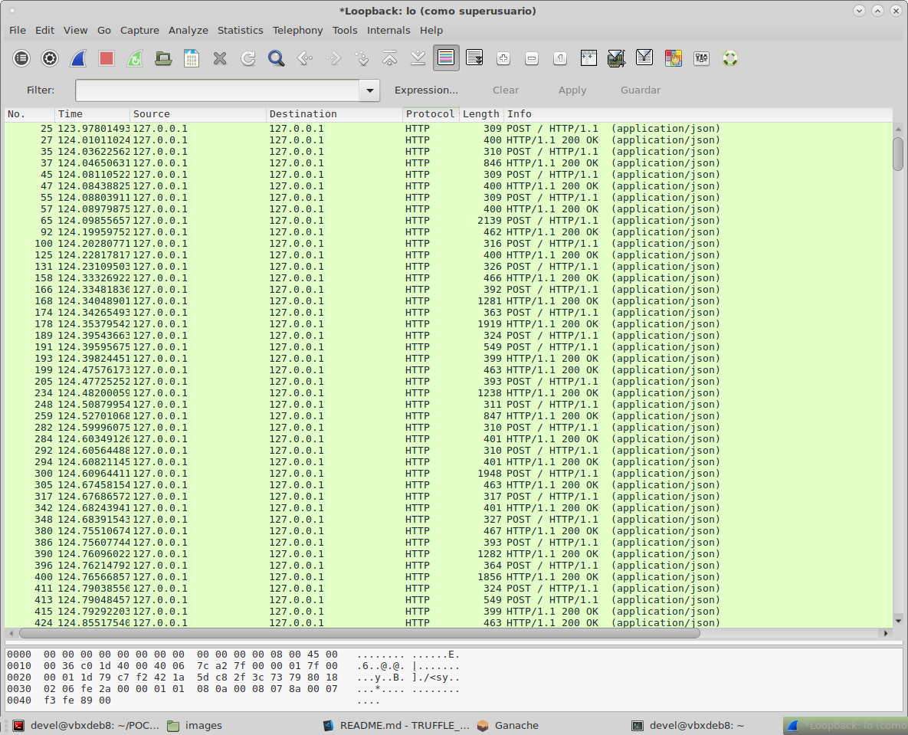

```http
[10:38:49] Starting server with initial configuration: {"hostname":"127.0.0.1","port":7545,"network_id":5777,"total_accounts":10,"unlocked_accounts":[],"vmErrorsOnRPCResponse":true}
[10:38:49] Ganache started successfully!
[10:38:49] Waiting for requests...
	
[11:16:15] net_version

	POST / HTTP/1.1
	Content-Type: application/json
	Connection: keep-alive
	Host: 127.0.0.1:7545
	User-Agent: Mozilla/5.0 (Linux x64) node.js/6.14.2 v8/5.1.281.111
	Content-Length: 59

	{"jsonrpc":"2.0","id":1,"method":"net_version","params":[]}

	HTTP/1.1 200 OK
	Access-Control-Allow-Headers: Origin, X-Requested-With, Content-Type, Accept
	Access-Control-Allow-Origin: *
	Access-Control-Allow-Methods: *
	Content-Type: application/json
	Date: Thu, 03 May 2018 09:16:15 GMT
	Connection: keep-alive
	Transfer-Encoding: chunked

	{"id":1,"jsonrpc":"2.0","result":"5777"}


[11:16:15] eth_accounts

	POST / HTTP/1.1
	Content-Type: application/json
	Connection: keep-alive
	Host: 127.0.0.1:7545
	User-Agent: Mozilla/5.0 (Linux x64) node.js/6.14.2 v8/5.1.281.111
	Content-Length: 60

	{"jsonrpc":"2.0","id":2,"method":"eth_accounts","params":[]}

	HTTP/1.1 200 OK
	Access-Control-Allow-Headers: Origin, X-Requested-With, Content-Type, Accept
	Access-Control-Allow-Origin: *
	Access-Control-Allow-Methods: *
	Content-Type: application/json
	Date: Thu, 03 May 2018 09:16:15 GMT
	Connection: keep-alive
	Transfer-Encoding: chunked

	{
	    "id": 2,
	    "jsonrpc": "2.0",
	    "result": [
		"0x76727bde041ba20d8129afd5a1b6f89c7d8f9abe",
		"0x8e1e49f5d9b6deb602c01254a68d9367e6821c10",
		"0xbb9b0a7272ef54ef39787bcfdb12e0fdf129dd32",
		"0x8712d69e0a9fa4529c66a2fdd144af80c8879b4e",
		"0xd172c88bc06c8e6bf37c93433a400ff82c633e9f",
		"0x6659f5c1441847596a979ec751b150b53e2c508b",
		"0x73d430606714e9f0f5450ebb5c05f0e17b161f78",
		"0x8e93a62a5bda4c9fedc2f4dfcb86916494581dd0",
		"0xed7e778966480e414ec6e97e1d247863bb4d8333",
		"0x4eb2bafa7b5d13cf0ab89ff8a00a172b580963f4"
	    ]
	}

[11:16:15] net_version

	POST / HTTP/1.1
	Content-Type: application/json
	Connection: keep-alive
	Host: 127.0.0.1:7545
	User-Agent: Mozilla/5.0 (Linux x64) node.js/6.14.2 v8/5.1.281.111
	Content-Length: 59

	{"jsonrpc":"2.0","id":3,"method":"net_version","params":[]}
	
	HTTP/1.1 200 OK
	Access-Control-Allow-Headers: Origin, X-Requested-With, Content-Type, Accept
	Access-Control-Allow-Origin: *
	Access-Control-Allow-Methods: *
	Content-Type: application/json
	Date: Thu, 03 May 2018 09:16:15 GMT
	Connection: keep-alive
	Transfer-Encoding: chunked

	{"id":3,"jsonrpc":"2.0","result":"5777"}

[11:16:15] net_version

	POST / HTTP/1.1
	Content-Type: application/json
	Connection: keep-alive
	Host: 127.0.0.1:7545
	User-Agent: Mozilla/5.0 (Linux x64) node.js/6.14.2 v8/5.1.281.111
	Content-Length: 59

	{"jsonrpc":"2.0","id":4,"method":"net_version","params":[]}
	
	HTTP/1.1 200 OK
	Access-Control-Allow-Headers: Origin, X-Requested-With, Content-Type, Accept
	Access-Control-Allow-Origin: *
	Access-Control-Allow-Methods: *
	Content-Type: application/json
	Date: Thu, 03 May 2018 09:16:15 GMT
	Connection: keep-alive
	Transfer-Encoding: chunked

	{"id":4,"jsonrpc":"2.0","result":"5777"}

[11:16:15] eth_sendTransaction
[11:16:15]   Transaction: 0x4292cc0871a8536146cb7d762f8403877d1097197a3aa70b8a518946a3948f76
[11:16:15]   Contract created: 0xfc33d1226a339218f67ea795fbfc2045cd2743af
[11:16:15]   Gas usage: 277462
[11:16:15]   Block Number: 1
[11:16:15]   Block Time: Thu May 03 2018 11:16:15 GMT+0200 (CEST)


	POST / HTTP/1.1
	Content-Type: application/json
	Connection: keep-alive
	Host: 127.0.0.1:7545
	User-Agent: Mozilla/5.0 (Linux x64) node.js/6.14.2 v8/5.1.281.111
	Content-Length: 1887

	{
	    "jsonrpc": "2.0",
	    "id": 5,
	    "method": "eth_sendTransaction",
	    "params": [
		{
		    "from": "0x76727BDe041Ba20D8129AFD5A1B6F89c7d8F9ABe",
		    "gas": "0x6691b7",
		    "gasPrice": "0x174876e800",
		    "data": "0x608060405234801561001057600080fd5b50336000806101000a81548173ffffffffffffffffffffffffffffffffffffffff021916908373ffffffffffffffffffffffffffffffffffffffff1602179055506102f8806100606000396000f300608060405260043610610062576000357c0100000000000000000000000000000000000000000000000000000000900463ffffffff1680630900f01014610067578063445df0ac146100aa5780638da5cb5b146100d5578063fdacd5761461012c575b600080fd5b34801561007357600080fd5b506100a8600480360381019080803573ffffffffffffffffffffffffffffffffffffffff169060200190929190505050610159565b005b3480156100b657600080fd5b506100bf610241565b6040518082815260200191505060405180910390f35b3480156100e157600080fd5b506100ea610247565b604051808273ffffffffffffffffffffffffffffffffffffffff1673ffffffffffffffffffffffffffffffffffffffff16815260200191505060405180910390f35b34801561013857600080fd5b506101576004803603810190808035906020019092919050505061026c565b005b60008060009054906101000a900473ffffffffffffffffffffffffffffffffffffffff1673ffffffffffffffffffffffffffffffffffffffff163373ffffffffffffffffffffffffffffffffffffffff16141561023d578190508073ffffffffffffffffffffffffffffffffffffffff1663fdacd5766001546040518263ffffffff167c010000000000000000000000000000000000000000000000000000000002815260040180828152602001915050600060405180830381600087803b15801561022457600080fd5b505af1158015610238573d6000803e3d6000fd5b505050505b5050565b60015481565b6000809054906101000a900473ffffffffffffffffffffffffffffffffffffffff1681565b6000809054906101000a900473ffffffffffffffffffffffffffffffffffffffff1673ffffffffffffffffffffffffffffffffffffffff163373ffffffffffffffffffffffffffffffffffffffff1614156102c957806001819055505b505600a165627a7a72305820d3e6e4a77a7d382cb8403c5992c64d18424bb037483f736422e00e3ba1ed03990029"
		}
	    ]
	}
	
	HTTP/1.1 200 OK
	Access-Control-Allow-Headers: Origin, X-Requested-With, Content-Type, Accept
	Access-Control-Allow-Origin: *
	Access-Control-Allow-Methods: *
	Content-Type: application/json
	Date: Thu, 03 May 2018 09:16:15 GMT
	Connection: keep-alive
	Transfer-Encoding: chunked

	{
	    "id": 5,
	    "jsonrpc": "2.0",
	    "result": "0x4292cc0871a8536146cb7d762f8403877d1097197a3aa70b8a518946a3948f76"
	}

[11:16:15] eth_newBlockFilter

	POST / HTTP/1.1
	Content-Type: application/json
	Connection: keep-alive
	Host: 127.0.0.1:7545
	User-Agent: Mozilla/5.0 (Linux x64) node.js/6.14.2 v8/5.1.281.111
	Content-Length: 66

	{"jsonrpc":"2.0","id":6,"method":"eth_newBlockFilter","params":[]}
	
	HTTP/1.1 200 OK
	Access-Control-Allow-Headers: Origin, X-Requested-With, Content-Type, Accept
	Access-Control-Allow-Origin: *
	Access-Control-Allow-Methods: *
	Content-Type: application/json
	Date: Thu, 03 May 2018 09:16:15 GMT
	Connection: keep-alive
	Transfer-Encoding: chunked

	{"id":6,"jsonrpc":"2.0","result":"0x02"}

[11:16:15] eth_getFilterChanges

	POST / HTTP/1.1
	Content-Type: application/json
	Connection: keep-alive
	Host: 127.0.0.1:7545
	User-Agent: Mozilla/5.0 (Linux x64) node.js/6.14.2 v8/5.1.281.111
	Content-Length: 76

	[{"jsonrpc":"2.0","id":7,"method":"eth_getFilterChanges","params":["0x02"]}]
	
	HTTP/1.1 200 OK
	Access-Control-Allow-Headers: Origin, X-Requested-With, Content-Type, Accept
	Access-Control-Allow-Origin: *
	Access-Control-Allow-Methods: *
	Content-Type: application/json
	Date: Thu, 03 May 2018 09:16:15 GMT
	Connection: keep-alive
	Transfer-Encoding: chunked

	[{"id":7,"jsonrpc":"2.0","result":["0xdb5812b2b10cb893b63e4b39249e58f03a00d02cbc68aa84363e61efdf506c24"]}]

[11:16:15] eth_getTransactionReceipt

	POST / HTTP/1.1
	Content-Type: application/json
	Connection: keep-alive
	Host: 127.0.0.1:7545
	User-Agent: Mozilla/5.0 (Linux x64) node.js/6.14.2 v8/5.1.281.111
	Content-Length: 141

	{
	    "jsonrpc": "2.0",
	    "id": 8,
	    "method": "eth_getTransactionReceipt",
	    "params": [
		"0x4292cc0871a8536146cb7d762f8403877d1097197a3aa70b8a518946a3948f76"
	    ]
	}


	HTTP/1.1 200 OK
	Access-Control-Allow-Headers: Origin, X-Requested-With, Content-Type, Accept
	Access-Control-Allow-Origin: *
	Access-Control-Allow-Methods: *
	Content-Type: application/json
	Date: Thu, 03 May 2018 09:16:15 GMT
	Connection: keep-alive
	Transfer-Encoding: chunked

	{
	    "id": 8,
	    "jsonrpc": "2.0",
	    "result": {
		"transactionHash": "0x4292cc0871a8536146cb7d762f8403877d1097197a3aa70b8a518946a3948f76",
		"transactionIndex": "0x00",
		"blockHash": "0xc1f247d2962b430c8471dad7d86c9b8c4da67eebed4995f8bb81722287926b2c",
		"blockNumber": "0x01",
		"gasUsed": "0x043bd6",
		"cumulativeGasUsed": "0x043bd6",
		"contractAddress": "0xfc33d1226a339218f67ea795fbfc2045cd2743af",
		"logs": [],
		"status": "0x01",
		"logsBloom": "0x00000000000000000000000000000000000000000000000000000000000000000000000000000000000000000000000000000000000000000000000000000000000000000000000000000000000000000000000000000000000000000000000000000000000000000000000000000000000000000000000000000000000000000000000000000000000000000000000000000000000000000000000000000000000000000000000000000000000000000000000000000000000000000000000000000000000000000000000000000000000000000000000000000000000000000000000000000000000000000000000000000000000000000000000000000000"
	    }
	}

[11:16:15] eth_getCode

	POST / HTTP/1.1
	Content-Type: application/json
	Connection: keep-alive
	Host: 127.0.0.1:7545
	User-Agent: Mozilla/5.0 (Linux x64) node.js/6.14.2 v8/5.1.281.111
	Content-Length: 112

	{
	    "jsonrpc": "2.0",
	    "id": 9,
	    "method": "eth_getCode",
	    "params": [
		"0xfc33d1226a339218f67ea795fbfc2045cd2743af",
		"latest"
	    ]
	}

	HTTP/1.1 200 OK
	Access-Control-Allow-Headers: Origin, X-Requested-With, Content-Type, Accept
	Access-Control-Allow-Origin: *
	Access-Control-Allow-Methods: *
	Content-Type: application/json
	Date: Thu, 03 May 2018 09:16:15 GMT
	Connection: keep-alive
	Transfer-Encoding: chunked

	{
	    "id": 9,
	    "jsonrpc": "2.0",
	    "result": "0x608060405260043610610062576000357c0100000000000000000000000000000000000000000000000000000000900463ffffffff1680630900f01014610067578063445df0ac146100aa5780638da5cb5b146100d5578063fdacd5761461012c575b600080fd5b34801561007357600080fd5b506100a8600480360381019080803573ffffffffffffffffffffffffffffffffffffffff169060200190929190505050610159565b005b3480156100b657600080fd5b506100bf610241565b6040518082815260200191505060405180910390f35b3480156100e157600080fd5b506100ea610247565b604051808273ffffffffffffffffffffffffffffffffffffffff1673ffffffffffffffffffffffffffffffffffffffff16815260200191505060405180910390f35b34801561013857600080fd5b506101576004803603810190808035906020019092919050505061026c565b005b60008060009054906101000a900473ffffffffffffffffffffffffffffffffffffffff1673ffffffffffffffffffffffffffffffffffffffff163373ffffffffffffffffffffffffffffffffffffffff16141561023d578190508073ffffffffffffffffffffffffffffffffffffffff1663fdacd5766001546040518263ffffffff167c010000000000000000000000000000000000000000000000000000000002815260040180828152602001915050600060405180830381600087803b15801561022457600080fd5b505af1158015610238573d6000803e3d6000fd5b505050505b5050565b60015481565b6000809054906101000a900473ffffffffffffffffffffffffffffffffffffffff1681565b6000809054906101000a900473ffffffffffffffffffffffffffffffffffffffff1673ffffffffffffffffffffffffffffffffffffffff163373ffffffffffffffffffffffffffffffffffffffff1614156102c957806001819055505b505600a165627a7a72305820d3e6e4a77a7d382cb8403c5992c64d18424bb037483f736422e00e3ba1ed03990029"
	}

[11:16:15] eth_uninstallFilter

	POST / HTTP/1.1
	Content-Type: application/json
	Connection: keep-alive
	Host: 127.0.0.1:7545
	User-Agent: Mozilla/5.0 (Linux x64) node.js/6.14.2 v8/5.1.281.111
	Content-Length: 74

	{"jsonrpc":"2.0","id":10,"method":"eth_uninstallFilter","params":["0x02"]}

	HTTP/1.1 200 OK
	Access-Control-Allow-Headers: Origin, X-Requested-With, Content-Type, Accept
	Access-Control-Allow-Origin: *
	Access-Control-Allow-Methods: *
	Content-Type: application/json
	Date: Thu, 03 May 2018 09:16:15 GMT
	Connection: keep-alive
	Transfer-Encoding: chunked

	{"id":10,"jsonrpc":"2.0","result":true}

[11:16:15] eth_sendTransaction
[11:16:16]   Transaction: 0x5bfc262a133354df7f4bd0499395cd63472297a6d5be9537c1ef3d09b3f96f71
[11:16:16]   Gas usage: 42008
[11:16:16]   Block Number: 2
[11:16:16]   Block Time: Thu May 03 2018 11:16:15 GMT+0200 (CEST)

	POST / HTTP/1.1
	Content-Type: application/json
	Connection: keep-alive
	Host: 127.0.0.1:7545
	User-Agent: Mozilla/5.0 (Linux x64) node.js/6.14.2 v8/5.1.281.111
	Content-Length: 298

	{
	    "jsonrpc": "2.0",
	    "id": 11,
	    "method": "eth_sendTransaction",
	    "params": [
		{
		    "from": "0x76727BDe041Ba20D8129AFD5A1B6F89c7d8F9ABe",
		    "gas": "0x6691b7",
		    "gasPrice": "0x174876e800",
		    "to": "0xfc33d1226a339218f67ea795fbfc2045cd2743af",
		    "data": "0xfdacd5760000000000000000000000000000000000000000000000000000000000000001"
		}
	    ]
	}

	HTTP/1.1 200 OK
	Access-Control-Allow-Headers: Origin, X-Requested-With, Content-Type, Accept
	Access-Control-Allow-Origin: *
	Access-Control-Allow-Methods: *
	Content-Type: application/json
	Date: Thu, 03 May 2018 09:16:16 GMT
	Connection: keep-alive
	Transfer-Encoding: chunked

	{
	    "id": 11,
	    "jsonrpc": "2.0",
	    "result": "0x5bfc262a133354df7f4bd0499395cd63472297a6d5be9537c1ef3d09b3f96f71"
	}

[11:16:16] eth_getTransactionReceipt

	POST / HTTP/1.1
	Content-Type: application/json
	Connection: keep-alive
	Host: 127.0.0.1:7545
	User-Agent: Mozilla/5.0 (Linux x64) node.js/6.14.2 v8/5.1.281.111
	Content-Length: 142

	{
	    "jsonrpc": "2.0",
	    "id": 12,
	    "method": "eth_getTransactionReceipt",
	    "params": [
		"0x5bfc262a133354df7f4bd0499395cd63472297a6d5be9537c1ef3d09b3f96f71"
	    ]
	}

	HTTP/1.1 200 OK
	Access-Control-Allow-Headers: Origin, X-Requested-With, Content-Type, Accept
	Access-Control-Allow-Origin: *
	Access-Control-Allow-Methods: *
	Content-Type: application/json
	Date: Thu, 03 May 2018 09:16:16 GMT
	Connection: keep-alive
	Transfer-Encoding: chunked

	{
	    "id": 12,
	    "jsonrpc": "2.0",
	    "result": {
		"transactionHash": "0x5bfc262a133354df7f4bd0499395cd63472297a6d5be9537c1ef3d09b3f96f71",
		"transactionIndex": "0x00",
		"blockHash": "0x284529a809db09175e2c7c1faeb4e9447825954a269caaca070a855577f48400",
		"blockNumber": "0x02",
		"gasUsed": "0xa418",
		"cumulativeGasUsed": "0xa418",
		"contractAddress": null,
		"logs": [],
		"status": "0x01",
		"logsBloom": "0x00000000000000000000000000000000000000000000000000000000000000000000000000000000000000000000000000000000000000000000000000000000000000000000000000000000000000000000000000000000000000000000000000000000000000000000000000000000000000000000000000000000000000000000000000000000000000000000000000000000000000000000000000000000000000000000000000000000000000000000000000000000000000000000000000000000000000000000000000000000000000000000000000000000000000000000000000000000000000000000000000000000000000000000000000000000"
	    }
	}

[11:16:16] eth_accounts

	POST / HTTP/1.1
	Content-Type: application/json
	Connection: keep-alive
	Host: 127.0.0.1:7545
	User-Agent: Mozilla/5.0 (Linux x64) node.js/6.14.2 v8/5.1.281.111
	Content-Length: 61

	{"jsonrpc":"2.0","id":13,"method":"eth_accounts","params":[]}

	HTTP/1.1 200 OK
	Access-Control-Allow-Headers: Origin, X-Requested-With, Content-Type, Accept
	Access-Control-Allow-Origin: *
	Access-Control-Allow-Methods: *
	Content-Type: application/json
	Date: Thu, 03 May 2018 09:16:16 GMT
	Connection: keep-alive
	Transfer-Encoding: chunked

	{
	    "id": 13,
	    "jsonrpc": "2.0",
	    "result": [
		"0x76727bde041ba20d8129afd5a1b6f89c7d8f9abe",
		"0x8e1e49f5d9b6deb602c01254a68d9367e6821c10",
		"0xbb9b0a7272ef54ef39787bcfdb12e0fdf129dd32",
		"0x8712d69e0a9fa4529c66a2fdd144af80c8879b4e",
		"0xd172c88bc06c8e6bf37c93433a400ff82c633e9f",
		"0x6659f5c1441847596a979ec751b150b53e2c508b",
		"0x73d430606714e9f0f5450ebb5c05f0e17b161f78",
		"0x8e93a62a5bda4c9fedc2f4dfcb86916494581dd0",
		"0xed7e778966480e414ec6e97e1d247863bb4d8333",
		"0x4eb2bafa7b5d13cf0ab89ff8a00a172b580963f4"
	    ]
	}

[11:16:16] net_version

	POST / HTTP/1.1
	Content-Type: application/json
	Connection: keep-alive
	Host: 127.0.0.1:7545
	User-Agent: Mozilla/5.0 (Linux x64) node.js/6.14.2 v8/5.1.281.111
	Content-Length: 60

	{"jsonrpc":"2.0","id":14,"method":"net_version","params":[]}
	
	HTTP/1.1 200 OK
	Access-Control-Allow-Headers: Origin, X-Requested-With, Content-Type, Accept
	Access-Control-Allow-Origin: *
	Access-Control-Allow-Methods: *
	Content-Type: application/json
	Date: Thu, 03 May 2018 09:16:16 GMT
	Connection: keep-alive
	Transfer-Encoding: chunked

	{"id":14,"jsonrpc":"2.0","result":"5777"}

[11:16:16] net_version

	POST / HTTP/1.1
	Content-Type: application/json
	Connection: keep-alive
	Host: 127.0.0.1:7545
	User-Agent: Mozilla/5.0 (Linux x64) node.js/6.14.2 v8/5.1.281.111
	Content-Length: 60

	{"jsonrpc":"2.0","id":15,"method":"net_version","params":[]}
	
	HTTP/1.1 200 OK
	Access-Control-Allow-Headers: Origin, X-Requested-With, Content-Type, Accept
	Access-Control-Allow-Origin: *
	Access-Control-Allow-Methods: *
	Content-Type: application/json
	Date: Thu, 03 May 2018 09:16:16 GMT
	Connection: keep-alive
	Transfer-Encoding: chunked

	{"id":15,"jsonrpc":"2.0","result":"5777"}

[11:16:16] eth_sendTransaction
[11:16:16]   Transaction: 0x927b544eacc28fe203adf74b6223fd8ecf95f87b96fafbf6458a4af5df553ae3
[11:16:16]   Contract created: 0xd48ecaf4c8704ae42ea151478b5feab49465dfcd
[11:16:16]   Gas usage: 246438
[11:16:16]   Block Number: 3
[11:16:16]   Block Time: Thu May 03 2018 11:16:16 GMT+0200 (CEST)

	POST / HTTP/1.1
	Content-Type: application/json
	Connection: keep-alive
	Host: 127.0.0.1:7545
	User-Agent: Mozilla/5.0 (Linux x64) node.js/6.14.2 v8/5.1.281.111
	Content-Length: 1696

	{
	    "jsonrpc": "2.0",
	    "id": 16,
	    "method": "eth_sendTransaction",
	    "params": [
		{
		    "from": "0x76727BDe041Ba20D8129AFD5A1B6F89c7d8F9ABe",
		    "gas": "0x6691b7",
		    "gasPrice": "0x174876e800",
		    "data": "0x608060405234801561001057600080fd5b506102d8806100206000396000f300608060405260043610610057576000357c0100000000000000000000000000000000000000000000000000000000900463ffffffff1680633de4eb171461005c57806343ae80d3146100af5780638588b2c51461011c575b600080fd5b34801561006857600080fd5b5061007161015d565b6040518082601060200280838360005b8381101561009c578082015181840152602081019050610081565b5050505090500191505060405180910390f35b3480156100bb57600080fd5b506100da600480360381019080803590602001909291905050506101de565b604051808273ffffffffffffffffffffffffffffffffffffffff1673ffffffffffffffffffffffffffffffffffffffff16815260200191505060405180910390f35b34801561012857600080fd5b5061014760048036038101908080359060200190929190505050610213565b6040518082815260200191505060405180910390f35b610165610288565b60006010806020026040519081016040528092919082601080156101d4576020028201915b8160009054906101000a900473ffffffffffffffffffffffffffffffffffffffff1673ffffffffffffffffffffffffffffffffffffffff168152602001906001019080831161018a575b5050505050905090565b6000816010811015156101ed57fe5b016000915054906101000a900473ffffffffffffffffffffffffffffffffffffffff1681565b60008082101580156102265750600f8211155b151561023157600080fd5b3360008360108110151561024157fe5b0160006101000a81548173ffffffffffffffffffffffffffffffffffffffff021916908373ffffffffffffffffffffffffffffffffffffffff160217905550819050919050565b610200604051908101604052806010906020820280388339808201915050905050905600a165627a7a723058208fc77019a0167c33adfbc42d02a69530898127a82e2d18a465dca64755918f790029"
		}
	    ]
	}

	HTTP/1.1 200 OK
	Access-Control-Allow-Headers: Origin, X-Requested-With, Content-Type, Accept
	Access-Control-Allow-Origin: *
	Access-Control-Allow-Methods: *
	Content-Type: application/json
	Date: Thu, 03 May 2018 09:16:16 GMT
	Connection: keep-alive
	Transfer-Encoding: chunked

	{
	    "id": 16,
	    "jsonrpc": "2.0",
	    "result": "0x927b544eacc28fe203adf74b6223fd8ecf95f87b96fafbf6458a4af5df553ae3"
	}

[11:16:16] eth_newBlockFilter

	POST / HTTP/1.1
	Content-Type: application/json
	Connection: keep-alive
	Host: 127.0.0.1:7545
	User-Agent: Mozilla/5.0 (Linux x64) node.js/6.14.2 v8/5.1.281.111
	Content-Length: 67

	{"jsonrpc":"2.0","id":17,"method":"eth_newBlockFilter","params":[]}
	
	HTTP/1.1 200 OK
	Access-Control-Allow-Headers: Origin, X-Requested-With, Content-Type, Accept
	Access-Control-Allow-Origin: *
	Access-Control-Allow-Methods: *
	Content-Type: application/json
	Date: Thu, 03 May 2018 09:16:16 GMT
	Connection: keep-alive
	Transfer-Encoding: chunked

	{"id":17,"jsonrpc":"2.0","result":"0x03"}

[11:16:16] eth_getFilterChanges

	POST / HTTP/1.1
	Content-Type: application/json
	Connection: keep-alive
	Host: 127.0.0.1:7545
	User-Agent: Mozilla/5.0 (Linux x64) node.js/6.14.2 v8/5.1.281.111
	Content-Length: 77

	[{"jsonrpc":"2.0","id":18,"method":"eth_getFilterChanges","params":["0x03"]}]
	
	HTTP/1.1 200 OK
	Access-Control-Allow-Headers: Origin, X-Requested-With, Content-Type, Accept
	Access-Control-Allow-Origin: *
	Access-Control-Allow-Methods: *
	Content-Type: application/json
	Date: Thu, 03 May 2018 09:16:16 GMT
	Connection: keep-alive
	Transfer-Encoding: chunked

	[{"id":18,"jsonrpc":"2.0","result":["0x284529a809db09175e2c7c1faeb4e9447825954a269caaca070a855577f48400"]}]

[11:16:16] eth_getTransactionReceipt

	POST / HTTP/1.1
	Content-Type: application/json
	Connection: keep-alive
	Host: 127.0.0.1:7545
	User-Agent: Mozilla/5.0 (Linux x64) node.js/6.14.2 v8/5.1.281.111
	Content-Length: 142

	{
	    "jsonrpc": "2.0",
	    "id": 19,
	    "method": "eth_getTransactionReceipt",
	    "params": [
		"0x927b544eacc28fe203adf74b6223fd8ecf95f87b96fafbf6458a4af5df553ae3"
	    ]
	}

	HTTP/1.1 200 OK
	Access-Control-Allow-Headers: Origin, X-Requested-With, Content-Type, Accept
	Access-Control-Allow-Origin: *
	Access-Control-Allow-Methods: *
	Content-Type: application/json
	Date: Thu, 03 May 2018 09:16:16 GMT
	Connection: keep-alive
	Transfer-Encoding: chunked

	{
	    "id": 19,
	    "jsonrpc": "2.0",
	    "result": {
		"transactionHash": "0x927b544eacc28fe203adf74b6223fd8ecf95f87b96fafbf6458a4af5df553ae3",
		"transactionIndex": "0x00",
		"blockHash": "0xf8180765a156a66712c5dbe567b04550faf1d5b298bec623d7a6c85f99d367f7",
		"blockNumber": "0x03",
		"gasUsed": "0x03c2a6",
		"cumulativeGasUsed": "0x03c2a6",
		"contractAddress": "0xd48ecaf4c8704ae42ea151478b5feab49465dfcd",
		"logs": [],
		"status": "0x01",
		"logsBloom": "0x00000000000000000000000000000000000000000000000000000000000000000000000000000000000000000000000000000000000000000000000000000000000000000000000000000000000000000000000000000000000000000000000000000000000000000000000000000000000000000000000000000000000000000000000000000000000000000000000000000000000000000000000000000000000000000000000000000000000000000000000000000000000000000000000000000000000000000000000000000000000000000000000000000000000000000000000000000000000000000000000000000000000000000000000000000000"
	    }
	}

[11:16:16] eth_getCode

	POST / HTTP/1.1
	Content-Type: application/json
	Connection: keep-alive
	Host: 127.0.0.1:7545
	User-Agent: Mozilla/5.0 (Linux x64) node.js/6.14.2 v8/5.1.281.111
	Content-Length: 113

	{
	    "jsonrpc": "2.0",
	    "id": 20,
	    "method": "eth_getCode",
	    "params": [
		"0xd48ecaf4c8704ae42ea151478b5feab49465dfcd",
		"latest"
	    ]
	}

	HTTP/1.1 200 OK
	Access-Control-Allow-Headers: Origin, X-Requested-With, Content-Type, Accept
	Access-Control-Allow-Origin: *
	Access-Control-Allow-Methods: *
	Content-Type: application/json
	Date: Thu, 03 May 2018 09:16:16 GMT
	Connection: keep-alive
	Transfer-Encoding: chunked

	{
	    "id": 20,
	    "jsonrpc": "2.0",
	    "result": "0x608060405260043610610057576000357c0100000000000000000000000000000000000000000000000000000000900463ffffffff1680633de4eb171461005c57806343ae80d3146100af5780638588b2c51461011c575b600080fd5b34801561006857600080fd5b5061007161015d565b6040518082601060200280838360005b8381101561009c578082015181840152602081019050610081565b5050505090500191505060405180910390f35b3480156100bb57600080fd5b506100da600480360381019080803590602001909291905050506101de565b604051808273ffffffffffffffffffffffffffffffffffffffff1673ffffffffffffffffffffffffffffffffffffffff16815260200191505060405180910390f35b34801561012857600080fd5b5061014760048036038101908080359060200190929190505050610213565b6040518082815260200191505060405180910390f35b610165610288565b60006010806020026040519081016040528092919082601080156101d4576020028201915b8160009054906101000a900473ffffffffffffffffffffffffffffffffffffffff1673ffffffffffffffffffffffffffffffffffffffff168152602001906001019080831161018a575b5050505050905090565b6000816010811015156101ed57fe5b016000915054906101000a900473ffffffffffffffffffffffffffffffffffffffff1681565b60008082101580156102265750600f8211155b151561023157600080fd5b3360008360108110151561024157fe5b0160006101000a81548173ffffffffffffffffffffffffffffffffffffffff021916908373ffffffffffffffffffffffffffffffffffffffff160217905550819050919050565b610200604051908101604052806010906020820280388339808201915050905050905600a165627a7a723058208fc77019a0167c33adfbc42d02a69530898127a82e2d18a465dca64755918f790029"
	}

[11:16:16] eth_uninstallFilter

	POST / HTTP/1.1
	Content-Type: application/json
	Connection: keep-alive
	Host: 127.0.0.1:7545
	User-Agent: Mozilla/5.0 (Linux x64) node.js/6.14.2 v8/5.1.281.111
	Content-Length: 74

	{"jsonrpc":"2.0","id":21,"method":"eth_uninstallFilter","params":["0x03"]}

	HTTP/1.1 200 OK
	Access-Control-Allow-Headers: Origin, X-Requested-With, Content-Type, Accept
	Access-Control-Allow-Origin: *
	Access-Control-Allow-Methods: *
	Content-Type: application/json
	Date: Thu, 03 May 2018 09:16:16 GMT
	Connection: keep-alive
	Transfer-Encoding: chunked

	{"id":21,"jsonrpc":"2.0","result":true}


[11:16:16] eth_sendTransaction
[11:16:16]   Transaction: 0xbaf987b538035d9b3565f2b32a401da2c5114eaba0c2739183bb8937e5f1ae4e
[11:16:16]   Gas usage: 27008
[11:16:16]   Block Number: 4
[11:16:16]   Block Time: Thu May 03 2018 11:16:16 GMT+0200 (CEST)

	POST / HTTP/1.1
	Content-Type: application/json
	Connection: keep-alive
	Host: 127.0.0.1:7545
	User-Agent: Mozilla/5.0 (Linux x64) node.js/6.14.2 v8/5.1.281.111
	Content-Length: 298

	{
	    "jsonrpc": "2.0",
	    "id": 22,
	    "method": "eth_sendTransaction",
	    "params": [
		{
		    "from": "0x76727BDe041Ba20D8129AFD5A1B6F89c7d8F9ABe",
		    "gas": "0x6691b7",
		    "gasPrice": "0x174876e800",
		    "to": "0xfc33d1226a339218f67ea795fbfc2045cd2743af",
		    "data": "0xfdacd5760000000000000000000000000000000000000000000000000000000000000002"
		}
	    ]
	}

	HTTP/1.1 200 OK
	Access-Control-Allow-Headers: Origin, X-Requested-With, Content-Type, Accept
	Access-Control-Allow-Origin: *
	Access-Control-Allow-Methods: *
	Content-Type: application/json
	Date: Thu, 03 May 2018 09:16:16 GMT
	Connection: keep-alive
	Transfer-Encoding: chunked

	{
	    "id": 22,
	    "jsonrpc": "2.0",
	    "result": "0xbaf987b538035d9b3565f2b32a401da2c5114eaba0c2739183bb8937e5f1ae4e"
	}


[11:16:16] eth_getTransactionReceipt


	POST / HTTP/1.1
	Content-Type: application/json
	Connection: keep-alive
	Host: 127.0.0.1:7545
	User-Agent: Mozilla/5.0 (Linux x64) node.js/6.14.2 v8/5.1.281.111
	Content-Length: 142

	{
	    "jsonrpc": "2.0",
	    "id": 23,
	    "method": "eth_getTransactionReceipt",
	    "params": [
		"0xbaf987b538035d9b3565f2b32a401da2c5114eaba0c2739183bb8937e5f1ae4e"
	    ]
	}

	HTTP/1.1 200 OK
	Access-Control-Allow-Headers: Origin, X-Requested-With, Content-Type, Accept
	Access-Control-Allow-Origin: *
	Access-Control-Allow-Methods: *
	Content-Type: application/json
	Date: Thu, 03 May 2018 09:16:16 GMT
	Connection: keep-alive
	Transfer-Encoding: chunked

	{
	    "id": 23,
	    "jsonrpc": "2.0",
	    "result": {
		"transactionHash": "0xbaf987b538035d9b3565f2b32a401da2c5114eaba0c2739183bb8937e5f1ae4e",
		"transactionIndex": "0x00",
		"blockHash": "0x2ea818d294e220a6887da1abb5e45416daf036efc2b7fe00ec7d36ea3ba840bb",
		"blockNumber": "0x04",
		"gasUsed": "0x6980",
		"cumulativeGasUsed": "0x6980",
		"contractAddress": null,
		"logs": [],
		"status": "0x01",
		"logsBloom": "0x00000000000000000000000000000000000000000000000000000000000000000000000000000000000000000000000000000000000000000000000000000000000000000000000000000000000000000000000000000000000000000000000000000000000000000000000000000000000000000000000000000000000000000000000000000000000000000000000000000000000000000000000000000000000000000000000000000000000000000000000000000000000000000000000000000000000000000000000000000000000000000000000000000000000000000000000000000000000000000000000000000000000000000000000000000000"
	    }
	}

```

## Creating a user interface to interact with the smart contract

Now that we've created the smart contract, deployed it to our local test blockchain and confirmed we can interact with it via the console, it's time to create a UI so that Pete has something to use for his pet shop!

Included with the pet-shop Truffle Box was code for the app's front-end. That code exists within the `src/` directory.

The front-end doesn't use a build system (webpack, grunt, etc.) to be as easy as possible to get started. The structure of the app is already there; we'll be filling in the functions which are unique to Ethereum. This way, you can take this knowledge and apply it to your own front-end development.

### Instantiating web3

1. Open `/src/js/app.js` in a text editor.

2. Examine the file. Note that there is a global App object to manage our application, load in the pet data in init() and then call the function initWeb3(). The web3 JavaScript library interacts with the Ethereum blockchain. It can retrieve user accounts, send transactions, interact with smart contracts, and more.

3. Remove the multi-line comment from within initWeb3 

```js
  initWeb3: function() {
    /*
     * Replace me...
     */

    return App.initContract();
  }
```

... and replace it with the following:

```js
// Is there an injected web3 instance?
if (typeof web3 !== 'undefined') {
  App.web3Provider = web3.currentProvider;
} else {
  // If no injected web3 instance is detected, fall back to Ganache
  App.web3Provider = new Web3.providers.HttpProvider('http://localhost:7545');
}
web3 = new Web3(App.web3Provider)
```

* **Things to notice**:

  * First, we check if there's a `web3 instance` already active. (Ethereum browsers like [Mist](https://github.com/ethereum/mist) or Chrome with the [MetaMask](https://metamask.io/) extension will inject their own web3 instances.) If an injected web3 instance is present, we get its provider and use it to create our web3 object.

  * If no injected web3 instance is present, we create our web3 object based on our local provider. (This fallback is fine for development environments, but insecure and not suitable for production.)

### Instantiating the contract

Now that we can interact with Ethereum via web3, we need to instantiate our smart contract so web3 knows where to find it and how it works. Truffle has a library to help with this called `truffle-contract`. It keeps information about the contract in sync with migrations, so you don't need to change the contract's deployed address manually.

1. Still in `/src/js/app.js`, remove the multi-line comment from within `initContract` 

```js
  initContract: function() {
    /*
     * Replace me...
     */

    return App.bindEvents();
  },
```

...and replace it with the following:

```js
$.getJSON('Adoption.json', function(data) {
  // Get the necessary contract artifact file and instantiate it with truffle-contract
  var AdoptionArtifact = data;
  App.contracts.Adoption = TruffleContract(AdoptionArtifact);

  // Set the provider for our contract
  App.contracts.Adoption.setProvider(App.web3Provider);

  // Use our contract to retrieve and mark the adopted pets
  return App.markAdopted();
});
```
* **Things to notice**:

  * We first retrieve the artifact file for our smart contract. **Artifacts are information about our contract such as its deployed address and Application Binary Interface (ABI). The ABI is a JavaScript object defining how to interact with the contract including its variables, functions and their parameters**.

  * Once we have the artifacts in our callback, we pass them to `TruffleContract()`. This creates an instance of the contract we can interact with.

  * With our contract instantiated, we set its web3 provider using the `App.web3Provider` value we stored earlier when setting up `web3`.

  * We then call the app's `markAdopted()` function in case any pets are already adopted from a previous visit. We've encapsulated this in a separate function since we'll need to update the UI any time we make a change to the smart contract's data.


### Getting The Adopted Pets and Updating The UI

1. Still in `/src/js/app.js`, remove the multi-line comment from `markAdopted` ...

```js
  markAdopted: function(adopters, account) {
    /*
     * Replace me...
     */
  },

```

... and replace it with the following:

```js
var adoptionInstance;

App.contracts.Adoption.deployed().then(function(instance) {
  adoptionInstance = instance;

  return adoptionInstance.getAdopters.call();
}).then(function(adopters) {
  for (i = 0; i < adopters.length; i++) {
    if (adopters[i] !== '0x0000000000000000000000000000000000000000') {
      $('.panel-pet').eq(i).find('button').text('Success').attr('disabled', true);
    }
  }
}).catch(function(err) {
  console.log(err.message);
});
```
* **Things to notice:**

  * We access the deployed `Adoption` contract, then `call getAdopters()` on that instance.

  * We first declare the `variable adoptionInstance` outside of the smart contract calls so we can access the instance after initially retrieving it.

  * Using `call()` allows us to read data from the blockchain **without having to send a full transaction, meaning we won't have to spend any ether**.

  * After calling `getAdopters()`, we then loop through all of them, checking to see if an address is stored for each pet. **Since the array contains address types, Ethereum initializes the array with 16 empty addresses**. This is why we check for an empty address string rather than null or other falsey value.

  * Once a `petId` with a corresponding address is found, we disable its adopt button and change the button text to "Success", so the user gets some feedback.

  * Any errors are logged to the console.

### Handling the adopt() Function

1. Still in /src/js/app.js, remove the multi-line comment from handleAdopt ...

```js
  handleAdopt: function(event) {
    event.preventDefault();

    var petId = parseInt($(event.target).data('id'));

    /*
     * Replace me...
     */
  }
```


... and replace it with the following:

```js
  handleAdopt: function(event) {
    event.preventDefault();

    var petId = parseInt($(event.target).data('id'));

    var adoptionInstance;

    web3.eth.getAccounts(function(error, accounts) {
      if (error) {
        console.log(error);
      }
    
      var account = accounts[0];
    
      App.contracts.Adoption.deployed().then(function(instance) {
        adoptionInstance = instance;
    
        // Execute adopt as a transaction by sending account
        return adoptionInstance.adopt(petId, {from: account});
      }).then(function(result) {
        return App.markAdopted();
      }).catch(function(err) {
        console.log(err.message);
      });
    });
  }

```

* Things to notice:

* We use `web3` to get the user's accounts. In the callback after an error check, we then select the first account.

* From there, we get the deployed contract as we did above and store the instance in `adoptionInstance`. This time though, **we're going to send a transaction instead of a call**. **Transactions require a `"from"` address and have an associated cos. This cost, paid in `ether`, is called `gas`. The `gas cost` is the fee for performing computation and/or storing data in a smart contract. We send the transaction by executing the `adopt()` function with both `the pet's ID` and an object containing the `account address`, which we stored earlier in account**.

* **The result of sending a transaction is the `transaction object`**. If there are no errors, we proceed to call our markAdopted() function to sync the UI with our newly stored data.


### Codigo de `src/js/app.js` resultante

```js
App = {
  web3Provider: null,
  contracts: {},

  init: function() {
    // Load pets.
    $.getJSON('../pets.json', function(data) {
      var petsRow = $('#petsRow');
      var petTemplate = $('#petTemplate');

      for (i = 0; i < data.length; i ++) {
        petTemplate.find('.panel-title').text(data[i].name);
        petTemplate.find('img').attr('src', data[i].picture);
        petTemplate.find('.pet-breed').text(data[i].breed);
        petTemplate.find('.pet-age').text(data[i].age);
        petTemplate.find('.pet-location').text(data[i].location);
        petTemplate.find('.btn-adopt').attr('data-id', data[i].id);

        petsRow.append(petTemplate.html());
      }
    });

    return App.initWeb3();
  },

  initWeb3: function() {
    // Is there an injected web3 instance?
    if (typeof web3 !== 'undefined') {
      App.web3Provider = web3.currentProvider;
    } else {
      // If no injected web3 instance is detected, fall back to Ganache
      App.web3Provider = new Web3.providers.HttpProvider('http://localhost:7545');
    }
    web3 = new Web3(App.web3Provider)

    return App.initContract();
  },

  initContract: function() {
    $.getJSON('Adoption.json', function(data) {
      // Get the necessary contract artifact file and instantiate it with truffle-contract
      var AdoptionArtifact = data;
      App.contracts.Adoption = TruffleContract(AdoptionArtifact);
    
      // Set the provider for our contract
      App.contracts.Adoption.setProvider(App.web3Provider);
    
      // Use our contract to retrieve and mark the adopted pets
      return App.markAdopted();
    });
    return App.bindEvents();
  },

  bindEvents: function() {
    $(document).on('click', '.btn-adopt', App.handleAdopt);
  },

  markAdopted: function(adopters, account) {

    var adoptionInstance;

    App.contracts.Adoption.deployed().then(function(instance) {
      adoptionInstance = instance;

      return adoptionInstance.getAdopters.call();
    }).then(function(adopters) {
      for (i = 0; i < adopters.length; i++) {
        if (adopters[i] !== '0x0000000000000000000000000000000000000000') {
          $('.panel-pet').eq(i).find('button').text('Success').attr('disabled', true);
        }
      }
    }).catch(function(err) {
      console.log(err.message);
    });

  },

  handleAdopt: function(event) {
    event.preventDefault();

    var petId = parseInt($(event.target).data('id'));

    var adoptionInstance;

    web3.eth.getAccounts(function(error, accounts) {
      if (error) {
        console.log(error);
      }
    
      var account = accounts[0];
    
      App.contracts.Adoption.deployed().then(function(instance) {
        adoptionInstance = instance;
    
        // Execute adopt as a transaction by sending account
        return adoptionInstance.adopt(petId, {from: account});
      }).then(function(result) {
        return App.markAdopted();
      }).catch(function(err) {
        console.log(err.message);
      });
    });
  }

};

$(function() {
  $(window).load(function() {
    App.init();
  });
});


```

## Installing and configuring lite-server

We can now start a local web server and use the `dapp`. We're using the `lite-server` library to serve our static files. This shipped with the pet-shop Truffle Box, but let's take a look at how it works.

1. Open `bs-config.json` in a text editor (in the project's root directory) and examine the contents:

```js
{
  "server": {
    "baseDir": ["./src", "./build/contracts"]
  }
}

```

This tells `lite-server` which files to include in our base directory. We add the `./src` directory for our `website files` and `./build/contracts` directory for the `contract artifacts`.

We've also added a `dev` command to the scripts object in the `package.json` file in the project's root directory. The scripts object allows us to `alias console commands to a single npm command`. In this case we're just doing a single command, but it's possible to have more complex configurations. Here's what yours should look like:

```js
  "scripts": {
    "dev": "lite-server",
    "test": "echo \"Error: no test specified\" && exit 1"
  },
```

```js
{
  "name": "pet-shop",
  "version": "1.0.0",
  "description": "",
  "main": "truffle.js",
  "directories": {
    "test": "test"
  },
  "scripts": {
    "dev": "lite-server",
    "test": "echo \"Error: no test specified\" && exit 1"
  },
  "author": "",
  "license": "ISC",
  "devDependencies": {
    "lite-server": "^2.3.0"
  }
}
```

This tells `npm` to run our local install of lite-server when we execute `npm run dev` from the console.

## Using the dapp

1. Start the local web server:

```sh
npm run dev
```

The dev server will launch and automatically open a new browser tab containing your dapp.

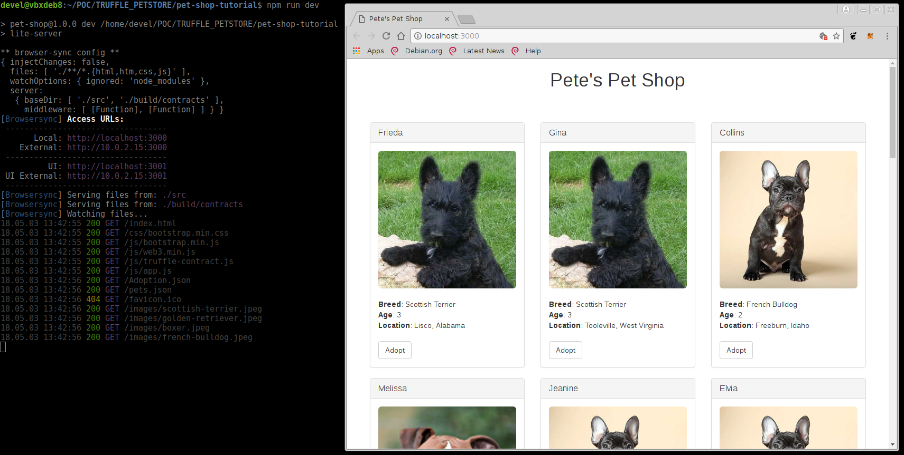

2. To use the dapp, click the Adopt button on the pet of your choice.

3. You'll be automatically prompted to approve the transaction by MetaMask. Click Submit to approve the transaction.


>Nota: Se advierte que la aplicación está consytantemete preguntando por el último `blocknumber`
> Aparentemente se trata del propio metamask una vez cargado el entorno web3: (obsérvese la cabecera `Origin: chrome-extension://nkbihfbeogaeaoehlefnkodbefgpgknn`)

```{"id":4793559820792108,"jsonrpc":"2.0","result":null}
POST / HTTP/1.1
Host: 127.0.0.1:7545
Connection: keep-alive
Content-Length: 94
accept: application/json
Origin: chrome-extension://nkbihfbeogaeaoehlefnkodbefgpgknn
User-Agent: Mozilla/5.0 (X11; Linux x86_64) AppleWebKit/537.36 (KHTML, like Gecko) Chrome/66.0.3359.117 Safari/537.36
content-type: application/json
Accept-Encoding: gzip, deflate, br
Accept-Language: en-US,en;q=0.9


{"id":4793559820792109,"jsonrpc":"2.0","params":["0x-1",true],"method":"eth_getBlockByNumber"}
HTTP/1.1 200 OK
Access-Control-Allow-Headers: Origin, X-Requested-With, Content-Type, Accept
Access-Control-Allow-Origin: *
Access-Control-Allow-Methods: *
Content-Type: application/json
Date: Thu, 03 May 2018 12:09:49 GMT
Connection: keep-alive
Transfer-Encoding: chunked

```

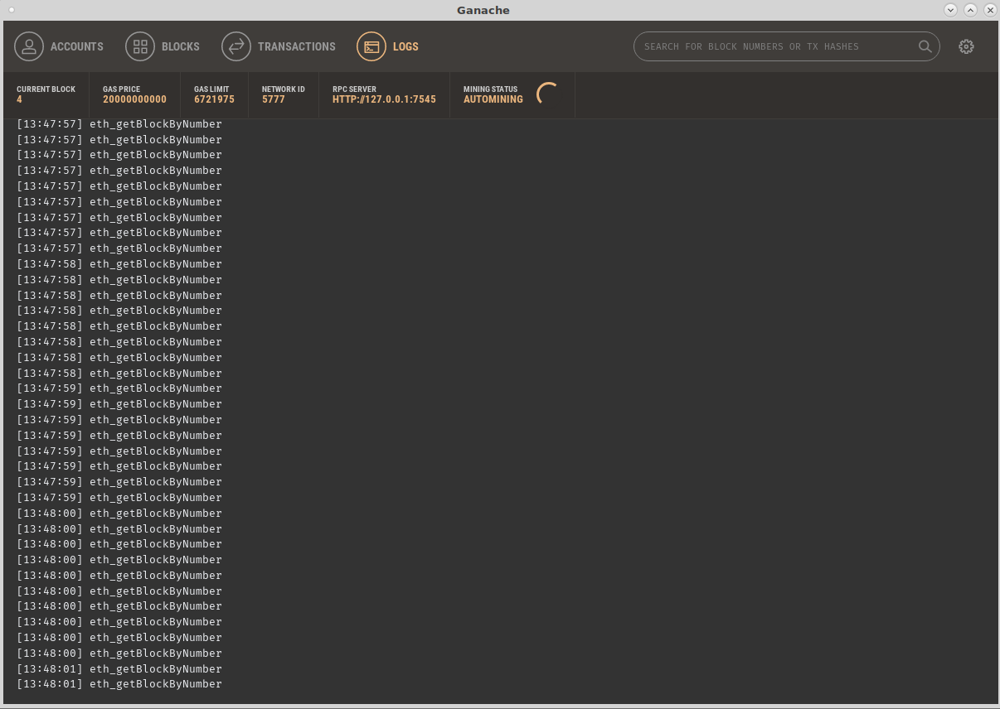

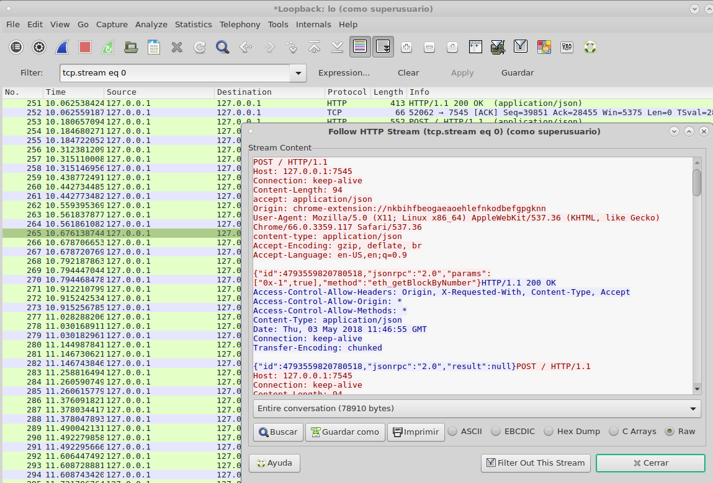

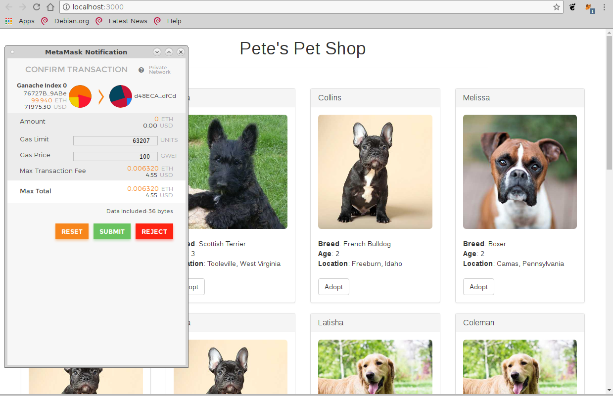

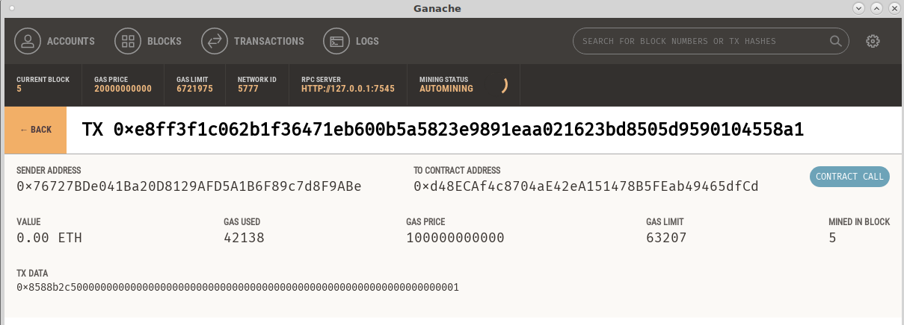

4 Adoption transaction review.

You'll see the button next to the adopted pet change to say "Success" and become disabled, just as we specified, because the pet has now been adopted.

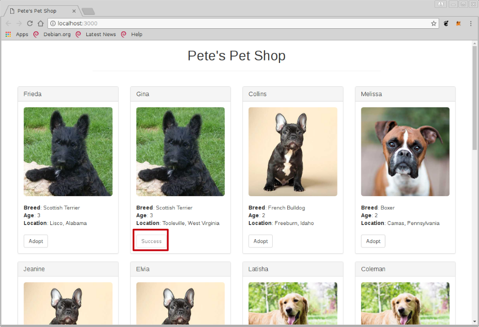


5 Ahora con otra cuenta (`index 1`) seleccionada en Metamask:

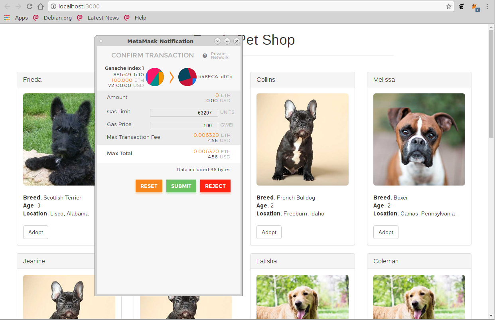

#### Obtención previa del numero de transacciones de la cuenta `0x8e1e49f5d9b6deb602c01254a68d9367e6821c10`

```http
POST / HTTP/1.1
Host: 127.0.0.1:7545
Connection: keep-alive
Content-Length: 136
accept: application/json
Origin: chrome-extension://nkbihfbeogaeaoehlefnkodbefgpgknn
User-Agent: Mozilla/5.0 (X11; Linux x86_64) AppleWebKit/537.36 (KHTML, like Gecko) Chrome/66.0.3359.117 Safari/537.36
content-type: application/json
Accept-Encoding: gzip, deflate, br
Accept-Language: en-US,en;q=0.9

{
    "id": 2764731700011,
    "jsonrpc": "2.0",
    "params": [
        "0x8e1e49f5d9b6deb602c01254a68d9367e6821c10",
        "latest"
    ],
    "method": "eth_getTransactionCount"
}

HTTP/1.1 200 OK
Access-Control-Allow-Headers: Origin, X-Requested-With, Content-Type, Accept
Access-Control-Allow-Origin: *
Access-Control-Allow-Methods: *
Content-Type: application/json
Date: Thu, 03 May 2018 12:10:07 GMT
Connection: keep-alive
Transfer-Encoding: chunked


{"id":2764731700011,"jsonrpc":"2.0","result":"0x0"}
```

#### Send raw transaction desde Metamask:
```http
POST / HTTP/1.1
Host: 127.0.0.1:7545
Connection: keep-alive
Content-Length: 366
accept: application/json
Origin: chrome-extension://nkbihfbeogaeaoehlefnkodbefgpgknn
User-Agent: Mozilla/5.0 (X11; Linux x86_64) AppleWebKit/537.36 (KHTML, like Gecko) Chrome/66.0.3359.117 Safari/537.36
content-type: application/json
Accept-Encoding: gzip, deflate, br
Accept-Language: en-US,en;q=0.9

{
    "id": 7451314711433,
    "jsonrpc": "2.0",
    "params": [
        "0xf88a8085174876e80082f6e794d48ecaf4c8704ae42ea151478b5feab49465dfcd80a48588b2c50000000000000000000000000000000000000000000000000000000000000002822d45a0250f0be26da5b88eed6bae9c540990b45bf8b56ed7508c7fa741fcaba5e0c83ba05b2932bb446b735239d9d23c8c752ceefade003136f3c0a3452872d16c4e5736"
    ],
    "method": "eth_sendRawTransaction"
}

HTTP/1.1 200 OK
Access-Control-Allow-Headers: Origin, X-Requested-With, Content-Type, Accept
Access-Control-Allow-Origin: *
Access-Control-Allow-Methods: *
Content-Type: application/json
Date: Thu, 03 May 2018 12:10:07 GMT
Connection: keep-alive
Transfer-Encoding: chunked

{
    "id": 7451314711433,
    "jsonrpc": "2.0",
    "result": "0x64c9350f61a4e692a3223615202d7f47dc5bef07964bc5487bfbacaffc96d0a9"
}
```

#### Llamada al contrato para obtener la lista de Adopters (array)
```http
POST / HTTP/1.1
Host: 127.0.0.1:7545
Connection: keep-alive
Content-Length: 197
accept: application/json
Origin: chrome-extension://nkbihfbeogaeaoehlefnkodbefgpgknn
User-Agent: Mozilla/5.0 (X11; Linux x86_64) AppleWebKit/537.36 (KHTML, like Gecko) Chrome/66.0.3359.117 Safari/537.36
content-type: application/json
Accept-Encoding: gzip, deflate, br
Accept-Language: en-US,en;q=0.9

{
    "id": 2861242469,
    "jsonrpc": "2.0",
    "params": [
        {
            "from": "0x8e1e49f5d9b6deb602c01254a68d9367e6821c10",
            "to": "0xd48ecaf4c8704ae42ea151478b5feab49465dfcd",
            "data": "0x3de4eb17"
        },
        "latest"
    ],
    "method": "eth_call"
}

HTTP/1.1 200 OK
Access-Control-Allow-Headers: Origin, X-Requested-With, Content-Type, Accept
Access-Control-Allow-Origin: *
Access-Control-Allow-Methods: *
Content-Type: application/json
Date: Thu, 03 May 2018 12:10:07 GMT
Connection: keep-alive
Transfer-Encoding: chunked


{
    "id": 2861242469,
    "jsonrpc": "2.0",
    "result": "0x000000000000000000000000000000000000000000000000000000000000000000000000000000000000000076727bde041ba20d8129afd5a1b6f89c7d8f9abe0000000000000000000000008e1e49f5d9b6deb602c01254a68d9367e6821c100000000000000000000000000000000000000000000000000000000000000000000000000000000000000000000000000000000000000000000000000000000000000000000000000000000000000000000000000000000000000000000000000000000000000000000000000000000000000000000000000000000000000000000000000000000000000000000000000000000000000000000000000000000000000000000000000000000000000000000000000000000000000000000000000000000000000000000000000000000000000000000000000000000000000000000000000000000000000000000000000000000000000000000000000000000000000000000000000000000000000000000000000000000000000000000000000000000000000000000000000000000000000000000000000000000000000000000000000000000000000000000000000000000000000000000000000000000000000000000000000000000000000000000000000000000000000000000000000000000000000000000000000000000000000000000000000000000000000000"
}
```

> Nota: Observar Header `Origin: chrome-extension://nkbihfbeogaeaoehlefnkodbefgpgknn`

#### Que se corresponde con la invocación a la función `function getAdopters() public view returns (address[16])` del contrato `Adoptions`

```
pragma solidity ^0.4.17;

contract Adoption {

    address[16] public adopters;
    
    // Adopting a pet
    function adopt(uint petId) public returns (uint) {
        require(petId >= 0 && petId <= 15);

        adopters[petId] = msg.sender;

        return petId;
    }

    // Retrieving the adopters
    function getAdopters() public view returns (address[16]) {
        return adopters;    
    }
}

```

```
result:
[00]"0x0000000000000000000000000000000000000000000000000000000000000000
[01]   00000000000000000000000076727bde041ba20d8129afd5a1b6f89c7d8f9abe
[02]   0000000000000000000000008e1e49f5d9b6deb602c01254a68d9367e6821c10
[03]   0000000000000000000000000000000000000000000000000000000000000000
[04]   0000000000000000000000000000000000000000000000000000000000000000
[05]   0000000000000000000000000000000000000000000000000000000000000000
[06]   0000000000000000000000000000000000000000000000000000000000000000
[07]   0000000000000000000000000000000000000000000000000000000000000000
[08]   0000000000000000000000000000000000000000000000000000000000000000
[09]   0000000000000000000000000000000000000000000000000000000000000000
[10]   0000000000000000000000000000000000000000000000000000000000000000
[11]   0000000000000000000000000000000000000000000000000000000000000000
[12]   0000000000000000000000000000000000000000000000000000000000000000
[13]   0000000000000000000000000000000000000000000000000000000000000000
[14]   0000000000000000000000000000000000000000000000000000000000000000
[15]   0000000000000000000000000000000000000000000000000000000000000000"```
```


* Efectivamente, 
  * En el bloque 5 puede verse la primera llamada a la función `function adopt(uint petId) public returns (uint) ` 
    * con la cuenta `0x76727BDe041Ba20D8129AFD5A1B6F89c7d8F9ABe`
    * a la dirección del contrato: `0xd48ECAf4c8704aE42eA151478B5FEab49465dfCd`
    * a la dirección de función: `0x8588b2c5`
    * con el `PetId=1 (uint)`: `0000000000000000000000000000000000000000000000000000000000000001`   

    * 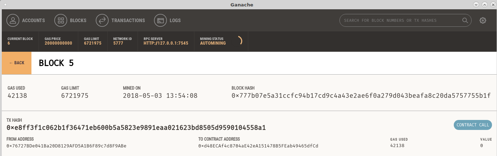

    *  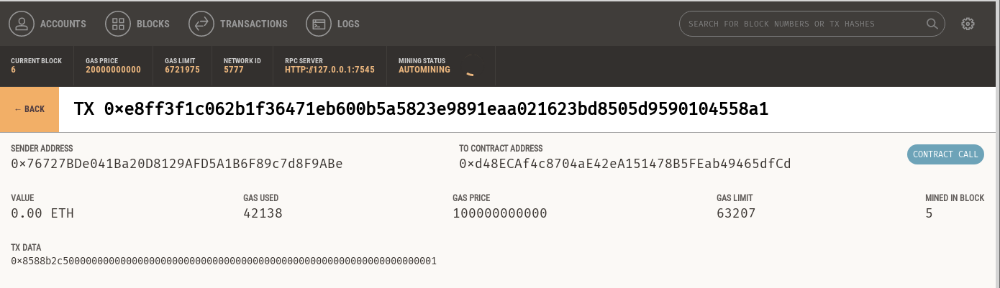

  * En el bloque 6 puede verse la segunda llamada a la función `function adopt(uint petId) public returns (uint) ` 
    * con la cuenta `0x8E1e49f5d9b6Deb602c01254A68d9367E6821c10`
    * a la dirección del contrato: `0xd48ECAf4c8704aE42eA151478B5FEab49465dfCd`
    * a la dirección de función: `0x8588b2c5`
    * con el `PetId=2 (uint)`: `0000000000000000000000000000000000000000000000000000000000000002`   

    * 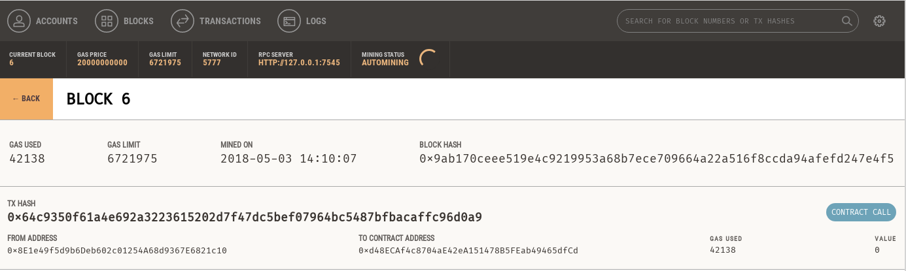

    * 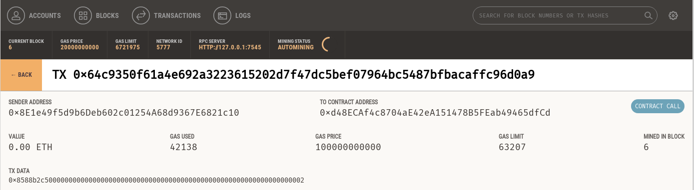


#### Obtención de la información contenida en el bloque #6 (0x6)
``` httpPOST / HTTP/1.1
Host: 127.0.0.1:7545
Connection: keep-alive
Content-Length: 93
accept: application/json
Origin: chrome-extension://nkbihfbeogaeaoehlefnkodbefgpgknn
User-Agent: Mozilla/5.0 (X11; Linux x86_64) AppleWebKit/537.36 (KHTML, like Gecko) Chrome/66.0.3359.117 Safari/537.36
content-type: application/json
Accept-Encoding: gzip, deflate, br
Accept-Language: en-US,en;q=0.9

{
    "id": 4793559820792293,
    "jsonrpc": "2.0",
    "params": [
        "0x6",
        true
    ],
    "method": "eth_getBlockByNumber"
}

HTTP/1.1 200 OK
Access-Control-Allow-Headers: Origin, X-Requested-With, Content-Type, Accept
Access-Control-Allow-Origin: *
Access-Control-Allow-Methods: *
Content-Type: application/json
Date: Thu, 03 May 2018 12:10:12 GMT
Connection: keep-alive
Transfer-Encoding: chunked


{
    "id": 4793559820792293,
    "jsonrpc": "2.0",
    "result": {
        "number": "0x6",
        "hash": "0x9ab170ceee519e4c9219953a68b7ece709664a22a516f8ccda94afefd247e4f5",
        "parentHash": "0x777b07e5a31ccfc94b17cd9c4a43e2ae6f0a279d043beafa8c20da5757755b1f",
        "mixHash": "0x1010101010101010101010101010101010101010101010101010101010101010",
        "nonce": "0x0000000000000000",
        "sha3Uncles": "0x1dcc4de8dec75d7aab85b567b6ccd41ad312451b948a7413f0a142fd40d49347",
        "logsBloom": "0x00000000000000000000000000000000000000000000000000000000000000000000000000000000000000000000000000000000000000000000000000000000000000000000000000000000000000000000000000000000000000000000000000000000000000000000000000000000000000000000000000000000000000000000000000000000000000000000000000000000000000000000000000000000000000000000000000000000000000000000000000000000000000000000000000000000000000000000000000000000000000000000000000000000000000000000000000000000000000000000000000000000000000000000000000000000",
        "transactionsRoot": "0x56e81f171bcc55a6ff8345e692c0f86e5b48e01b996cadc001622fb5e363b421",
        "stateRoot": "0xf54bbfde21ef2fe011dd20bae16f49ffb343aee8658124a691d9850f685b9f9e",
        "receiptsRoot": "0x56e81f171bcc55a6ff8345e692c0f86e5b48e01b996cadc001622fb5e363b421",
        "miner": "0x0000000000000000000000000000000000000000",
        "difficulty": "0x0",
        "totalDifficulty": "0x0",
        "extraData": "0x00",
        "size": "0x03e8",
        "gasLimit": "0x6691b7",
        "gasUsed": "0xa49a",
        "timestamp": "0x5aeafc1f",
        "transactions": [
            {
                "hash": "0x64c9350f61a4e692a3223615202d7f47dc5bef07964bc5487bfbacaffc96d0a9",
                "nonce": "0x0",
                "blockHash": "0x9ab170ceee519e4c9219953a68b7ece709664a22a516f8ccda94afefd247e4f5",
                "blockNumber": "0x06",
                "transactionIndex": "0x00",
                "from": "0x8e1e49f5d9b6deb602c01254a68d9367e6821c10",
                "to": "0xd48ecaf4c8704ae42ea151478b5feab49465dfcd",
                "value": "0x0",
                "gas": "0xf6e7",
                "gasPrice": "0x174876e800",
                "input": "0x8588b2c50000000000000000000000000000000000000000000000000000000000000002"
            }
        ],
        "uncles": []
    }
}


```

#### Obtención del último bloque `latest`

```http
POST / HTTP/1.1
Host: 127.0.0.1:7545
Connection: keep-alive
Content-Length: 96
accept: application/json
Origin: chrome-extension://nkbihfbeogaeaoehlefnkodbefgpgknn
User-Agent: Mozilla/5.0 (X11; Linux x86_64) AppleWebKit/537.36 (KHTML, like Gecko) Chrome/66.0.3359.117 Safari/537.36
content-type: application/json
Accept-Encoding: gzip, deflate, br
Accept-Language: en-US,en;q=0.9

{
    "id": 4793559820792294,
    "jsonrpc": "2.0",
    "params": [
        "latest",
        true
    ],
    "method": "eth_getBlockByNumber"
}

HTTP/1.1 200 OK
Access-Control-Allow-Headers: Origin, X-Requested-With, Content-Type, Accept
Access-Control-Allow-Origin: *
Access-Control-Allow-Methods: *
Content-Type: application/json
Date: Thu, 03 May 2018 12:10:12 GMT
Connection: keep-alive
Transfer-Encoding: chunked


{
    "id": 4793559820792294,
    "jsonrpc": "2.0",
    "result": {
        "number": "0x6",
        "hash": "0x9ab170ceee519e4c9219953a68b7ece709664a22a516f8ccda94afefd247e4f5",
        "parentHash": "0x777b07e5a31ccfc94b17cd9c4a43e2ae6f0a279d043beafa8c20da5757755b1f",
        "mixHash": "0x1010101010101010101010101010101010101010101010101010101010101010",
        "nonce": "0x0000000000000000",
        "sha3Uncles": "0x1dcc4de8dec75d7aab85b567b6ccd41ad312451b948a7413f0a142fd40d49347",
        "logsBloom": "0x00000000000000000000000000000000000000000000000000000000000000000000000000000000000000000000000000000000000000000000000000000000000000000000000000000000000000000000000000000000000000000000000000000000000000000000000000000000000000000000000000000000000000000000000000000000000000000000000000000000000000000000000000000000000000000000000000000000000000000000000000000000000000000000000000000000000000000000000000000000000000000000000000000000000000000000000000000000000000000000000000000000000000000000000000000000",
        "transactionsRoot": "0x56e81f171bcc55a6ff8345e692c0f86e5b48e01b996cadc001622fb5e363b421",
        "stateRoot": "0xf54bbfde21ef2fe011dd20bae16f49ffb343aee8658124a691d9850f685b9f9e",
        "receiptsRoot": "0x56e81f171bcc55a6ff8345e692c0f86e5b48e01b996cadc001622fb5e363b421",
        "miner": "0x0000000000000000000000000000000000000000",
        "difficulty": "0x0",
        "totalDifficulty": "0x0",
        "extraData": "0x00",
        "size": "0x03e8",
        "gasLimit": "0x6691b7",
        "gasUsed": "0xa49a",
        "timestamp": "0x5aeafc1f",
        "transactions": [
            {
                "hash": "0x64c9350f61a4e692a3223615202d7f47dc5bef07964bc5487bfbacaffc96d0a9",
                "nonce": "0x0",
                "blockHash": "0x9ab170ceee519e4c9219953a68b7ece709664a22a516f8ccda94afefd247e4f5",
                "blockNumber": "0x06",
                "transactionIndex": "0x00",
                "from": "0x8e1e49f5d9b6deb602c01254a68d9367e6821c10",
                "to": "0xd48ecaf4c8704ae42ea151478b5feab49465dfcd",
                "value": "0x0",
                "gas": "0xf6e7",
                "gasPrice": "0x174876e800",
                "input": "0x8588b2c50000000000000000000000000000000000000000000000000000000000000002"
            }
        ],
        "uncles": []
    }
}

```

#### Comprobación que no existe un bloque posterior al último devuelto. Se pregunta por el (0x7) y se devuelve "null"


``` http
POST / HTTP/1.1
Host: 127.0.0.1:7545
Connection: keep-alive
Content-Length: 93
accept: application/json
Origin: chrome-extension://nkbihfbeogaeaoehlefnkodbefgpgknn
User-Agent: Mozilla/5.0 (X11; Linux x86_64) AppleWebKit/537.36 (KHTML, like Gecko) Chrome/66.0.3359.117 Safari/537.36
content-type: application/json
Accept-Encoding: gzip, deflate, br
Accept-Language: en-US,en;q=0.9

{
    "id": 4793559820792300,
    "jsonrpc": "2.0",
    "params": [
        "0x7",
        true
    ],
    "method": "eth_getBlockByNumber"
}

HTTP/1.1 200 OK
Access-Control-Allow-Headers: Origin, X-Requested-With, Content-Type, Accept
Access-Control-Allow-Origin: *
Access-Control-Allow-Methods: *
Content-Type: application/json
Date: Thu, 03 May 2018 12:10:12 GMT
Connection: keep-alive
Transfer-Encoding: chunked

{
    "id": 4793559820792300,
    "jsonrpc": "2.0",
    "result": null
}

```

#### Transacción confirmada:

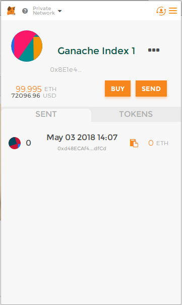

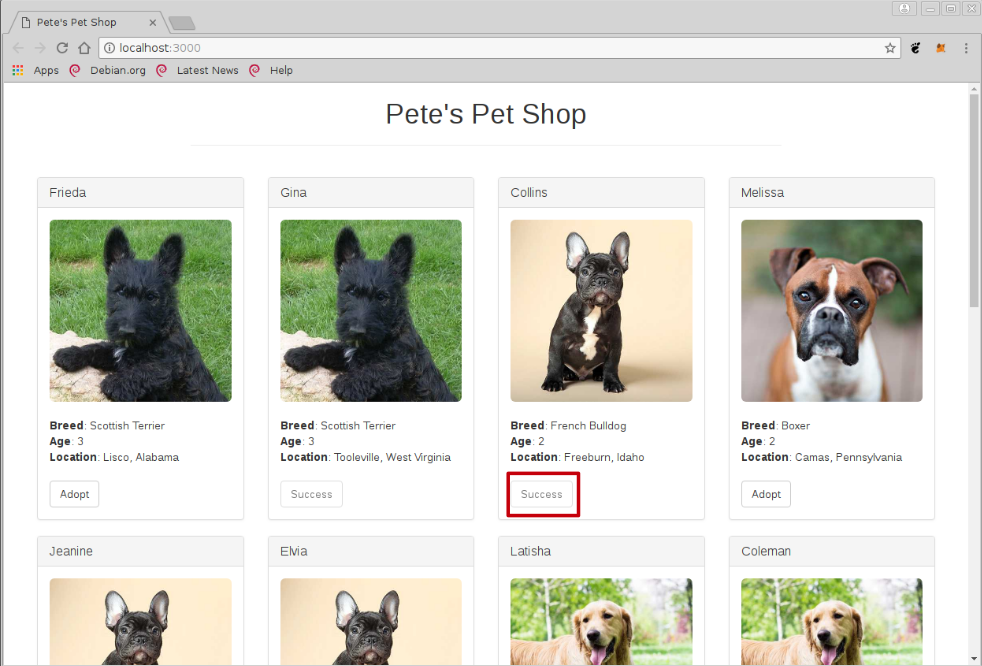

#### Comprobación de saldo de la cuenta `0x8712d69e0a9fa4529c66a2fdd144af80c8879b4e` 

```http

POST / HTTP/1.1
Host: 127.0.0.1:7545
Connection: keep-alive
Content-Length: 130
accept: application/json
Origin: chrome-extension://nkbihfbeogaeaoehlefnkodbefgpgknn
User-Agent: Mozilla/5.0 (X11; Linux x86_64) AppleWebKit/537.36 (KHTML, like Gecko) Chrome/66.0.3359.117 Safari/537.36
content-type: application/json
Accept-Encoding: gzip, deflate, br
Accept-Language: en-US,en;q=0.9

{
    "id": 4793559820792299,
    "jsonrpc": "2.0",
    "params": [
        "0x8712d69e0a9fa4529c66a2fdd144af80c8879b4e",
        "latest"
    ],
    "method": "eth_getBalance"
}

HTTP/1.1 200 OK
Access-Control-Allow-Headers: Origin, X-Requested-With, Content-Type, Accept
Access-Control-Allow-Origin: *
Access-Control-Allow-Methods: *
Content-Type: application/json
Date: Thu, 03 May 2018 12:10:12 GMT
Connection: keep-alive
Transfer-Encoding: chunked

{
    "id": 4793559820792299,
    "jsonrpc": "2.0",
    "result": "0x56bc75e2d63100000"
}


```

>Nota: `0x56bc75e2d63100000` equivale a  `100000000000000000000` en decimal


